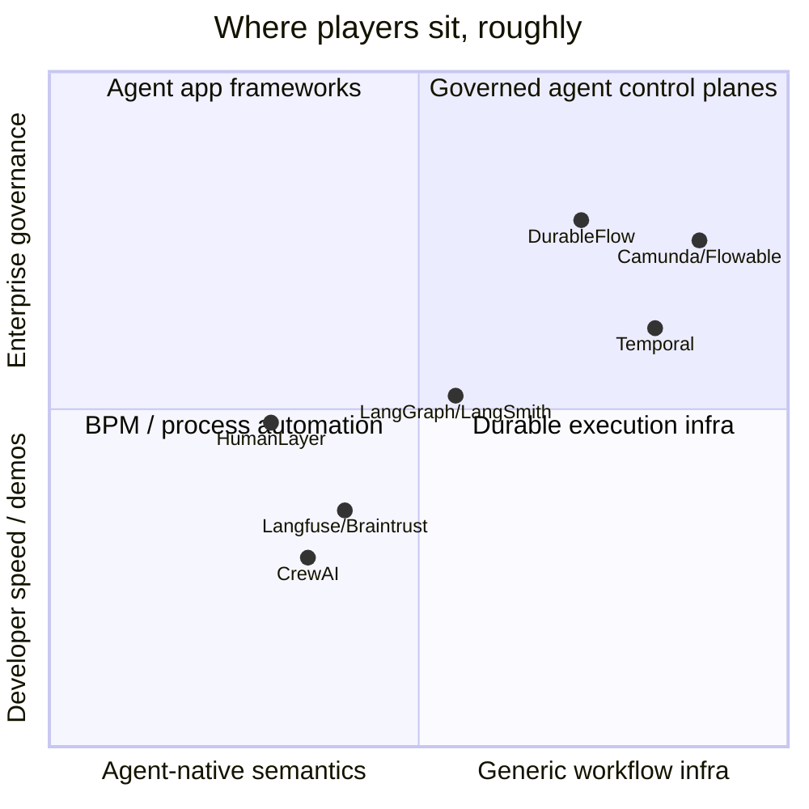
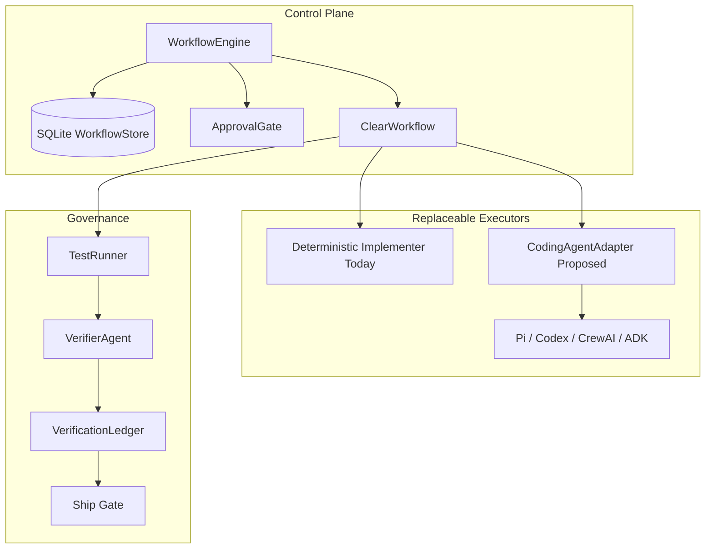

# Competitive Differentiation and Space Map

This document maps the competitive space around DurableFlow and clarifies the
working thesis: DurableFlow is best understood as a reference control plane for
verifiable agentic work, not as another agent personality framework.

## Core Thesis

Enterprises do not primarily need more autonomous agents. They need governed,
durable systems that can safely assign work to agents, recover from failures,
control permissions, preserve evidence, and prove when work is complete.

DurableFlow's strongest positioning is:

> Agents are replaceable workers inside a durable, policy-governed workflow.

The workflow owns truth. Agents execute bounded tasks.

That makes DurableFlow a control plane for verifiable agentic work:

- declared workflow
- durable state
- checkpoint and resume
- scoped permissions
- approval gates
- idempotent side effects
- context lineage
- telemetry
- independent verification
- evidence-backed completion
- model and agent replaceability

This is deliberately not a maturity claim against production platforms such as
LangSmith, Temporal, or BPM suites. DurableFlow is a compact reference
architecture: the control-plane pattern enterprises should demand, demonstrated
in code small enough to audit.

Another way to say it:

> Workflow-as-truth. Agent-as-worker. Completion-as-evidence.

## Why This Matters

Most agent demos optimize for intelligence: better prompts, stronger models,
more agent collaboration, more tool use. Fortune 500 buyers tend to care more
about control surfaces:

- Who approved this?
- What state was the workflow in?
- What data did the model see?
- What external side effect happened?
- Was it retried?
- Was the retry idempotent?
- Who verified the result?
- What evidence supports the completion claim?
- Can we replay, audit, or block the workflow?

DurableFlow should lead with those questions.

## Category Definition

DurableFlow targets the control plane for verifiable agentic work.

A control plane for verifiable agentic work must answer:

- What workflow owns this action?
- What state was durable at each boundary?
- What context was selected, consumed, and credited?
- What side effects occurred, and were they idempotent?
- Who approved risky transitions?
- Who implemented the work?
- Who independently verified it?
- What evidence supports completion?
- Why was the workflow allowed to ship or blocked?

This category is not defined by smarter model calls. It is defined by whether
agentic work can be governed, resumed, inspected, and proven complete.

## Status Legend

This document mixes implemented repo behavior with intended architecture. Use
these labels when turning positioning into roadmap or sales material:

- **Implemented**: present in the codebase today.
- **Demonstrated**: present as a deterministic or mock implementation.
- **Partial**: adapter boundary or prototype exists, but the full integration
  is not complete.
- **Proposed**: design direction only.

Current status:

| Capability | Status | Notes |
|---|---|---|
| Linear durable workflow engine | Implemented | `WorkflowEngine` checkpoints step results through SQLite. |
| Approval gate / pause / resume | Implemented | `PauseForApproval` and `ApprovalGate` are first-class workflow primitives. |
| Model routing, fallback, and cost accounting | Implemented | Mock providers are default; Anthropic is optional. |
| Context lineage | Implemented | Context ledger records observed, selected, consumed, and credited artifacts. |
| CLEAR factory loop | Demonstrated | Deterministic implement/assess/remediate loop under `factory/`. |
| Independent verification ledger and ship gate | Implemented | `VerificationLedger` blocks unverifiable completion claims. |
| ADK agent adapter | Partial | Boundary exists; full Google ADK Runner integration is not claimed. |
| Coding-agent adapter interface | Proposed | Described in `factory/pi-dev.md`; not yet implemented as code. |
| Pi / Codex / Claude Code backend | Proposed | Intended as replaceable factory executor adapters. |

## Space Map

DurableFlow sits between agent-native frameworks and generic workflow
infrastructure. Its wedge is the semantic layer above durable execution:
governance semantics for agentic work.



The ecosystem splits into layers:

| Layer | Examples | What they optimize for |
|---|---|---|
| Agent construction | CrewAI, OpenAI Agents SDK, Google ADK, AutoGen | Fast assembly of agents, crews, tools, memory, and task loops |
| Agent platform | LangGraph + LangSmith | Graph orchestration, deployment, tracing, evals, HITL, managed runtime |
| Durability infrastructure | Temporal, Dapr Workflows | Durable execution, distributed recovery, retries, saga patterns |
| Agentic governance semantics | DurableFlow's target layer | Approval as state, context lineage, verifier separation, evidence-backed ship gates |

The market is moving in this direction. Agent frameworks are adding durable
state, human-in-the-loop controls, deployment, tracing, and evals. Workflow
platforms are adding agent-facing integrations. Coding-agent tools are becoming
software-factory surfaces. DurableFlow's bet is that the enduring layer is not
another agent loop, but the semantics that make agentic work accountable:
workflow ownership, durable state boundaries, scoped side effects, lineage,
independent verification, and evidence-backed completion.

## Paradigm Comparison

| Dimension | DurableFlow Paradigm | Agent/Crew Paradigm |
|---|---|---|
| Top-level abstraction | Durable workflow / control plane | Agents, crews, tasks |
| Agent role | Replaceable executor | Primary programming model |
| State ownership | Workflow owns durable state | Agent runtime or flow owns context/state |
| Completion | Evidence-backed gate | Task/agent output, optionally guarded |
| Failure model | Checkpoint, resume, retry, fallback | Framework-dependent |
| Human control | Approval gates as first-class workflow events | Often guardrails or callbacks |
| Auditability | Built into workflow semantics | Usually added through tracing/observability |
| Enterprise fit | Strong for governed automation | Strong for fast agent app assembly |

The enterprise-friendly architecture is not "no agents." It is:

```text
Durable workflow control plane
  -> bounded agent/coding-agent adapters
  -> independent verification
  -> evidence-backed gates
```

## DurableFlow vs. CrewAI

CrewAI is a multi-agent framework. It is designed around agents, crews, tasks,
tools, memory, knowledge, and flows. It is attractive because it makes agent
systems easy to assemble and explain.

DurableFlow is different. It is a reliability and governance runtime for
agentic workflows. Its center of gravity is not collaboration between agents;
it is operational control over long-running, failure-prone workflows.

| Dimension | DurableFlow | CrewAI |
|---|---|---|
| Primary idea | Durable workflow runtime for agent reliability | Multi-agent app framework |
| Agent model | Currently split between `agent/` turn agents and `factory/` implementer/verifier roles | First-class agents, crews, tasks, and flows |
| State passing | Explicit checkpoints: `StepResult.step_data`, `agent_history`, `ClearPhaseState` | Flow state, task context, memory, knowledge |
| Control flow | Linear engine; loops live inside extension-owned state | Sequential/hierarchical processes and event-driven flows |
| Durability focus | Core teaching primitive | Supported, but not the central identity |
| Verification | Independent verifier, evidence ledger, ship gate | Guardrails, callbacks, HITL patterns |
| Best fit | Governed automation, reliability demos, control plane | Rapid multi-agent automation development |
| Relationship | Can host CrewAI as an executor/backend | Could implement workflows that need DurableFlow-like controls |

Positioning statement:

> CrewAI helps developers build agent teams. DurableFlow governs whether
> agentic work can safely proceed, recover, and be claimed complete.

## Factory and Coding Agents

The `factory/` extension clarifies the control-plane thesis.

The factory should own the workflow definition: today `CLEAR.md`, later any
equivalent workflow spec. Pi, Codex, Claude Code, CrewAI, or another coding
agent should be a replaceable backend, not the factory itself.

The right boundary:

```text
factory / CLEAR workflow
  -> phase state
  -> approval gates
  -> mounted artifacts
  -> coding-agent adapter
  -> independent verifier
  -> remediation or advancement
  -> ship gate
```

The coding agent should receive a bounded request and return a structured
result. It should not own workflow state or declare completion.

Suggested adapter families:

- `TurnAgentAdapter`: one reasoning/tool-use turn, as in `agent/`.
- `CodingAgentAdapter`: implement one bounded phase, as needed by `factory/`.
- `VerifierAdapter`: independently assess evidence and produce verdicts.

Two execution styles are acceptable. Two unrelated agent definition systems are
not. DurableFlow should unify identity, declaration, state handoff, and result
shape, while preserving specialized contracts for different agent roles.

## Architecture Grounding

The control-plane thesis maps directly to current repo structure.



### Linear Macro Engine, Extension-Owned Loops

The top-level engine is intentionally simple: it runs registered workflow steps
in order, checkpoints results, pauses for approval, and resumes. Branchy agent
behavior belongs in extension-owned state.

In `factory/`, the implement/assess/remediate loop lives inside the
`phase_runner` macro step. The loop state is held in `ClearPhaseState` and
persisted through `ClearPhaseStore`, so a crash can resume on the current
phase, attempt, and lap without changing core engine semantics.

This is a key architectural point: DurableFlow does not need the core engine to
become an agent graph runtime. It can host graphy or loopy behavior by making
that behavior explicit, durable, and inspectable at the extension boundary.

### Agents as Bounded Executors

In the general `agent/` package, agents conform to a small turn protocol:

```python
def step(history: list[dict], context: dict) -> AgentTurn:
    ...
```

State is passed in as durable `history` plus run `context`; the returned
`AgentTurn` is appended back to `agent_history` and checkpointed.

In `factory/`, the current implementer/verifier roles are more specific:

- the implementer writes bounded phase artifacts in an isolated workspace
- the verifier runs the declared test command and writes a report
- CLEAR state decides whether to remediate, advance, block, or ship

The direction is to unify these under shared adapter identity and structured
request/result contracts while preserving role-specific execution methods.

### Human-in-the-Loop as a Core Primitive

Approval is not modeled as a callback around an agent. It is a workflow event.
`PauseForApproval` stops execution and stores enough state to resume the same
workflow after approval. `ApprovalGate` records pending decisions in SQLite.

This matters for enterprise positioning: a human gate is not an optional UI
hook; it is part of the durable process state.

### Independent Claim Verification

DurableFlow treats "done" as an evidence question, not an agent assertion.

The factory verifier has a distinct identity from the implementer. Test output,
reports, and evidence artifacts flow into `VerificationLedger`. The final
`ship` step checks the ledger and raises `ShipBlockedError` when required
claims are missing, stale, unverifiable, or not independently verified.

This is one of the clearest wedges against general agent frameworks: completion
is not whatever the agent says at the end of a task. Completion is a gated
claim backed by evidence.

## Direct Competitors

The most direct competitor is LangSmith Deployment / LangGraph Platform.

LangSmith Deployment is positioned as a workflow orchestration runtime for
agent workloads, with durable execution, stateful runs, streaming, deployment,
horizontal scaling, and cloud/self-hosted control plane options.

| Competitor | How Direct | Why |
|---|---:|---|
| LangSmith Deployment / LangGraph | Very direct | Agent runtime, durable execution, state, runs, deployment, control plane |
| Temporal | Very direct architecturally | Durable workflow engine with strong retry/recovery semantics; less agent-native |
| CrewAI Flows | Medium-direct | Agent/team framework with flow state and event-driven orchestration |
| Flowable / Camunda | Medium-direct enterprise | BPM/workflow governance and process automation; less LLM-agent-native |
| HumanLayer | Adjacent | Coding-agent control surface / software-factory peer; not a full durable workflow runtime |
| Langfuse / Arize / Braintrust | Partial | Observability, tracing, and evals, not execution control planes |
| OpenAI Agents SDK / Google ADK / AutoGen | Indirect | Agent construction/runtime frameworks; likely DurableFlow backends |

## Differentiation Against LangGraph / LangSmith

LangGraph and LangSmith are closest because they already speak the language of
production agent deployment: durable execution, threads, runs, state, scaling,
observability, and managed/self-hosted deployment.

LangGraph/LangSmith is also converging on many of the same buyer questions:
durable execution, human-in-the-loop flows, deployment, evals, observability,
and operational control. DurableFlow should not claim to be more mature. The
sharper differentiation is semantic:

| Dimension | LangGraph / LangSmith | DurableFlow Opportunity |
|---|---|---|
| Agent runtime | Strong | Treat agent runtimes as replaceable backends |
| Durable execution | Strong | Keep durability small, inspectable, and educational |
| Observability | Strong | Tie traces to explicit evidence and claim verification |
| Workflow state | Strong | Make state human-auditable and policy-oriented |
| Human gates | Supported | Make approval a core primitive, not an add-on |
| Completion semantics | Runtime/task oriented | Evidence-backed ship gates and independent verification |
| Educational clarity | Complex production platform | Minimal reference architecture for control-plane primitives |

Positioning statement:

> LangGraph/LangSmith is a production agent platform. DurableFlow is a compact
> reference control plane for verifiable, durable, approval-gated agentic work.

The competitive warning is simple: LangGraph/LangSmith can absorb the generic
"agent control plane" vocabulary. DurableFlow must lead with what is
structurally different:

- evidence ranks
- independent verifier identity
- ship gates that block unverifiable completion
- context lineage as an audit artifact
- extension-owned durable loops on a deliberately simple engine

## Differentiation Against Temporal

Temporal is the strongest architectural analogue for durable workflow execution.
It already owns the durable execution mental model: workflows, activities,
retries, deterministic replay, long-running processes, and reliability.

DurableFlow should not compete with Temporal on infrastructure depth. The
DurableFlow wedge is agent-specific semantics:

- model fallback and cost accounting
- context selection and lineage
- approval gates for agent side effects
- verifier/implementer separation
- evidence-backed completion
- agent adapter pattern
- small educational surface area

Positioning statement:

> Temporal is durable execution infrastructure. DurableFlow is the agentic
> control-plane pattern built on durability, verification, and auditability.

Temporal could eventually be a backend for DurableFlow-style semantics.

## Differentiation Against BPM / Workflow Platforms

Flowable, Camunda, and similar BPM platforms are enterprise-native control
planes. They understand process, audit, governance, human tasks, and structured
workflow. They are strong competitors in buyer language.

DurableFlow's distinction is that it starts from the operational hazards of LLM
agents:

- model/provider failure
- hallucinated completion
- prompt/context growth
- untrusted agent claims
- tool side effects
- approval and idempotency boundaries
- context lineage and model attribution

Positioning statement:

> BPM platforms govern business processes. DurableFlow governs agentic work
> where model behavior, context, tools, and verification are first-class risks.

## Adjacent Coding-Agent Factories

Pi, Claude Code, Codex, HumanLayer, OpenHands, Devin-style systems, and similar
tools all compete for the "software factory" frame. They are increasingly good
at creating tasks, opening worktrees, editing code, running commands, and
collaborating around design docs.

DurableFlow should not fight them as coding harnesses. The factory thesis is
that those systems are executors under a workflow/evidence control plane:

```text
workflow spec owns truth
  -> coding agent implements bounded work
  -> independent verifier checks evidence
  -> ledger records claims
  -> ship gate refuses unverifiable completion
```

HumanLayer is better classified here than as a narrow HITL tool. It is adjacent
to Pi and other coding-agent control surfaces. DurableFlow's relationship to
this category should be complementary: use the coding agent as a backend while
keeping workflow state, gates, evidence, and completion semantics outside the
agent harness.

## What Fortune 500 Buyers Would Prefer

For serious internal automation, especially workflows touching customer data,
money movement, regulated operations, production systems, or enterprise change
management, a Fortune 500 buyer is more likely to prefer the DurableFlow-style
paradigm:

- workflow-first
- policy-governed
- auditable
- approval-aware
- failure-resumable
- evidence-backed
- model/vendor replaceable

They may use CrewAI, Pi, Codex, Claude, OpenAI Agents SDK, Google ADK, or
LangGraph agents as workers. But the top-level control plane should make the
workflow accountable.

## DurableFlow Product Narrative

DurableFlow is not "another agent framework."

DurableFlow is a reference control plane for verifiable agentic workflows:

- it assigns bounded work to agents
- it checkpoints every stage
- it gates risky actions
- it records what context was selected and consumed
- it handles retries and provider fallback
- it prevents duplicate side effects
- it separates implementation from verification
- it refuses to ship unverifiable claims

The durable workflow is the source of truth. Agents are swappable execution
backends.

The most defensible narrative is:

> DurableFlow demonstrates the control-plane pattern enterprises should demand:
> durable state, scoped side effects, human gates, context lineage, independent
> verification, and evidence-backed completion.

That avoids overclaiming against production platforms while keeping the
project's real asset at the center: trustworthy completion semantics.

In short:

> DurableFlow is workflow-as-truth infrastructure for agentic systems where
> "done" must be proven, not merely asserted.

## Sources and Reference Points

- CrewAI docs describe agents, crews, flows, state, processes, memory,
  knowledge, HITL, and observability: <https://docs.crewai.com/>
- CrewAI Flows docs describe event-driven workflows and shared flow state:
  <https://docs.crewai.com/en/concepts/flows>
- LangSmith Deployment docs describe an agent workload runtime with durable
  execution, scaling, deployment options, and a control plane:
  <https://docs.langchain.com/langsmith/deployment>
- Pi describes itself as a customizable coding-agent harness with print/JSON,
  RPC, SDK, provider, skill, and extension mechanisms:
  <https://pi.dev/>
