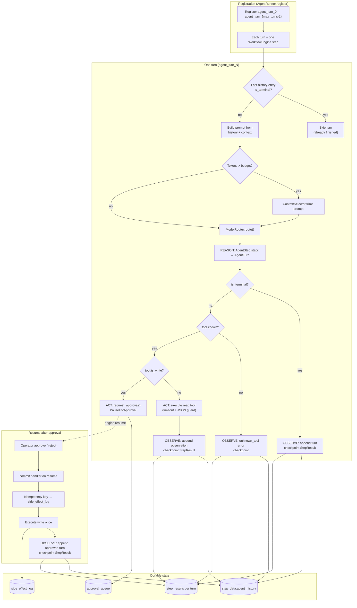
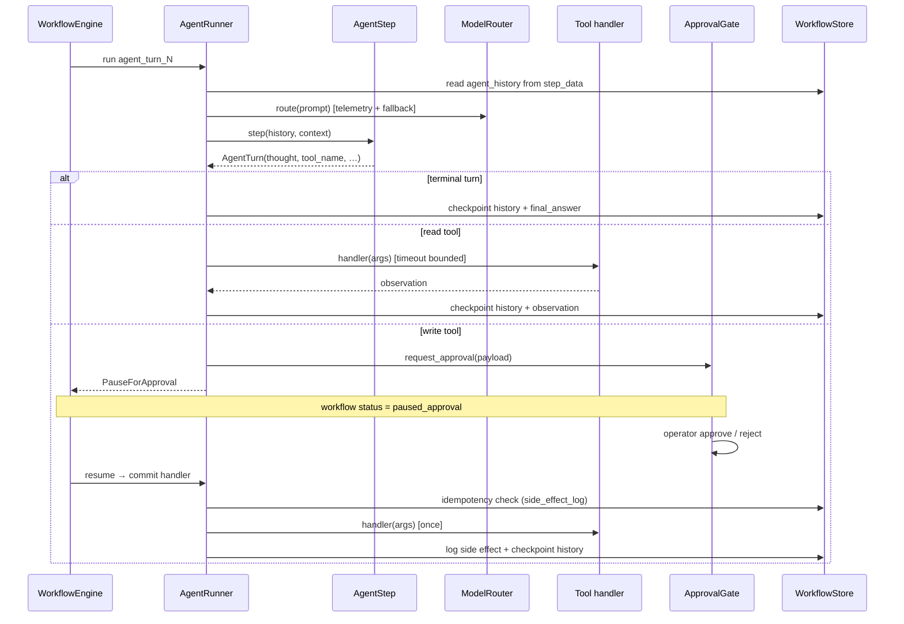

# Agentic Loop

Visual reference for the reason-act-observe loop in `agent/`, bridged into the durable `WorkflowEngine`.

**Related:** [dflow-arch.md](dflow-arch.md) · [field-pattern.md](field-pattern.md) · [walkthrough.md](walkthrough.md) (Agent Readiness section) · [readiness/README.md](../readiness/README.md)

**Source file:** [agent-loop.mmd](agent-loop.mmd) (standalone Mermaid for editors and CLI)

## Where the code lives

| Piece | Module | Role |
|-------|--------|------|
| Turn contract | `agent/protocol.py` | `AgentStep.step()` → `AgentTurn` |
| Durable bridge | `agent/runner.py` | `AgentRunner` registers one engine step per turn |
| Demo agent | `agent/mini_react.py` | Deterministic ReAct `AgentStep` for readiness tests |
| Tools | `agent/tools.py` | `ToolSpec` handlers (read vs write) |
| Harness | `readiness/harness.py` | Naked vs wrapped comparison |

## Diagram choice

Use two complementary views:

1. **Flowchart (primary)** — shows how one turn maps onto `WorkflowEngine`, and where branching happens (terminal, read tool, write + approval, checkpoint). Best for understanding the durable shell.
2. **Sequence diagram (secondary)** — shows temporal message flow across `AgentStep`, `AgentRunner`, tools, and `ApprovalGate` for a single turn.

## Durable bridge (flowchart)

`AgentRunner` does not run a free-form `while` loop in memory. It pre-registers `agent_turn_0` … `agent_turn_{max_turns-1}` as linear workflow steps. Each step runs exactly one reason-act-observe cycle and checkpoints `agent_history` before the next turn can start. Resume after crash reconstructs history from `step_data` and continues at `current_step + 1`.

## One turn (sequence)

## Key invariants

1. **One turn, one checkpoint** — completed turns are never re-reasoned; resume continues at the next registered step index.
2. **History is the source of truth** — `step_data["agent_history"]` holds the full reason-act-observe trace.
3. **Writes pause; reads run** — `ToolSpec.is_write` routes through `ApprovalGate`; approved writes use idempotency keys in `side_effect_log`.
4. **Agent logic is pluggable** — any object implementing `AgentStep` (`mini_react`, ADK adapter, your own LLM loop) plugs into the same bridge.
