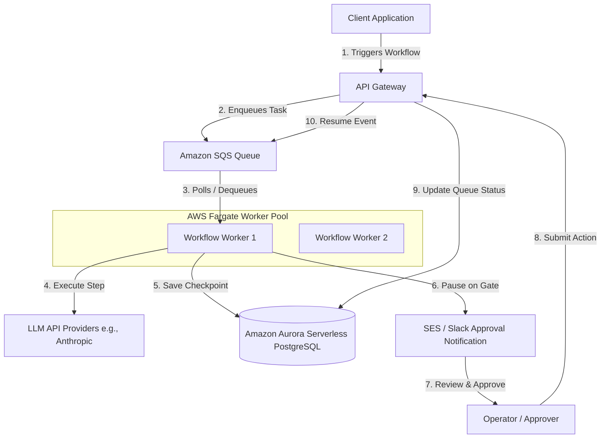

# AWS Deployment Architecture for DurableFlow

This guide evaluates AWS deployment options for **DurableFlow** and outlines how to scale its core primitives—durable execution, approval gates, cost accounting, and context selection—to a production-grade AWS environment.

---

## 1. Compute Options Evaluation

Choosing between **AWS Lambda**, **ECS Fargate**, and **EC2** for running agentic workflows depends on execution durations, operational complexity, and state management.

| Dimension | AWS Lambda (Serverless Functions) | ECS Fargate (Serverless Containers) | AWS EC2 (Virtual Machines) |
| :--- | :--- | :--- | :--- |
| **Execution Duration** | ⚠️ Hard 15-minute timeout. Workflows must be chunked or run step-by-step. | ✅ Unlimited execution time. Ideal for long-running workflows and agent loops. | ✅ Unlimited execution time. Easiest lift-and-shift. |
| **State Persistence** | ❌ Ephemeral file system. Cannot use local SQLite files easily across runs without mounting Amazon EFS. | ⚠️ Ephemeral local disk, but supports EFS mounts or RDS/Aurora. | ✅ Persistent EBS volumes allow simple local SQLite storage. |
| **HITL Approvals** | ✅ High efficiency: Lambda exits on `paused_approval` (0 idle cost) and resumes on API Gateway event. | ✅ Workers pause, polling a database or waiting on SQS queues for resume events. | ✅ Standard process suspension, or polling SQLite database. |
| **Scaling & Concurrency** | ✅ Instant scaling to thousands of concurrent workflow runs. | ✅ Managed scaling based on SQS queue size or CPU metrics. | ⚠️ Slow auto-scaling (minutes) and requires managing load balancing. |
| **Idle Cost** | ✅ **$0 when idle**. Pay-per-use model is perfect for low-frequency workflows. | ⚠️ Baseline running cost for container tasks, but can scale to 0 when idle. | ❌ High idle cost; VMs run 24/7 regardless of workflow traffic. |
| **Operating Overhead** | ✅ **Minimal**. Managed runtime, patch-free. | ✅ **Low**. Manage container definitions and scaling rules, not VMs. | ❌ **High**. Responsible for OS patching, server health, and storage backups. |

---

## 2. The Persistence Challenge: SQLite in the Cloud

DurableFlow uses SQLite via [WorkflowStore](file:///Users/marcos/Downloads/durableflow/src/store.py#L68) to persist checkpoints, approvals, and side-effect logs. When moving to AWS, local files on ephemeral storage (Lambda/Fargate) present a challenge.

### Option A: Local SQLite + Amazon Elastic File System (EFS)
* **How it works**: Mount an EFS volume to AWS Lambda or ECS Fargate tasks. SQLite reads/writes directly to EFS.
* **Pros**: No changes to database schema or queries; simple SQLite configuration.
* **Cons**: 
  * EFS is a networked filesystem. SQLite WAL mode can experience high latencies over network mounts.
  * SQLite does not handle high-concurrency write locks well over network drives, increasing risk of `database is locked` errors under concurrent worker load.
  * Best limited to single-worker deployments.

### Option B: SQLite + Litestream (S3 Replicated)
* **How it works**: Run Litestream alongside the workflow process. Litestream continuously streams SQLite WAL changes to an Amazon S3 bucket. On container restart, the local SQLite database is restored from S3.
* **Pros**: Maintains local SQLite query speeds. Prevents data loss on ephemeral compute restarts.
* **Cons**: 
  * Does not support concurrent writes from multiple worker instances (active-passive setup only).
  * Adds dependency on background replication processes.

### Option C: Migration to Amazon RDS or Aurora Serverless v2 (Recommended)
* **How it works**: Modify [WorkflowStore](file:///Users/marcos/Downloads/durableflow/src/store.py#L68) to connect to a PostgreSQL database (like Aurora Serverless v2) instead of SQLite.
* **Pros**: 
  * Full support for concurrent workflow executions across multiple workers.
  * Automatic scaling of compute resources (Aurora Serverless) and automated backups.
  * Enterprise-grade transactions and high availability.
* **Cons**: Requires rewriting the SQL client adapter to use a PostgreSQL driver (e.g., `psycopg2` or `asyncpg`) and managing database connection pools.

---

## 3. Production Architecture Design

For a production deployment of DurableFlow, **ECS Fargate with Aurora Serverless v2 (PostgreSQL)** is the recommended path. It balances containerized flexibility, persistent multi-worker database access, and low operational overhead.

### Architecture Workflow Diagram

The workflow coordinates execution, checkpoints, and human approval gates across serverless infrastructure:

### Component Details

1. **Amazon API Gateway & SQS**:
   * API Gateway provides a REST endpoint to start workflows or submit approval decisions.
   * Start requests push an event to an **SQS Queue** containing the `workflow_id`.
   * Approval actions write `approved` or `rejected` to the database and send a resume signal to the SQS queue.

2. **ECS Fargate Worker Pool**:
   * A pool of Fargate container instances running the workflow execution engine.
   * Workers pull `workflow_id`s from SQS.
   * If a workflow is resumed, the worker reads the last step index from the database and resumes from that step, preventing re-execution of previous steps.
   * On process failure/termination, the SQS message visibility timeout expires, and another worker picks up the workflow to resume from the last saved checkpoint automatically.

3. **Amazon Aurora Serverless v2 (PostgreSQL)**:
   * Replaces SQLite. Keeps track of running states (`workflows`), execution history (`step_results`), human approvals (`approval_queue`), and side-effect logs (`side_effect_log`).
   * Scaled down automatically during periods of low activity.

4. **Amazon CloudWatch & Telemetry**:
   * Telemetry logs produced by the [TelemetryLogger](file:///Users/marcos/Downloads/durableflow/src/telemetry.py) are written to stdout and forwarded to **Amazon CloudWatch Logs** for analysis, auditing, and cost tracking.

---

## 4. Implementation Path to Production

To prepare this repository for production AWS deployment, execute the following steps:

1. **Database Adapter Separation**:
   * Decouple SQL queries in `store.py` from `sqlite3`. Create a database interface class (e.g., `BaseWorkflowStore`) and implement two adapters: `SQLiteWorkflowStore` (for local tests/demos) and `PostgresWorkflowStore` (for production).
2. **Containerization**:
   * Create a `Dockerfile` that packages the DurableFlow code, dependencies from `pyproject.toml`, and the worker script.
3. **Infrastructure as Code (IaC)**:
   * Write an AWS CDK or Terraform script to provision:
     * VPC with public and private subnets.
     * Aurora Serverless v2 PostgreSQL database.
     * ECS Cluster with Fargate Service, auto-scaled based on SQS queue size.
     * SQS FIFO queue (to guarantee step sequencing if needed).
     * API Gateway and Lambda function to handle webhook routing for approvals.
