# DurableFlow Architecture

Visual architecture for **Durable Flow**: Python stdlib, SQLite persistence, mock model providers by default, and CLI demos.

**Related docs:** [README](../README.md) (quick start) · [dflow-spec.md](dflow-spec.md) (requirements and acceptance criteria)

## How To Read This Document

Each section is a Mermaid diagram plus brief prose. The diagrams describe **what runs today**, not a production target.

**Two status layers.** Workflow progress lives in `workflows.status` (e.g. `paused_approval`, `running`, `completed`). Operator decisions live separately in `approval_queue.status` (`pending`, `approved`, `rejected`). Calling `ApprovalGate.approve()` or `reject()` updates the queue only; `WorkflowEngine.resume()` reads that decision and updates workflow status.

**Checkpoint semantics.** `workflows.current_step` is the **integer index** of the last completed step (0 = `ingest_email`, 1 = `select_context`, …). `execute()` and `resume()` continue at `current_step + 1`. Each completed step appends its output to `step_data` (JSON dict keyed by step name).

**Registration, not delegation.** `InboxTriageWorkflow.register(engine)` binds step functions onto `WorkflowEngine`. At runtime the engine invokes registered callables; it does not call a separate workflow service object.

**Demo-only helpers.** `WorkflowStore.mark_stale_for_demo()` and `WorkflowEngine.replace_step()` exist for the crash demo and tests. Production crash detection relies on stale `running` workflows; `replace_step()` injects failure without mutating private engine state.

## Core Invariants

1. **Checkpoint after every completed step** — `save_checkpoint()` writes to `step_results` and merges output into `step_data` before the next step runs.
2. **Pause on human gate** — a step returning `PauseForApproval` persists a pending checkpoint and sets `paused_approval`; execution stops until `resume()`.
3. **Idempotency before side effects** — `send_reply` checks `side_effect_log` before executing; duplicate keys return the logged result.
4. **Hard token budget** — `ContextSelector` never returns items whose summed `token_count` exceeds the budget (4096 in inbox triage).
5. **No in-memory-only workflow state** — all durable state lives in SQLite (`workflows`, `step_results`, `approval_queue`, `side_effect_log`).

SQLite uses WAL mode and `PRAGMA busy_timeout = 30000` for local durability. There is no concurrent multi-workflow execution in this reference runtime.

## System Context

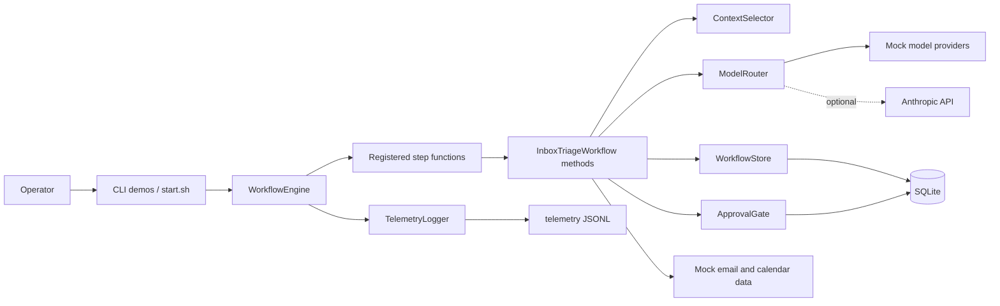

The engine orchestrates registered steps. Step bodies live on `InboxTriageWorkflow` and call selector, router, approval, and store through a shared dependencies dict (including telemetry injected by the engine).

## Extension Pattern

Sibling extension packages may use the fixed-step `WorkflowEngine` when their work naturally maps to registered steps, or they may wrap the lower-level `WorkflowStore` directly when their domain has its own execution loop. In both cases, extensions keep their schemas additive, store durable checkpoints through `WorkflowStore`, and use `TelemetryLogger.log_event()` for domain-specific events.

Current implemented examples follow both shapes: Readiness registers agent turns as deterministic workflow steps, while Colony adds `colony_*` tables and checkpoints job stages through `WorkflowStore.save_checkpoint()`. Draft extensions such as Target Planner should follow the same boundary: no core table rewrites, no hidden in-memory state, and no new claim in this architecture document until the implementation exists.

## Module Dependencies

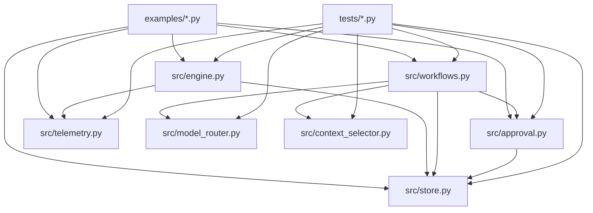

`engine.py` does not import `workflows.py`. Demos and tests construct `InboxTriageWorkflow`, call `register(engine)` to bind step functions, and pass `workflow.dependencies()` into the engine constructor.

## Inbox Triage Workflow

Step indices shown in parentheses. Checkpoints occur after each completed step.

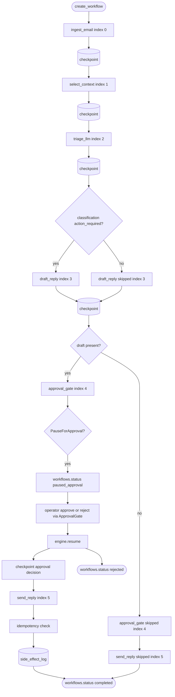

Informational or fyi messages skip draft, approval queue, and send. Rejection is recorded during `resume()`, not by re-entering `approval_gate`.

## Golden Path Sequence

Action-required email with operator approval before send.

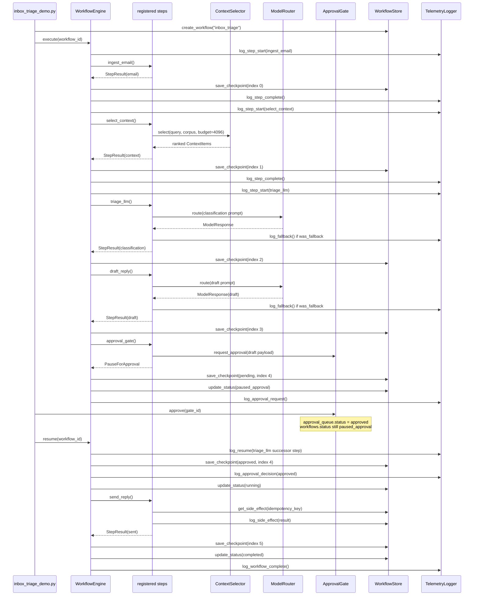

## Crash Recovery Sequence

Process-level crash during `triage_llm` (index 2). Parent resumes at index 2, not from ingest.

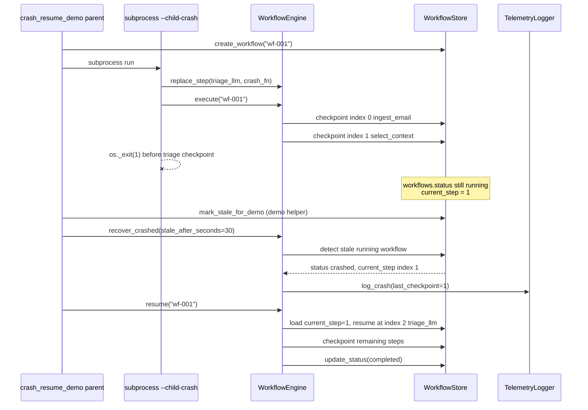

## Workflow State Machine

States in `workflows.status`. Approval queue updates are separate until `resume()` applies them.

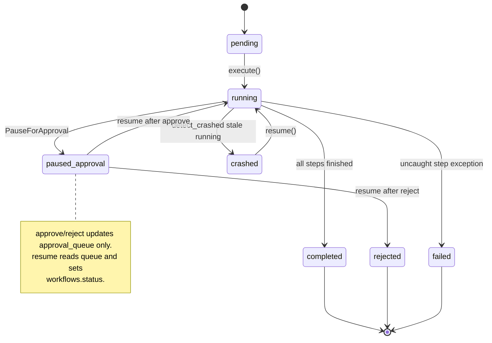

Brief intermediate `approved` on the workflow row may appear inside `_resume_index_after_approval()` before the next step runs; externally the workflow returns to `running`.

## Approval Gate

Two layers: gate queue (`approval_queue`) and workflow status (`workflows`).

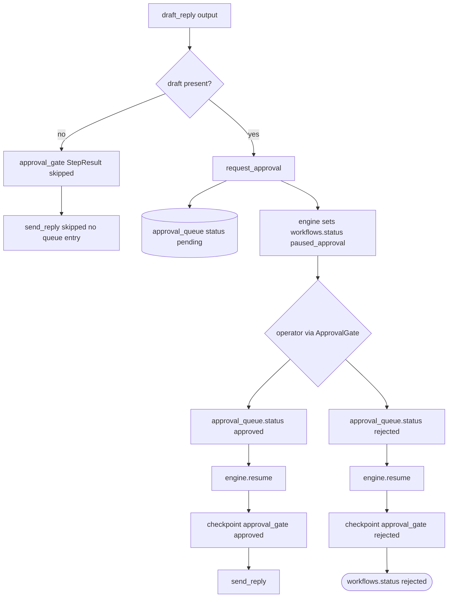

## SQLite Persistence Model

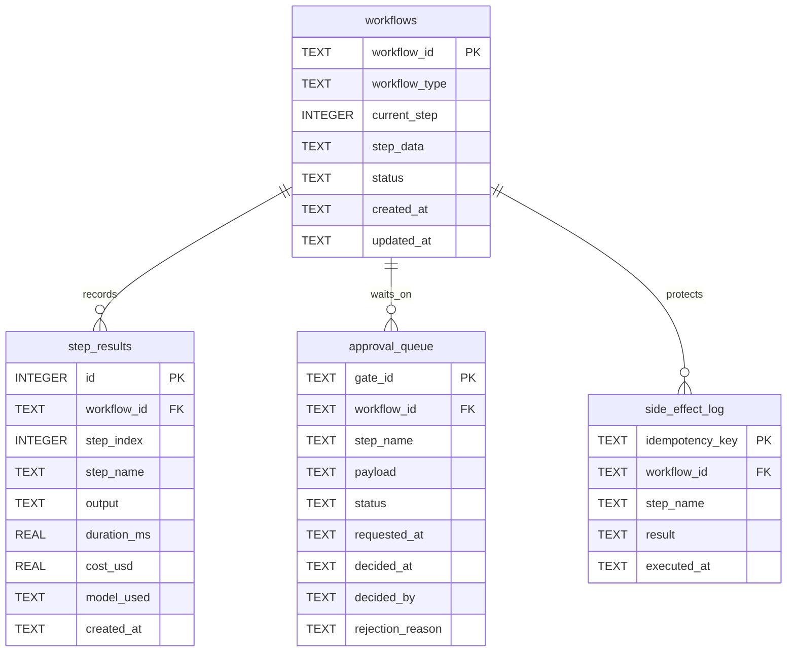

`step_data` is a JSON object accumulating each step's output by step name. `current_step` is the last completed step index.

## Model Routing And Fallback

Mock providers support `fail=True` and `mock_delay_seconds` exceeding `timeout_seconds` to simulate timeout. Real Anthropic calls use the SDK client timeout.

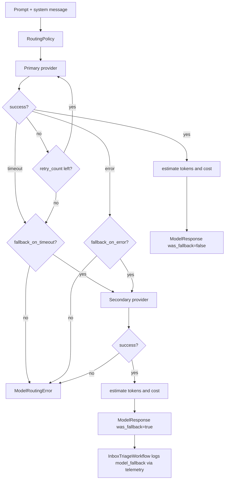

## Context Selection Under Token Budget

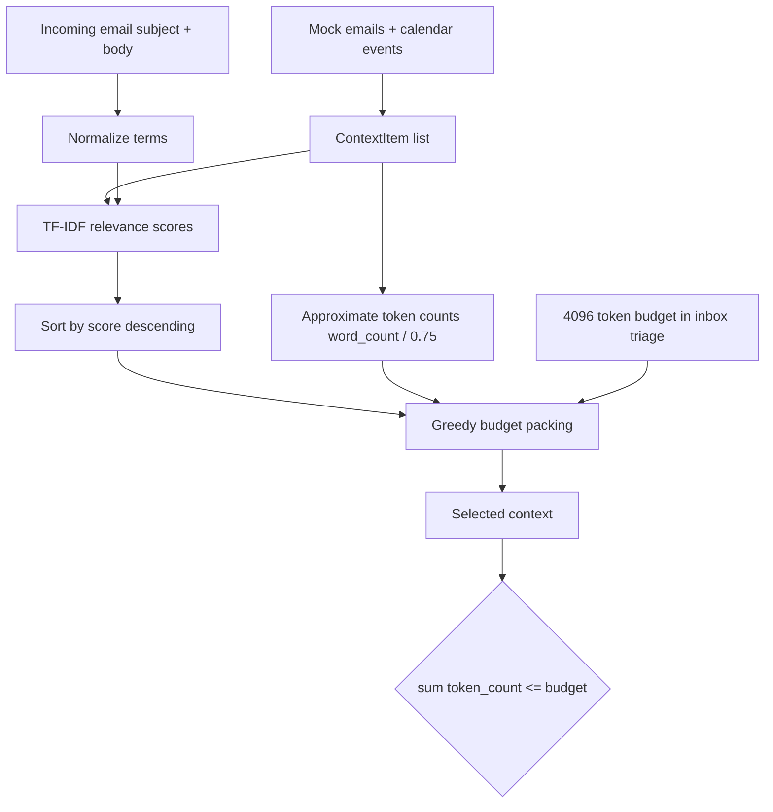

## Idempotent Send

Key format in code: `sha256("{workflow_id}:send_reply:{payload_hash}")`.

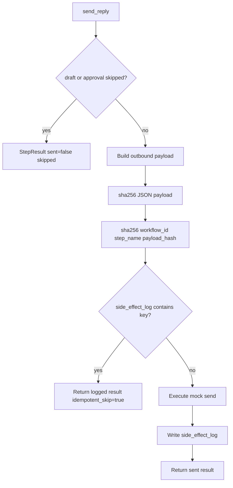

## Telemetry Events

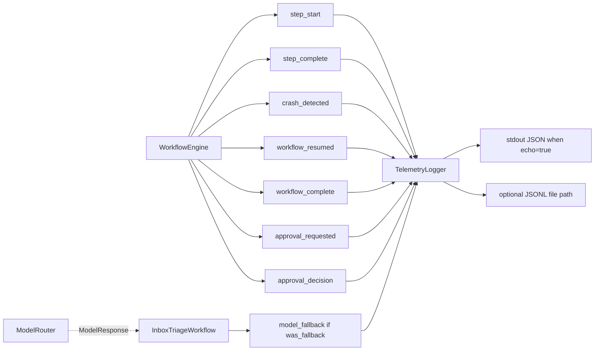

## Demo Execution Paths

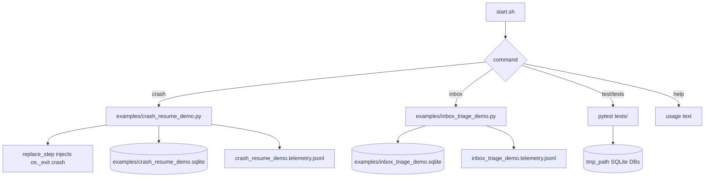

## Non-Goals

This reference runtime intentionally excludes: concurrent workflow workers, real email or calendar APIs, embedding-based retrieval, production-grade tokenizers, and governance or authorization policy beyond the approval gate. See README **What This Is Not** for the production-oriented replacement stack.
