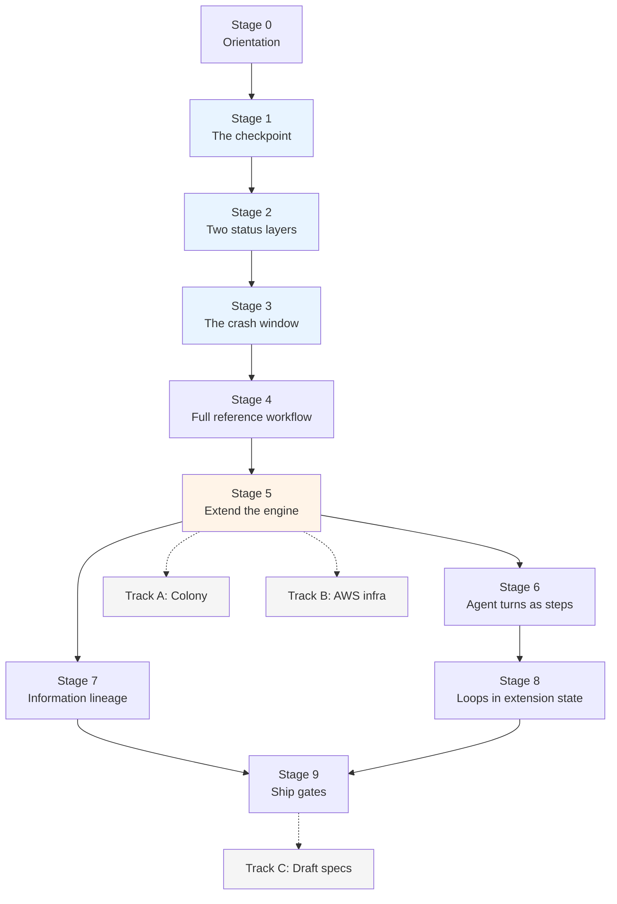

# DurableFlow Learning Path

**Audience:** Anyone who needs to hold this repo in their head — new contributors, reviewers, and authors returning to spec-driven work whose code has outgrown their memory of it.

**Purpose:** A staged path where each stage depends on the one before it. [walkthrough.md](walkthrough.md) explains *what exists and why*; this document is *the order to learn it in*, with a verification gate at every stage so you know whether you actually got it.

**How this differs from the other docs:**

| Doc | Genre | Use it to |
|-----|-------|-----------|
| [README.md](../README.md) | Quick start | Run something in 2 minutes |
| **learning-path.md** (this) | **Staged curriculum** | **Build understanding in dependency order** |
| [walkthrough.md](walkthrough.md) | Reference + index | Look up why a package exists |
| [dflow-arch.md](dflow-arch.md) | Diagrams + invariants | See the state machine and schema |
| [exercises.md](exercises.md) | Task list | Drill one primitive |
| `*-spec.md` | Contracts | Change behavior safely |

---

## How to use this

Each stage has the same five parts. Do not skip the last two — they are the difference between reading and knowing.

1. **Question** — the one thing this stage answers.
2. **Run** — produce an artifact before reading about it.
3. **Read** — specific files and line ranges, not whole documents.
4. **Predict, then verify** — write down your answer *before* running the check. A wrong prediction is the highest-value moment in this path; it locates a false belief precisely.
5. **Gate** — the claim you should be able to defend. If you can't, re-read; do not advance.

**Ground rule:** use a scratch database (`/tmp/learn-N.sqlite`) whenever you experiment, so demo databases in `examples/` stay clean for comparison.

**Total:** roughly 8 focused hours to Stage 9. Stages 0–5 (about 3.5 hours) are the load-bearing core; everything after is optional and selectable by interest.

---

## Concept dependency map



Stages 1–3 are the spine: **checkpoint, gate, crash window.** Every extension in this repo is a variation on those three. Stage 5 is the comprehension gate — if you can add a step without breaking checkpoint semantics, the rest of the repo becomes legible. Stages 6–9 fan out and can be taken in any order the arrows allow.

---

# Part I — The Core Spine

## Stage 0 — Orientation

**Time:** 15 min · **Prereq:** Python 3.11+, macOS or Linux · **Question:** What does this repo actually produce?

### Run

```bash
./start.sh crash      # process is killed mid-workflow, then resumes
./start.sh test       # full suite, no API keys needed
```

### Read

Only this, and only once: [walkthrough.md § The Throughline](walkthrough.md#the-throughline) through [§ Architectural Layers](walkthrough.md#architectural-layers) (lines 11–51). Roughly 5 minutes. Ignore the rest of that file for now — it is a reference index and will not reward linear reading yet.

### Predict, then verify

The crash demo killed the process with a real `os._exit`, not a mocked exception. **Predict:** after the kill, how many rows are in `step_results`, and what is `workflows.current_step`?

```bash
sqlite3 examples/crash_resume_demo.sqlite \
  "SELECT workflow_id, current_step, status FROM workflows;
   SELECT step_index, step_name FROM step_results ORDER BY step_index;"
```

### Gate

You can state the repo's thesis in one sentence without using the word "agent": *checkpoint every completed unit of progress to durable storage, so failure costs one step instead of the whole run.*

---

## Stage 1 — The checkpoint

**Time:** 45 min · **Prereq:** Stage 0 · **Question:** What exactly is a checkpoint, and when is it written?

This is the single most important stage. Everything else in the repo is a variation on it.

### Read

Two files, in this order. Together they are under 800 lines and everything else in the repo assumes them.

| File | Focus | Why |
|------|-------|-----|
| [src/store.py:83-137](../src/store.py#L83-L137) | `_init_schema` | Four tables: `workflows`, `step_results`, `approval_queue`, `side_effect_log`. Read the schema before any logic — the tables *are* the mental model. |
| [src/store.py:165-208](../src/store.py#L165-L208) | `save_checkpoint` | The one write that makes progress durable. |
| [src/engine.py:47-105](../src/engine.py#L47-L105) | `WorkflowEngine`, `execute`, `resume` | The public surface: register steps, run from `current_step + 1`. |
| [src/engine.py:190-252](../src/engine.py#L190-L252) | `_run_from_step` | The whole loop. Read this line by line. |

While reading `_run_from_step`, note the ordering at [engine.py:236](../src/engine.py#L236): the step function runs to completion **first**, and `save_checkpoint` is called **after** it returns. Hold that thought — Stage 3 is entirely about the gap between those two lines.

### Predict, then verify

`current_step` after the crash was `1`, and `select_context` is index 1. **Predict:** when the workflow resumes, does it re-run `select_context`, or start at `triage_llm`?

Find your answer in the code before running anything — [engine.py:89-105](../src/engine.py#L89-L105). Then confirm against the telemetry:

```bash
jq -c 'select(.event_type=="step_start") | .step_name' \
  examples/crash_resume_demo.telemetry.jsonl
```

If `select_context` appears once, resume skipped it. If twice, it re-ran. Which is it, and which line of code decides?

### Gate

You can answer: **"If the process dies between two steps, what is lost?"** — and name the exact line that bounds the loss. You can also explain why `current_step` means *last completed* index rather than *next to run*, and what would break if it meant the other thing.

---

## Stage 2 — Two status layers

**Time:** 45 min · **Prereq:** Stage 1 · **Question:** How does a human decision survive a restart?

### Run

```bash
./start.sh inbox
# when prompted, REJECT the draft
```

### Read

| File | Focus |
|------|-------|
| [src/approval.py:24-102](../src/approval.py#L24-L102) | `ApprovalGate` — `request_approval`, `approve`, `reject` |
| [src/engine.py:212-224](../src/engine.py#L212-L224) | The `PauseForApproval` branch inside the run loop |
| [src/engine.py:112-189](../src/engine.py#L112-L189) | `_resume_index_after_approval` and `_approval_rejection_policy` |

The key structural fact, stated in [walkthrough.md:76](walkthrough.md#L76): **`workflows.status` is execution state; `approval_queue.status` is the operator decision.** They are deliberately separate tables. The engine never asks a human anything — it halts, and a *different* process records the decision.

Notice at [engine.py:212-221](../src/engine.py#L212-L221) that pausing still writes a checkpoint — at the *same* index, with `pending: True`. Ask yourself why a pause is a checkpoint at all.

### Predict, then verify

**Predict:** after your rejection, what is `workflows.status`, and how many rows are in `side_effect_log`?

```bash
sqlite3 examples/inbox_triage_demo.sqlite \
  "SELECT status FROM workflows;
   SELECT status, decided_by FROM approval_queue;
   SELECT COUNT(*) FROM side_effect_log;"
```

Now the harder one. `ApprovalRejectionPolicy` at [engine.py:23-27](../src/engine.py#L23-L27) has more than one value. **Predict** what changes if a step's policy is *continue* rather than *terminate*, then read [engine.py:184-189](../src/engine.py#L184-L189) and [walkthrough.md:76](walkthrough.md#L76). Which extension needs the *continue* semantics, and why can't it use the default?

### Gate

You can explain why approval state lives in its own table instead of a column on `workflows`, and describe what a reviewer would lose if the two were merged.

---

## Stage 3 — The crash window

**Time:** 30 min · **Prereq:** Stages 1–2 · **Question:** Why do idempotency keys exist?

This stage is short and is the sharpest idea in the repo.

### Read

[src/workflows.py:346-392](../src/workflows.py#L346-L392) — `send_reply`. Trace the order of operations: it checks `get_side_effect(key)` *before* performing the send, and calls `log_side_effect` as part of doing it.

Then re-read [engine.py:236](../src/engine.py#L236). The step function — including the external send — completes, and *only then* is the checkpoint written.

### Predict, then verify

**Predict:** a process is killed in the microseconds between the send completing and `save_checkpoint` returning. On resume, the engine re-runs the step, because from its perspective the step never finished. Does the customer get two emails?

Then read [store.py:283-313](../src/store.py#L283-L313) (`log_side_effect`, `get_side_effect`) and run:

```bash
./start.sh test 2>&1 | grep -i idempotent
pytest tests/test_resume.py -v -k idempotent
```

### Gate

You can draw the crash window on a whiteboard — the interval between "external effect happened" and "we durably know it happened" — and explain why no amount of checkpointing closes it, only idempotency keys make it survivable. This is the argument that separates a durable runtime from a retry loop.

---

## Stage 4 — The reference workflow end to end

**Time:** 45 min · **Prereq:** Stages 1–3 · **Question:** How do the remaining core primitives compose?

You now understand checkpoint, gate, and idempotency. The remaining three core modules are comparatively simple, and the inbox workflow exists to exercise all six in one readable path.

### Read

```text
ingest_email → select_context → triage_llm → draft_reply → approval_gate → send_reply
     0              1              2             3              4             5
```

| Module | Lines | Primitive |
|--------|-------|-----------|
| [src/context_selector.py](../src/context_selector.py) | 122 | TF-IDF rank, greedy pack under a hard token budget |
| [src/model_router.py](../src/model_router.py) | 258 | Primary → secondary fallback, per-call cost accounting |
| [src/telemetry.py](../src/telemetry.py) | 197 | JSONL structured events |
| [src/workflows.py:19-56](../src/workflows.py#L19-L56) | — | `InboxTriageWorkflow.register()` — how steps get wired to the engine |

Read `register()` closely. The engine does not import workflow logic; workflows register `(name, fn)` pairs into it. That inversion is what makes every extension in Part II possible.

### Predict, then verify

Do [exercises.md § Exercise 3](exercises.md) (force model fallback) and [§ Exercise 4](exercises.md) (context budget). Both take about 10 minutes and are already written as predict-verify drills.

Then a contract-versus-configuration drill — a valuable habit in a spec-driven repo. The selector's contract is a hard ceiling supplied by its caller; `4096` is the large-corpus acceptance-test budget, not a global runtime constant. **Predict** the value chosen by the reference workflow, then look:

```bash
grep -rn 'token_budget' src/workflows.py
grep -rn '4096' src tests
```

Explain why `300` in `src/workflows.py` and `4096` in `tests/test_context_budget.py` do not conflict: the invariant is `sum(selected.token_count) <= token_budget`, regardless of the configured value. Then confirm that the golden-path spec and architecture diagram distinguish the reference configuration from the acceptance-test fixture.

### Gate

You can name all six core primitives, the module that owns each, and the step of inbox triage that exercises it — from memory.

---

## Stage 5 — Extend the engine (comprehension gate)

**Time:** 60 min · **Prereq:** Stages 1–4 · **Question:** Can I add durable behavior without breaking it?

**Do not skip this stage.** Everything up to here is reading. This is the first stage where the repo can tell you that you are wrong, and it is the gate between Part I and Part II.

### Build

Complete [exercises.md § Exercise 7](exercises.md): add a seventh step, `archive_thread`, after `send_reply`.

Requirements, all of which follow from Stages 1–3:

- [ ] New method on `InboxTriageWorkflow`, registered in `register()`
- [ ] Returns a `StepResult`; reads prior output from `step_data`
- [ ] A full run produces **seven** rows in `step_results`
- [ ] A test asserting the new output appears in `step_data`
- [ ] `./start.sh test` still fully passes — no core regressions

### Predict, then verify

Before running: **predict** whether an in-flight workflow that was checkpointed at step 5 under the *old* six-step registration will complete, fail, or hang when resumed against the *new* seven-step engine. Then create exactly that situation on a scratch database and find out.

This is not a trick question — it is the migration problem every durable execution system has, and this repo's answer is visible in `_run_from_step`'s loop bound.

### Gate

Your step is checkpointed like any other, your test passes, the suite is green, and you can state the constraint in your own words: *the engine is a linear step runner; branching and loops belong in extension-owned state, not in the step list.* Stage 8 is that constraint's hardest test case.

---

# Part II — Extension Tracks

Each track is independent and reuses the Part I primitives to answer a different operational question. **Take them in this order if you have no strong preference** — it runs shallowest-to-deepest and each one makes the next easier. If you have a specific question, jump to the matching stage.

| If you care about… | Go to |
|--------------------|-------|
| Shipping an agent safely | Stage 6 |
| Auditing what the model saw | Stage 7 |
| Long-running, self-correcting workflows | Stage 8 |
| Preventing regressions in CI | Stage 9 |
| Cheap unreliable compute | Track A |
| Production topology | Track B |

**A note on scope:** four tracks in this repo are draft specs, not running code — Target Planner, DataFlow, and portions of the LangSmith and OpenTelemetry adapters. They are deliberately deferred to Track C. Reading a draft spec as if it were implemented is the main way to get confused here.

---

## Stage 6 — Agent turns as durable steps

**Time:** 60 min · **Prereq:** Stage 5 · **Question:** How does a reason-act-observe loop become durable?

### Run

```bash
./start.sh readiness    # naked vs wrapped agent, verdict-first report
./start.sh mcp          # gated write over the mock legacy CRM
```

Read the generated [readiness_report.md](../readiness_report.md) before any source.

### Read

| File | Focus |
|------|-------|
| [agent/runner.py:139-205](../agent/runner.py#L139-L205) | `register` and `_make_turn_step` — **the central trick: one agent turn = one engine step** |
| [agent/runner.py:206-231](../agent/runner.py#L206-L231) | `_make_commit_handler` — approval resumption for a turn |
| [agent/runner.py:270-305](../agent/runner.py#L270-L305) | `_execute_write_once`, `_idempotency_key` — Stage 3's idea, applied to tool calls |
| [agent/mini_react.py](../agent/mini_react.py) | 82 lines; the whole agent |
| [readiness/harness.py](../readiness/harness.py) | The six injected failure modes |

The 82-line agent is the point: the intelligence is trivial, the durable shell around it is the product.

### Predict, then verify

The strongest demo is prompt injection. **Predict** what the naked agent does versus the wrapped agent when a tool observation contains an injected instruction to perform an unsafe write. Then find both outcomes in `readiness.json` and locate the line in `runner.py` that produces the difference.

### Gate

You can explain how `AgentRunner` gets crash recovery *for free* without `WorkflowEngine` knowing what an agent is — and connect it to the `register()` inversion you read at Stage 4.

**Next:** [readiness/README.md](../readiness/README.md) → [field-pattern.md](field-pattern.md) (the six-item deployment checklist).

---

## Stage 7 — Information lineage

**Time:** 45 min · **Prereq:** Stage 5 · **Question:** What information justified the decision?

### Run

```bash
./start.sh context
python -m context.cli audit --db examples/inbox_triage_context_demo.sqlite --workflow-id <id>
```

### Read

| File | Focus |
|------|-------|
| [context/models.py](../context/models.py) | `InfoArtifact`, `ContextLedgerEvent`, `DecisionRecord`, `DecisionLineage` |
| [context/ledger.py](../context/ledger.py) | Additive `context_*` tables — **no core schema was modified** |
| [src/workflows.py:477-563](../src/workflows.py#L477-L563) | `_record_consumed`, `_record_model_context` — the integration seam |
| [src/engine.py:271-298](../src/engine.py#L271-L298) | `_link_context_decisions` |

Lifecycle: `observed → retrieved → {selected, rejected} → consumed → influential`.

### Predict, then verify

The context demo uses a deliberately small token budget so rejection is visible. **Predict** whether a rejected artifact appears in the audit trace at all. Then check — and read the rejection *reason* recorded alongside it.

Then the boundary question: influence is accepted only from explicit structured attribution or deterministic fixtures, never inferred from model prose ([walkthrough.md:194](walkthrough.md#L194)). **Predict** what a "selected but not influential" artifact means, and why the audit shows it rather than hiding it.

### Gate

You can explain the difference between *selected* and *influential*, and state one thing the v0.2a audit **does not** prove. If you can't name a non-claim, re-read [context-extension.md](context-extension.md) — the boundaries are the credibility.

---

## Stage 8 — Loops belong in extension state

**Time:** 60 min · **Prereq:** Stage 6 · **Question:** How does a linear engine host a self-correcting workflow?

This is the deepest stage, and the direct answer to Stage 5's constraint. It is also the stage most relevant if you built this repo spec-first, because Factory *is* a spec-driven workflow implemented on the unchanged engine.

### Read

| File | Focus |
|------|-------|
| [factory/clear_workflow.py](../factory/clear_workflow.py) | Eight macro steps on the **unchanged** `WorkflowEngine` |
| [factory/phase_store.py](../factory/phase_store.py) | `clear_phase_state` table — where the loop actually lives |
| [factory/remediation.py](../factory/remediation.py) | Five Whys remediation cycle |
| [factory/verification_ledger.py](../factory/verification_ledger.py) | Independent claim verification before `ship` completes |

CLEAR = Context → Layout → Execute → Assess → Remediate → Run.

### Predict, then verify

The implement/assess/remediate micro-loop can iterate an unbounded number of times, but the engine's step list is fixed. **Predict** where the iteration count is stored and what happens to it on crash. Then find it in `clear_phase_state` and check your answer against `phase_runner`.

Run the CLEAR tests and read one closely:

```bash
pytest tests/test_clear_phase_runner.py tests/test_clear_crash_subprocess.py -v
```

### Gate

You can explain why putting the loop in the engine would have been the wrong design, in terms of checkpoint semantics from Stage 1 — and why `verification_ledger.py` exists at all, i.e. why implementer assertion is not accepted as evidence of completion.

---

## Stage 9 — Ship gates

**Time:** 45 min · **Prereq:** Stage 7 or 8 · **Question:** Did a change regress known-good behavior?

### Read

The pipeline is `traces → eval cases → scorers → verdict`:

| File | Role |
|------|------|
| [evals/cases.py](../evals/cases.py) | Normalize completed runs into `EvalCase` (redacted) |
| [evals/scorers.py](../evals/scorers.py) | Pluggable `EvalScorer` interface |
| [evals/gate.py](../evals/gate.py) | Aggregate `ScoreResult` → `EvalGateReport` |
| [golden.md](../golden.md) | Domain scenarios and expected anchors |
| [verification/deferred-items.md](../verification/deferred-items.md) | Claims explicitly *not* yet proven |

```bash
python -m evals.cli --help
pytest tests/test_eval_gate.py tests/test_eval_scorers.py -v
```

### Predict, then verify

The gate returns three outcomes, not two: passed, failed, **incomplete**. **Predict** what distinguishes *incomplete* from *failed*, and why a ship gate needs that third state. Then confirm in `gate.py`.

### Gate

You can trace one golden case from a completed workflow trace all the way to a ship verdict, and explain why domain rubrics deliberately live outside DurableFlow.

Read [verification/deferred-items.md](../verification/deferred-items.md) in full. Given how this repo was built, it is the most useful single file for reconciling what the specs claim against what is actually proven.

---

# Part III — Optional Tracks

## Track A — Colony (measured durability)

**Prereq:** Stage 5 · **Question:** Does durable checkpointing beat naive retry under identical instance loss?

```bash
python examples/chaos_benchmark_demo.py
python examples/single_eviction_demo.py
```

Read [colony/README.md](../colony/README.md) → [colony-methodology.md](colony-methodology.md) → `colony/benchmark.py`. The deliverable is the comparison table, not the controller code.

**Gate:** you can state one threat to validity in the benchmark without looking it up. The methodology doc leads with them; a benchmark whose author can't name its weaknesses isn't evidence.

## Track B — AWS deployment sketch

**Prereq:** Stage 5 · **Question:** How do these abstractions map to production infrastructure?

Read [infra/README.md](../infra/README.md), [infra/durableflow_stack.py](../infra/durableflow_stack.py), [worker.py](../worker.py), then [store.py:400-474](../src/store.py#L400-L474) (`PostgresWorkflowStore`).

**Gate:** you can name what changes and what stays identical when SQLite becomes Aurora. The answer should be short — that is the point of the abstraction.

## Track C — Draft specs (not implemented)

**Prereq:** Stage 9 · Read these only once you can distinguish spec from code by reflex.

- [planner/planner-spec.md](../planner/planner-spec.md) — budgeted local-first routing
- [dataflow-spec.md](../dataflow-spec.md) — typed data DAG lineage
- [opentelemetry-adapter-proposal.md](opentelemetry-adapter-proposal.md), [aws-deployment-proposal.md](aws-deployment-proposal.md)

**Gate:** for each, you can say what would have to be built and which existing tests would need to change. That is the difference between a spec you've read and a spec you could execute.

---

## Where to go after

| Goal | Path |
|------|------|
| Change core behavior | [dflow-spec.md](dflow-spec.md) + `tests/` |
| Add an extension | [dflow-arch.md § Extension Pattern](dflow-arch.md) — additive tables, optional deps, verdict-first output |
| Look something up | [walkthrough.md § Repository Index](walkthrough.md#repository-index-all-spec-files) — all 9 specs and 7 READMEs |
| Explain the repo to someone else | [durable-flow-overview.md](../durable-flow-overview.md) (portfolio) + [competitive-differentiation-and-space-map.md](../competitive-differentiation-and-space-map.md) (positioning) |
| Contribute | [CONTRIBUTING.md](../CONTRIBUTING.md) |

---

## Self-assessment

You have genuinely absorbed this repo when you can answer all of these without looking:

1. If the process dies between two steps, what is lost — and which line bounds it?
2. Why is approval state in a separate table from workflow status?
3. Why can't checkpointing alone prevent a duplicate side effect?
4. Why is the engine a linear step runner rather than a graph orchestrator?
5. Where does a loop live, if not in the engine?
6. How does `AgentRunner` get crash recovery without the engine knowing about agents?
7. What is the difference between a *selected* and an *influential* context artifact?
8. Name one thing each implemented track explicitly does **not** prove.

Question 8 is the one that matters most. In this repo the boundaries are load-bearing: every track states what it does not prove, and a reviewer who can only recite the claims has read half of it.
