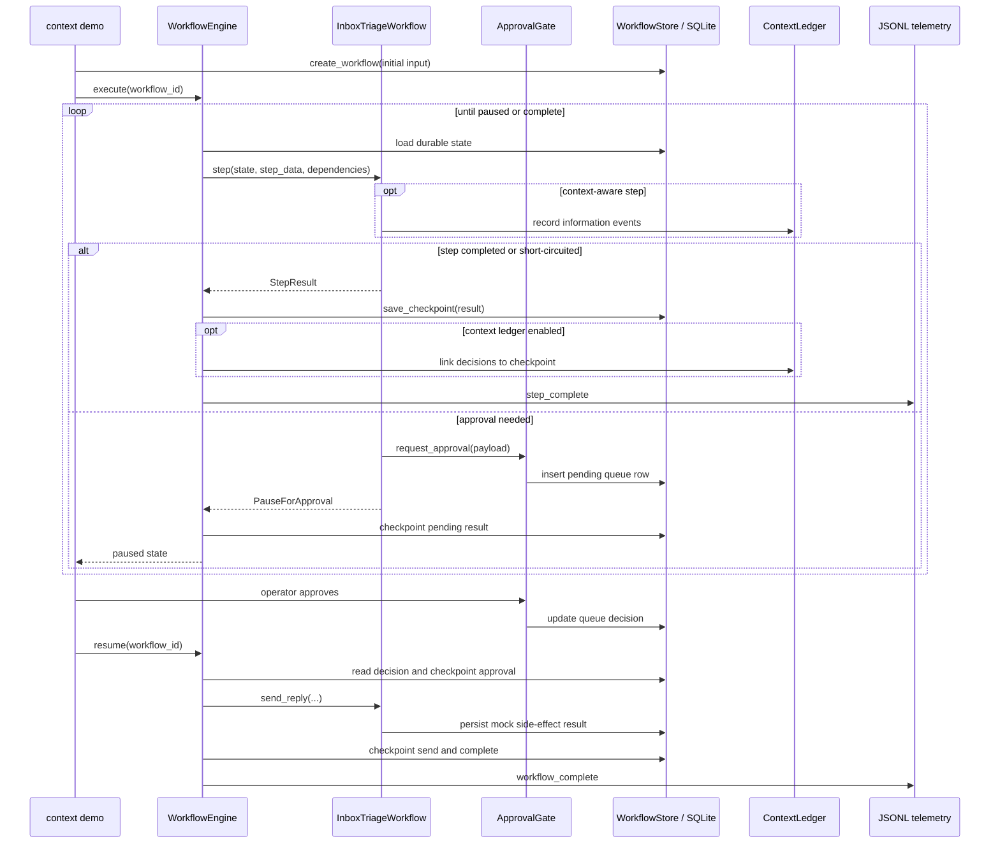
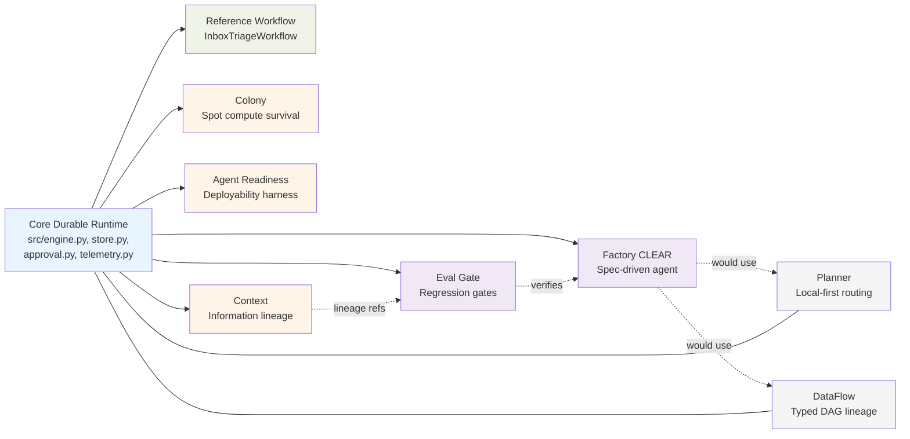

# DurableFlow Repository Walkthrough

**Audience:** Engineers onboarding to the repo, reviewers assessing scope, or contributors deciding where to work next.

**Purpose:** Explain why each part of the repository exists, how it was implemented, and how the pieces fit together through a single architectural throughline. This document is also the **canonical index** for every `*-spec.md` and `README.md` in the repo (9 specs, 7 READMEs).

## Start Here

### What you should understand after reading

You do not need to memorize every package. A successful first pass leaves you able to answer five questions:

1. What failure is DurableFlow designed to survive?
2. What exactly is persisted after each step, and where?
3. How do approval and side-effect state differ from workflow execution state?
4. Why is inbox triage the reference workflow rather than the product?
5. Which repository areas are implemented proof tracks, deployment sketches, or draft specifications?

### Choose a route

- **Ten-minute orientation:** read [The Throughline](#the-throughline), [Why the Core Exists](#why-the-core-exists), and [Follow One Run](#follow-one-run). Then stop.
- **Learn by running the code:** use [learning-path.md](learning-path.md), which pairs selected parts of this document with demos, source, predictions, and verification gates.
- **Look up a package or contract:** jump to [Extension Tracks](#extension-tracks-and-how-they-fit) or the [Reference Appendix](#reference-appendix).

This file is both an orientation and a reference. The opening sections build the runtime mental model; later sections widen into optional tracks and exhaustive indexes.

**Related:** [README](../README.md) (quick start) · [dflow-arch.md](dflow-arch.md) (diagrams) · [durable-flow-overview.md](../durable-flow-overview.md) (product portfolio) · [docs/README.md](README.md) (supplementary doc index)

---

## The Throughline

Most agent demos optimize for intelligence — prompts, tools, retrieval, and answers. DurableFlow optimizes for **survivability and inspectability**: can a multi-step agentic workflow complete under crashes, approvals, cost pressure, context limits, side effects, and unreliable compute — and can a reviewer **prove** what happened afterward?

Everything in this repository hangs off one pattern:

> **Wrap agentic work in a durable shell.** Checkpoint after every completed unit of progress. Persist operator decisions separately from execution state. Guard retries with deterministic idempotency keys. Emit structured telemetry. Then add optional proof tracks that answer adjacent operational questions (compute reliability, deployability, information lineage, spend control, typed data flow, post-run evaluation).

The inbox triage workflow is not the product. It is the **reference vehicle** that makes the shell concrete. Extensions reuse the same primitives (`WorkflowStore`, checkpoint semantics, telemetry, model routing) but ask different questions.

One boundary matters from the start: the reference workflow demonstrates **local replay suppression for a mock send**, not atomic exactly-once delivery to a remote email service. A production adapter must pass the idempotency key to a downstream service that honors it, or use an outbox/reconciliation design. A local SQLite record cannot by itself make a network effect atomic.

---

## Architectural Layers

Think of the repo as four stacked layers:

```text
┌─────────────────────────────────────────────────────────────────┐
│  Proof tracks (optional, additive)                              │
│  Colony · Readiness · Context · Eval Gate · Planner (draft)     │
│  DataFlow (draft) · LangSmith adapter · Factory/CLEAR example   │
├─────────────────────────────────────────────────────────────────┤
│  Agent loop (reason-act-observe on top of the engine)           │
│  agent/ · readiness harness · mcp_server/                       │
├─────────────────────────────────────────────────────────────────┤
│  Reference workflow + demos                                     │
│  src/workflows.py · examples/ · data/                           │
├─────────────────────────────────────────────────────────────────┤
│  Core durable runtime (stdlib + SQLite)                         │
│  src/engine.py · store.py · approval.py · model_router.py ·     │
│  context_selector.py · telemetry.py                              │
└─────────────────────────────────────────────────────────────────┘
         │                              │
         ▼                              ▼
   Local SQLite (default)      infra/ + worker.py (AWS sketch)
```

**Design rule across layers:** extensions add tables and packages; they do not rewrite core schema or hide state in memory. Demos run without API keys. Optional integrations (Anthropic, MCP, ADK, LangSmith, Vast) are gated behind extras and env vars.

**Evidence spine:** `tests/`, `golden.md`, and `verification/` are not product layers, but they matter architecturally. Specs define the contract, tests prove local behavior, golden cases anchor regression expectations, and verification records deferred or independently checked claims. When a track says "implemented," the intended proof path is spec -> code -> deterministic test/demo -> verdict or audit artifact.

---

## Why the Core Exists

### Problem statement

Production assistant workflows fail operationally long before they fail intellectually:

| Scaling problem | Core mechanism | Module |
|-----------------|----------------|--------|
| Partial failure mid-workflow | Checkpoint after each step; resume from last index | `src/engine.py`, `src/store.py` |
| Unsafe or user-facing actions | Pause on `PauseForApproval`; persist gate in SQLite | `src/approval.py` |
| Duplicate mock side effects on retry | Deterministic key lookup + persisted mock result | `src/workflows.py` (`send_reply`) |
| Provider timeout / 5xx | Primary → secondary fallback with cost accounting | `src/model_router.py` |
| Context corpus exceeds model window | TF-IDF rank + greedy pack under hard token budget | `src/context_selector.py` |
| Non-deterministic path audit | JSONL telemetry for steps, crashes, fallback, approvals | `src/telemetry.py` |

### Implementation shape

The core follows a deliberately small contract:

1. **`WorkflowStore`** owns the core durable state: `workflows`, `step_results`, `approval_queue`, `side_effect_log`. WAL mode SQLite; optional `PostgresWorkflowStore` for the AWS sketch.
2. **`WorkflowEngine`** is a **linear step runner**. It registers `(name, fn)` pairs, runs from `current_step + 1`, checkpoints after each completed step, and stops on `PauseForApproval`.
3. **Step functions** receive `(WorkflowState, step_data, dependencies)` and return `StepResult` or `PauseForApproval`. They are registered by demos/extensions — the engine does not import workflow logic.
4. **Two status layers:** `workflows.status` (execution) vs `approval_queue.status` (operator decision). Approve/reject updates the queue; `resume()` reads it and updates workflow status.

This is intentionally **not** a graph orchestrator. Branching and loops live in extension-owned state (see Factory `phase_runner`, Agent turns as steps, Colony job stages).

**Spec:** [docs/dflow-spec.md](dflow-spec.md) (READY — full acceptance criteria and test plan)  
**Diagrams:** [docs/dflow-arch.md](dflow-arch.md)

---

## The Reference Workflow: Inbox Triage

`InboxTriageWorkflow` in `src/workflows.py` exists to exercise every core primitive in one readable path:

```text
ingest_email → select_context → triage_llm → draft_reply → approval_gate → send_reply
     0              1              2             3              4             5
```

**Why this scenario:** Email triage combines retrieval (context selection), non-deterministic model calls (classification + draft), human gate (approval), and a side effect (send) — the same shape as many production assistants.

**How it connects:**

- Mock corpus from `data/mock_emails.json` and `data/mock_calendar.json`
- `ContextSelector.select()` ranks prior emails/events using term frequency × smoothed inverse document frequency, then greedily packs them under a hard budget; the inbox context demo currently uses `token_budget=300` so selected/rejected lineage is easy to inspect, while budget behavior is also tested at 4096 tokens
- `ModelRouter.route()` calls mock providers by default; optional Anthropic via `ANTHROPIC_API_KEY`
- Informational emails still pass through all six linear steps, but the draft, approval, and send steps return checkpointed `skipped` results instead of doing their normal work
- When a `ContextLedger` is injected via dependencies, steps record observed/retrieved/selected/rejected/consumed events and explicit decision lineage (Context extension)

**Retrieval method label vs algorithm (`bm25` mismatch):**

`SelectionResult.retrieval_method` defaults to and is serialized as `"bm25"` (see `src/context_selector.py`, and assembly-lineage metadata on `retrieved` events in `src/workflows.py`). That string is a **metadata label only**. It is not a claim that Okapi BM25 is implemented.

What `_score_relevance()` actually does, for each document and each query term present in the document:

1. **Term frequency in the query** — `query_tf` from a bag-of-words count on the query.  
2. **Term frequency in the document** — raw count of that term in the item content (no BM25-style saturation such as `tf / (tf + k1 · (1 − b + b · |d|/avgdl))`).  
3. **Smoothed IDF** — `log((N + 1) / (df + 1)) + 1` over the in-memory corpus, then  
4. **Accumulate** `query_tf * doc_tf * idf` and sort by score (timestamp as tie-break).

That is a simple **TF × smoothed-IDF** product (the same family the rest of the docs call “TF-IDF-like”), followed by greedy token-budget packing in `_pack_budget`. Classic BM25 also length-normalizes documents and saturates term frequency; this selector does neither.

**How to read lineage and audits:** if a context audit or `retrieved` event shows `retrieval_method: bm25`, treat it as a **label mismatch / historical name**, not as evidence of BM25 ranking. For claims and measurements, describe the baseline as TF × smoothed-IDF (or “TF-IDF-like”) unless the code and the label are fixed together. A future change should either implement real BM25 and keep the label, or rename the label (e.g. `tf_idf`) to match the implementation — both at once, so lineage stays honest.

**Entry points:**

| Demo | What it proves |
|------|----------------|
| `examples/crash_resume_demo.py` | Subprocess `os._exit`; resume from checkpoint |
| `examples/inbox_triage_demo.py` | Golden path + interactive approval |
| `examples/inbox_triage_context_demo.py` | Inbox triage + context audit trace |
| `./start.sh` | Wrapper for crash, inbox, context, readiness, mcp, test |

---

## Follow One Run

The fastest way to understand the repository is to follow one action-required email through the two durable boundaries: **step checkpointing** and **approval**.

The engine is linear. It does not jump over registered steps. Each ordinary step returns a `StepResult`; the engine merges that output into `workflows.step_data`, appends a `step_results` row, advances `current_step`, and commits those changes together in `save_checkpoint()`.

| Moment | `current_step` | Workflow status | Other durable evidence | What happens next |
|--------|---------------:|-----------------|------------------------|-------------------|
| Workflow created | `-1` | `pending` | Initial input in `step_data` | `execute()` marks it running |
| `ingest_email` through `draft_reply` complete | `3` | `running` | Four step-result rows; outputs accumulated in `step_data` | Run `approval_gate` |
| Approval requested | `4` | `paused_approval` | Pending gate in `approval_queue`; a pending result at step 4 | Return control to the caller |
| Operator approves | `4` | `paused_approval` | `approval_queue.status = approved` with actor/time | A later `resume()` reads the decision |
| Engine processes approval | `4` | `approved → running` | Approved result appended at step 4; `step_data["approval_gate"]` replaces the pending view | Run `send_reply` |
| Mock send completes | `5` | `completed` | Deterministic result in `side_effect_log`; send result checkpointed | Emit completion telemetry |

Two details are easy to miss:

1. **A pause is itself checkpointed.** Step 4 has not completed its business decision, but the engine persists where and why it stopped. Approval later appends the decided result at the same step index and replaces that step's accumulated output.
2. **Operator and engine state move independently.** `ApprovalGate.approve()` changes the queue row; it does not execute the workflow. `WorkflowEngine.resume()` consumes that durable decision and continues.

### Follow the crash demo

The crash demo exercises the repository's headline path with a real subprocess exit during `triage_llm`:

| Moment | `current_step` | Workflow status | Durable evidence | Why |
|--------|---------------:|-----------------|------------------|-----|
| Workflow created | `-1` | `pending` | No step-result rows | Nothing has run |
| `ingest_email` and `select_context` complete | `1` | `running` | Results for indexes 0 and 1 | Both returned and checkpointed |
| Child process dies during `triage_llm` | `1` | `running` | No result for index 2 | `os._exit` bypasses exception handling and checkpointing |
| Parent marks the abandoned run stale and calls `recover_crashed()` | `1` | `crashed` | Crash telemetry; prior checkpoints unchanged | Detection reclassifies stale `running` state but does not resume it |
| Caller invokes `resume()` | `1 → 4` | `running → paused_approval` | Steps 2–3 checkpoint; step 4 records the pending gate | Resume starts at `current_step + 1`, so indexes 0–1 are not repeated |
| Demo approves and resumes again | `4 → 5` | `paused_approval → completed` | Approval result, mock side-effect result, and send checkpoint | The final registered step completes |

**Crash and failure are different states.** A hard process exit leaves the workflow `running` until stale-run detection marks it `crashed`. A normal Python exception is caught by the engine, which marks the workflow `failed` and re-raises without checkpointing that step. An explicit `resume()` retries either state from the last completed index; recovery is never an invisible background action.

### All workflow statuses

| Status | Meaning |
|--------|---------|
| `pending` | Created but not executing |
| `running` | A caller is executing or resuming steps |
| `paused_approval` | Execution stopped on a durable human gate |
| `approved` | Transient resume state after an approved decision is checkpointed |
| `rejected` | Terminal under the default rejection policy |
| `completed` | All registered steps checkpointed |
| `failed` | A step raised an exception caught by the engine |
| `crashed` | A stale `running` workflow was detected after process loss |

### The external side-effect boundary

For pure computation, rerunning one uncheckpointed step is the intended recovery behavior. For an external side effect, there is an additional boundary:

```text
remote effect happens ──────────────> local checkpoint commits
                    crash window
```

The mock `send_reply` demonstrates that a repeated call can reuse a locally persisted result. A real email, payment, or CRM adapter must also make the remote operation idempotent; otherwise a crash can occur after the remote system acted but before local state records success.

### Verify the model

Run the interactive path and enter `y` when prompted. The query below describes that approval branch:

```bash
./start.sh inbox
sqlite3 examples/inbox_triage_demo.sqlite \
  "SELECT current_step, status FROM workflows;
   SELECT step_index, step_name FROM step_results ORDER BY id;
   SELECT status, decided_by FROM approval_queue;
   SELECT step_name, idempotency_key FROM side_effect_log;"
```

Before running the query, predict why step index `4` appears twice while there are only six unique registered steps. If you can explain that and why `current_step` ends at `5`, you have the core checkpoint model.

Then rerun `./start.sh inbox` and reject the draft. Predict the differences before querying: the workflow should end at step `4` with status `rejected`, and `side_effect_log` should contain zero rows. The demo resets its SQLite file on each run, so the two branches do not contaminate each other.

---

## Extension Tracks and How They Fit

Extensions are **sibling packages** that share the core ethos (local-first, deterministic fixtures, verdict-first reports). They answer one operational question each.

### Status at a glance

| Track | Status | Spec | README |
|-------|--------|------|--------|
| Core | Implemented | [dflow-spec.md](dflow-spec.md) | [README](../README.md) |
| Colony | Implemented benchmark | [colony/colony-spec.md](../colony/colony-spec.md) | [colony/README.md](../colony/README.md) |
| Agent Readiness | Implemented demo | [readiness/docs/dflow-readiness-spec.md](../readiness/docs/dflow-readiness-spec.md) | [readiness/README.md](../readiness/README.md) |
| Context | Implemented v0.2a | [context/context-spec.md](../context/context-spec.md), [context/context-measurement-spec.md](../context/context-measurement-spec.md) | [context/README.md](../context/README.md) |
| Eval Gate | Implemented platform | [eval-gate-spec.md](eval-gate-spec.md) | *(no README — spec only)* |
| Target Planner | Draft spec | [planner/planner-spec.md](../planner/planner-spec.md) | *(no README — spec only)* |
| DataFlow | Draft spec | [dataflow-spec.md](../dataflow-spec.md) | *(no README — spec only)* |
| LangSmith adapter | Implemented optional | *(no `-spec.md` — see [langsmith-adapter.md](langsmith-adapter.md))* | *(no README — adapter doc only)* |
| Factory / CLEAR | Worked example | [factory/clear-spec.md](../factory/clear-spec.md) | [factory/README.md](../factory/README.md) |
| AWS infra | Deployment sketch | — | [infra/README.md](../infra/README.md) |

---

### Colony — survivability on spot-like compute

**Question:** Does durable checkpointing improve completion vs naive retry under identical instance loss?

**Why it exists:** Core DurableFlow proves crash recovery for one workflow. Colony scales the question to a **batch of long-running jobs** on heterogeneous, spot-priced compute — a class of failure production teams hit on cheap GPU/CPU marketplaces.

**How it was implemented:**

- **`ColonyController`** dispatches jobs across a pool of instances from a **`ComputeProvider`** (mock or gated Vast)
- **`ChaosSchedule`** (seeded) kills instances on a fixed timeline — same schedule for naive and durable runners
- **`ColonyStore`** extends persistence with `colony_*` tables; job stages checkpoint through the same durability model as core
- **Naive runner** restarts the whole job on loss; **durable runner** migrates to a healthy instance and resumes from last stage
- **`benchmark.py`** orchestrates side-by-side comparison; **`render_terminal.py`** prints completion, cost, wall-clock, recoveries

**Fit:** Sits on top of `WorkflowStore` patterns, not inside `WorkflowEngine` step lists. Proof artifact is the benchmark table, not the controller code.

**Read next:** [colony/README.md](../colony/README.md) → [colony-methodology.md](colony-methodology.md)

---

### Agent Readiness Pack — deployability before customer systems

**Question:** Can this agent ship without causing an incident?

**Why it exists:** A working demo agent is not a deployable agent. Readiness wraps a fragile reason-act-observe loop and measures **before/after** against six production failure modes.

**How it was implemented:**

- **`agent/runner.py`** — `AgentRunner` registers each agent turn as a `WorkflowEngine` step; checkpoints every turn; intercepts write tools through approval; enforces token/turn budgets
- **`agent/mini_react.py`** — minimal ReAct agent for deterministic fixtures
- **`readiness/harness.py`** — injects failures (timeout, malformed JSON, prompt injection, context overflow, fallback, crash-after-write). Its injection case pauses a proposed write for review; it does not claim to solve provenance under injection.
- **`readiness/scoring.py`** + **`view.py`** + **`render.py`** — Safety, Reliability, Cost, Observability scores → verdict-first report
- **`mcp_server/legacy_crm.py`** + **`agent/mcp_client.py`** — gated writes over MCP (official protocol when installed, stdio JSON fallback)
- **`agent/adk_adapter.py`** — adapter boundary for Google ADK; does not claim full Runner E2E

**Fit:** Demonstrates the **Durable Agent Pattern** ([field-pattern.md](field-pattern.md)): wrap, checkpoint, idempotent writes, gate writes, run failure scenarios, ship from evidence.

**MCP boundary:** MCP is treated as an external tool transport, not as the source of workflow truth. The CRM server exposes a write-capable surface; `AgentRunner` and `ApprovalGate` decide whether the write is allowed, and `WorkflowStore`/`side_effect_log` preserve the durable audit trail. The stdio JSON fallback exists only so the same safety contract can be demonstrated without optional dependencies.

**Read next:** [readiness/README.md](../readiness/README.md) → `examples/readiness_demo.py`

---

### Context — durable information state

**Question:** What information did the workflow observe, select, consume, and credit as influential?

**Why it exists:** Execution durability alone cannot explain *why* a decision was made. A workflow can complete perfectly on bad or untraceable context.

**How it was implemented:**

- **`context/ledger.py`** — `ContextLedger` with additive SQLite tables (`context_*`)
- **`context/models.py`** — `InfoArtifact`, `ContextLedgerEvent`, `DecisionRecord`, `DecisionLineage`
- Event lifecycle: `observed → retrieved → {selected, rejected} → consumed → influential`
- **`context/audit_view.py`** + **`cli.py`** — privacy-safe audit trace (digests/refs, not raw bodies by default)
- **`src/workflows.py`** integration — optional `context_ledger` in dependencies; inbox steps emit assembly lineage metadata (retrieval method, score, rank, rejection reason)
- v0.2a adds **assembly lineage**: retrieved/rejected events with validated metadata

**Fit:** Peer extension. Does not require Colony or Readiness. Cross-links to DataFlow (draft) would be explicit metadata refs only.

**Read next:** [context/README.md](../context/README.md) → [context-extension.md](context-extension.md) → `python -m context.cli audit`

---

### Eval Gate — post-run regression and ship gates

**Question:** Did a workflow change regress known-good behavior, safety, context fidelity, or cost?

**Why it exists:** DurableFlow records rich local traces. Eval Gate closes the loop: **traces → eval cases → scorers → pass/fail verdict** for CI or release decisions.

**How it was implemented:**

- **`evals/cases.py`** — normalize completed runs into `EvalCase` (redacted inputs, trace metadata, lineage refs)
- **`evals/scorers.py`** — pluggable `EvalScorer` interface; generic + app-supplied scorers
- **`evals/gate.py`** — `EvalGateRunner` aggregates `ScoreResult` → `EvalGateReport` (passed/failed/incomplete)
- **`evals/cli.py`**, **`manifest.py`**, **`registry.py`**, **`view.py`** — CLI, dataset manifests, rendering
- Optional LangSmith export via **`integrations/langsmith_eval_export.py`**; local SQLite remains source of truth

**Fit:** Platform capability used by Factory verification and any app repo (e.g. support-triage scenarios in `golden.md`). Domain rubrics stay outside DurableFlow.

**Spec:** [eval-gate-spec.md](eval-gate-spec.md) (DRAFT)

---

### Target Planner — budgeted, local-first model placement (draft)

**Question:** Can requests use `"model": "auto"` with cost/privacy/latency constraints and escalate only on **verifiable** failure?

**Why it exists (spec only today):** Core `ModelRouter` handles per-call fallback. Planner would produce a **durable execution plan** across local/cloud tiers with session budgets and plan traces — sibling to Colony, not a child.

**Planned shape:** `PlannerStore` wraps `WorkflowStore`; OpenAI-compatible proxy; no `WorkflowEngine` step list (variable attempt chain). Explicit model names bypass planner.

**Spec:** [planner/planner-spec.md](../planner/planner-spec.md)

---

### DataFlow — typed data DAG lineage (draft)

**Question:** What typed data products flowed through the workflow, and did runtime materializations match declared step contracts?

**Why it exists (spec only today):** Context tracks *information for models*. DataFlow would track *typed data products* (`IncomingEmail` → `SelectedContextSet` → `TriageDecision` → …) with validation and graph audit — complementary, decoupled from Context.

**Spec:** [dataflow-spec.md](../dataflow-spec.md) (with design details in [prune-proposal.md](../prune-proposal.md))

---

### LangSmith adapter — optional observability export

**Question:** Can local telemetry and context lineage be exported to LangSmith without making it part of the runtime?

**Why it exists:** Production teams use LangSmith for traces and evals. DurableFlow keeps SQLite authoritative; export is best-effort, non-blocking, digest-redacted.

**How it was implemented:**

- **`integrations/langsmith_adapter.py`** — bounded queue, retry, `ContextExporter` protocol hook from `WorkflowEngine`
- Engine defines `ContextExporter` protocol; never imports LangSmith directly
- Optional `[langsmith]` extra in `pyproject.toml`

**Spec:** [langsmith-adapter.md](langsmith-adapter.md) (with live SDK verification deferred per [verification/deferred-items.md](../verification/deferred-items.md))

---

### Factory / CLEAR — spec-driven agent workflow as proof

**Question:** Can the core engine host a realistic, multi-phase, self-remediating agent workflow with independent verification before "ship"?

**Why it exists:** Extensions prove individual operational claims. **Factory** is a **worked example** that eats its own cooking: a CLEAR-mnemonic workflow (Context → Layout → Execute → Assess → Remediate → Run) built on unchanged `WorkflowEngine`.

**How it was implemented:**

- **`factory/clear_workflow.py`** — eight macro steps on linear engine; **`phase_runner`** owns implement/assess/remediate micro-loop in `clear_phase_state` table
- **`factory/phase_store.py`**, **`remediation.py`**, **`agent_runner.py`** — phase checkpoints, Five Whys remediation, mock model laps
- **`factory/verification_ledger.py`** — independent claim verification before `ship` completes
- **`factory/audit_view.py`** — operator-facing audit summary
- **`factory/pi-dev.md`** — design proposal for mounting coding agent adapters (like Pi) as replaceable workers

**Fit:** Not a productized software factory. It demonstrates that **loops belong in extension state**, not in the engine — and that completion requires verified evidence, not implementer assertion.

**Read next:** [factory/README.md](../factory/README.md) → [factory/clear-spec.md](../factory/clear-spec.md)

---

### AWS infra — production deployment sketch

**Why it exists:** SQLite teaches durability mechanics; production needs Postgres, queue decoupling, and spot workers.

**Shape:**

- **`infra/durableflow_stack.py`** — CDK: API Gateway → Lambda → SQS FIFO → ECS Fargate Spot workers → Aurora Serverless v2
- **`worker.py`** — long-polls SQS, uses `PostgresWorkflowStore`, runs `InboxTriageWorkflow`
- Root **`Dockerfile`** — worker container image

**Fit:** Illustrates how core abstractions map to AWS; not required for local demos or tests.

**Read next:** [infra/README.md](../infra/README.md)

---

## Cross-Cutting Data Flow

### Inbox + Context + Telemetry

End-to-end path for the richest local demo:



The arrows distinguish ownership: the workflow implements domain steps, the engine decides when progress is checkpointed, the approval gate records human decisions, and the store is the durable meeting point. The context ledger and telemetry describe the same execution from different perspectives; neither replaces workflow state.

### Proof outputs

| Track | Controlled input | Evidence surface | Decision |
|-------|------------------|------------------|----------|
| Agent Readiness | Six injected failure scenarios; naked vs wrapped runner | `readiness.json`, verdict-first report | Ship or do not ship |
| Colony | Identical seeded instance-loss schedule; naive vs durable runner | Completion, cost, wall-clock, recovery table | Measured durability delta |
| Eval Gate | Completed traces, golden cases, required scorers | Passed, failed, or incomplete report | Release or block |
| Verification | Claimed capabilities and deferred checks | `golden.md`, `verification/` ledger | Proven, failed, or still only a claim |

This is the proof loop: workflows create durable traces, extensions turn them into comparable evidence, and eval or verification artifacts support a decision.

---

## Extension Relationships

How the proof tracks compose around the durable core:



---

## Reference Appendix

Everything in this appendix is exhaustive lookup material. A newcomer can skip it on the first pass; contributors should use it to find the public entry point and implementation contract for an area.

### Repository Index: All Spec Files

Every `*-spec.md` in the repository (9 files). Specs are private implementation contracts with acceptance criteria; public proof is code, tests, demos, and READMEs.

| Spec | Path | Status | Area | One-line purpose |
|------|------|--------|------|------------------|
| Durable Flow (core) | [docs/dflow-spec.md](dflow-spec.md) | READY | Core | Checkpoint/resume, approval, routing, context budget, idempotency, telemetry |
| Colony | [colony/colony-spec.md](../colony/colony-spec.md) | Ready | Extension | Naive vs durable benchmark on spot-like compute under seeded chaos |
| Agent Readiness | [readiness/docs/dflow-readiness-spec.md](../readiness/docs/dflow-readiness-spec.md) | Ready | Extension | Ship/do-not-ship harness for six production failure modes |
| Context | [context/context-spec.md](../context/context-spec.md) | Draft / v0.2a implemented | Extension | Information lineage: observed → retrieved → selected/rejected → consumed → influential |
| Context Measurement | [context/context-measurement-spec.md](../context/context-measurement-spec.md) | Draft | Extension (methodology) | Evaluation discipline for context selection quality and latency (future requirements) |
| Eval Gate | [docs/eval-gate-spec.md](eval-gate-spec.md) | DRAFT | Platform | Traces → eval cases → scorers → pass/fail gate for workflow changes |
| Target Planner | [planner/planner-spec.md](../planner/planner-spec.md) | DRAFT | Extension | Budgeted local-first target selection with verifiable escalation |
| DataFlow | [dataflow-spec.md](../dataflow-spec.md) | DRAFT | Extension | Typed data DAG contracts, materializations, and graph audit |
| CLEAR (Factory) | [factory/clear-spec.md](../factory/clear-spec.md) | Extension spec | Worked example | Spec-driven agent workflow with phase loops and independent verification |

**Pairing note:** LangSmith integration is documented in [docs/langsmith-adapter.md](langsmith-adapter.md) (not a `-spec.md` file). Colony public methodology lives in [docs/colony-methodology.md](colony-methodology.md) (companion to [colony/colony-spec.md](../colony/colony-spec.md)).

---

### Repository Index: All README Files

Every `README.md` in the repository (7 files). READMEs are operator and reviewer entry points; specs hold implementation detail.

| README | Path | Scope | Start here for |
|--------|------|-------|----------------|
| Root | [README.md](../README.md) | Whole repo | Quick start (`./start.sh`), extension overview, design decisions, positioning |
| Docs | [docs/README.md](README.md) | Documentation folder | Exercises, architecture, spec links, suggested reading path |
| Colony | [colony/README.md](../colony/README.md) | Colony extension | Chaos benchmark commands, mock results, file map |
| Readiness | [readiness/README.md](../readiness/README.md) | Agent Readiness Pack | Readiness demo, failure modes, report contract, MCP/ADK boundaries |
| Context | [context/README.md](../context/README.md) | Context extension | Context durability thesis, audit CLI, assembly lineage |
| Factory | [factory/README.md](../factory/README.md) | CLEAR worked example | Eight-step CLEAR workflow, phase_runner loops, verification gate |
| Infra | [infra/README.md](../infra/README.md) | AWS CDK deployment | API Gateway, SQS, ECS Fargate Spot, Aurora Postgres topology |

**Areas without a README:** Eval Gate ([eval-gate-spec.md](eval-gate-spec.md) only), Target Planner ([planner/planner-spec.md](../planner/planner-spec.md) only), DataFlow ([dataflow-spec.md](../dataflow-spec.md) only), LangSmith adapter ([langsmith-adapter.md](langsmith-adapter.md) only).

---

## Where to Go Next

Use [learning-path.md](learning-path.md) when orientation is no longer enough. It sequences demos, source files, exercises, and specs in dependency order, with a verification gate at each stage.

| Part | Stages | Covers |
|------|--------|--------|
| I — Core spine | 0–5 (~3.5 h) | Checkpoint → approval gate → crash window → full workflow → **extend the engine** |
| II — Extensions | 6–9 (~3.5 h) | Agent turns as steps → information lineage → loops in extension state → ship gates |
| III — Optional | Tracks A–C | Colony benchmark, AWS topology, draft specs |

The extension subsections are listed flat but are not equally load-bearing. If you have no specific goal, read **Context → Agent Readiness → Factory/CLEAR**: each exercises a different primitive, ending with the hardest lesson that loops belong in extension state. Colony is implemented but independent. Planner and DataFlow are draft specifications, not shipped features.

**Implement or extend**

- Core changes → [dflow-spec.md](dflow-spec.md) + tests in `tests/`
- New extension → follow additive SQLite tables, optional dependencies, verdict-first reports; see [dflow-arch.md § Extension Pattern](dflow-arch.md)

---

## Mental Model Summary

### Package summary

| Layer | One-line purpose |
|-------|------------------|
| `src/` | Minimal durable runtime: checkpoint, approve, route, select context, log |
| `src/workflows.py` | Reference inbox triage proving the runtime |
| `agent/` + `readiness/` | Agent turns as durable steps + deployability harness |
| `context/` | Durable information lineage alongside execution state |
| `colony/` | Measured durability on spot-like compute batches |
| `evals/` | Traces → cases → scorers → ship gate |
| `factory/` | End-to-end spec-driven agent workflow example with verification |
| `integrations/` | Optional export to external observability |
| `infra/` + `worker.py` | AWS mapping of the same abstractions |
| `planner/` + `dataflow-spec.md` | Draft extensions for spend control and typed data DAGs |

The repo is coherent when read as **one operational lab with optional proof tracks**, not a monolithic agent platform. The throughline is survivability and inspectability: make agentic work resumable, govern side effects, measure what broke, and show what information and data justified each decision — locally, deterministically, and honestly about what is proven vs planned.
