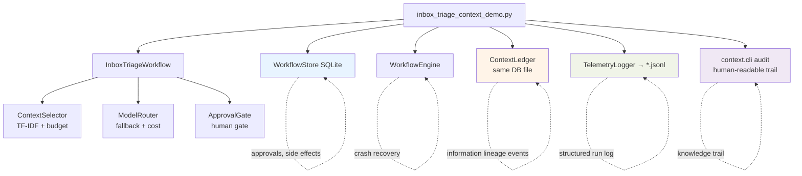
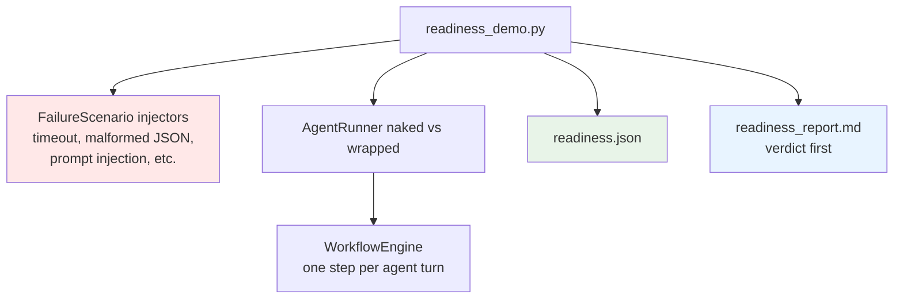
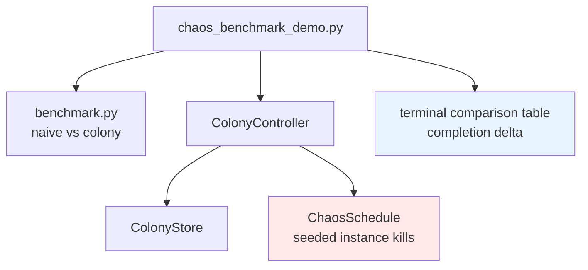
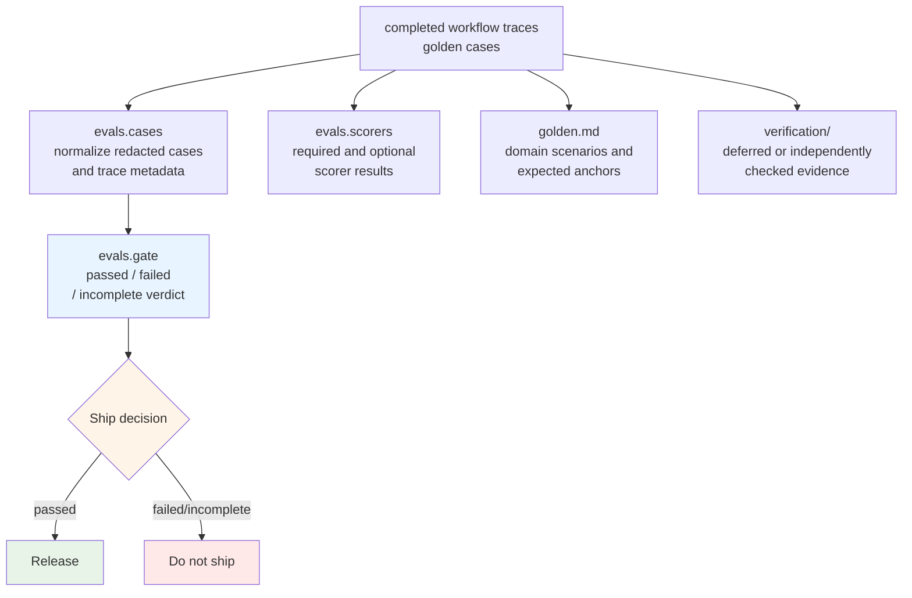
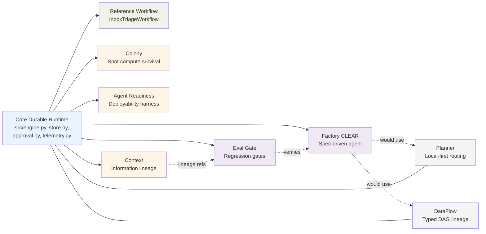

# DurableFlow Repository Walkthrough

**Audience:** Engineers onboarding to the repo, reviewers assessing scope, or contributors deciding where to work next.

**Purpose:** Explain why each part of the repository exists, how it was implemented, and how the pieces fit together through a single architectural throughline. This document is also the **canonical index** for every `*-spec.md` and `README.md` in the repo (9 specs, 7 READMEs).

**Related:** [README](../README.md) (quick start) · [dflow-arch.md](dflow-arch.md) (diagrams) · [durable-flow-overview.md](../durable-flow-overview.md) (product portfolio) · [docs/README.md](README.md) (supplementary doc index)

---

## The Throughline

Most agent demos optimize for intelligence — prompts, tools, retrieval, and answers. DurableFlow optimizes for **survivability and inspectability**: can a multi-step agentic workflow complete under crashes, approvals, cost pressure, context limits, side effects, and unreliable compute — and can a reviewer **prove** what happened afterward?

Everything in this repository hangs off one pattern:

> **Wrap agentic work in a durable shell.** Checkpoint after every completed unit of progress. Persist operator decisions separately from execution state. Guard side effects with idempotency keys. Emit structured telemetry. Then add optional proof tracks that answer adjacent operational questions (compute reliability, deployability, information lineage, spend control, typed data flow, post-run evaluation).

The inbox triage workflow is not the product. It is the **reference vehicle** that makes the shell concrete. Extensions reuse the same primitives (`WorkflowStore`, checkpoint semantics, telemetry, model routing) but ask different questions.

---

## Architectural Layers

Think of the repo as four concentric layers:

```text
┌─────────────────────────────────────────────────────────────────┐
│  Proof tracks (optional, additive)                              │
│  Colony · Readiness · Context · Eval Gate · Planner (draft)     │
│  DataFlow (draft) · LangSmith adapter · Factory/CLEAR example   │
├─────────────────────────────────────────────────────────────────┤
│  Agent loop (reason-act-observe on top of the engine)           │
│  agent/ · readiness harness · mcp_server/                       │
├─────────────────────────────────────────────────────────────────┤
│  Reference workflow + demos                                     │
│  src/workflows.py · examples/ · data/                           │
├─────────────────────────────────────────────────────────────────┤
│  Core durable runtime (stdlib + SQLite)                         │
│  src/engine.py · store.py · approval.py · model_router.py ·     │
│  context_selector.py · telemetry.py                              │
└─────────────────────────────────────────────────────────────────┘
         │                              │
         ▼                              ▼
   Local SQLite (default)      infra/ + worker.py (AWS sketch)
```

**Design rule across layers:** extensions add tables and packages; they do not rewrite core schema or hide state in memory. Demos run without API keys. Optional integrations (Anthropic, MCP, ADK, LangSmith, Vast) are gated behind extras and env vars.

**Evidence spine:** `tests/`, `golden.md`, and `verification/` are not product layers, but they matter architecturally. Specs define the contract, tests prove local behavior, golden cases anchor regression expectations, and verification records deferred or independently checked claims. When a track says "implemented," the intended proof path is spec -> code -> deterministic test/demo -> verdict or audit artifact.

---

## Why the Core Exists

### Problem statement

Production assistant workflows fail operationally long before they fail intellectually:

| Scaling problem | Core mechanism | Module |
|-----------------|----------------|--------|
| Partial failure mid-workflow | Checkpoint after each step; resume from last index | `src/engine.py`, `src/store.py` |
| Unsafe or user-facing actions | Pause on `PauseForApproval`; persist gate in SQLite | `src/approval.py` |
| Duplicate side effects on retry | Idempotency key in `side_effect_log` before execute | `src/workflows.py` (`send_reply`) |
| Provider timeout / 5xx | Primary → secondary fallback with cost accounting | `src/model_router.py` |
| Context corpus exceeds model window | TF-IDF rank + greedy pack under hard token budget | `src/context_selector.py` |
| Non-deterministic path audit | JSONL telemetry for steps, crashes, fallback, approvals | `src/telemetry.py` |

### Implementation shape

The core follows a deliberately small contract:

1. **`WorkflowStore`** owns all durable state: `workflows`, `step_results`, `approval_queue`, `side_effect_log`. WAL mode SQLite; optional `PostgresWorkflowStore` for the AWS sketch.
2. **`WorkflowEngine`** is a **linear step runner**. It registers `(name, fn)` pairs, runs from `current_step + 1`, checkpoints after each completed step, and stops on `PauseForApproval`.
3. **Step functions** receive `(WorkflowState, step_data, dependencies)` and return `StepResult` or `PauseForApproval`. They are registered by demos/extensions — the engine does not import workflow logic.
4. **Two status layers:** `workflows.status` (execution) vs `approval_queue.status` (operator decision). Approve/reject updates the queue; `resume()` reads it and updates workflow status.

This is intentionally **not** a graph orchestrator. Branching and loops live in extension-owned state (see Factory `phase_runner`, Agent turns as steps, Colony job stages).

**Spec:** [docs/dflow-spec.md](dflow-spec.md) (READY — full acceptance criteria and test plan)  
**Diagrams:** [docs/dflow-arch.md](dflow-arch.md)

---

## The Reference Workflow: Inbox Triage

`InboxTriageWorkflow` in `src/workflows.py` exists to exercise every core primitive in one readable path:

```text
ingest_email → select_context → triage_llm → draft_reply → approval_gate → send_reply
     0              1              2             3              4             5
```

**Why this scenario:** Email triage combines retrieval (context selection), non-deterministic model calls (classification + draft), human gate (approval), and a side effect (send) — the same shape as many production assistants.

**How it connects:**

- Mock corpus from `data/mock_emails.json` and `data/mock_calendar.json`
- `ContextSelector.select()` packs prior emails/events under a hard budget; the inbox context demo currently uses `token_budget=300` so selected/rejected lineage is easy to inspect, while budget behavior is also tested at 4096 tokens
- `ModelRouter.route()` calls mock providers by default; optional Anthropic via `ANTHROPIC_API_KEY`
- Informational emails skip draft, approval, and send
- When a `ContextLedger` is injected via dependencies, steps record observed/retrieved/selected/rejected/consumed events and explicit decision lineage (Context extension)

**Entry points:**

| Demo | What it proves |
|------|----------------|
| `examples/crash_resume_demo.py` | Subprocess `os._exit`; resume from checkpoint |
| `examples/inbox_triage_demo.py` | Golden path + interactive approval |
| `examples/inbox_triage_context_demo.py` | Inbox triage + context audit trace |
| `./start.sh` | Wrapper for crash, inbox, context, readiness, mcp, test |

---

## Extension Tracks and How They Fit

Extensions are **sibling packages** that share the core ethos (local-first, deterministic fixtures, verdict-first reports). They answer one operational question each.

### Status at a glance

| Track | Status | Spec | README |
|-------|--------|------|--------|
| Core | Implemented | [dflow-spec.md](dflow-spec.md) | [README](../README.md) |
| Colony | Implemented benchmark | [colony/colony-spec.md](../colony/colony-spec.md) | [colony/README.md](../colony/README.md) |
| Agent Readiness | Implemented demo | [readiness/docs/dflow-readiness-spec.md](../readiness/docs/dflow-readiness-spec.md) | [readiness/README.md](../readiness/README.md) |
| Context | Implemented v0.2a | [context/context-spec.md](../context/context-spec.md), [context/context-measurement-spec.md](../context/context-measurement-spec.md) | [context/README.md](../context/README.md) |
| Eval Gate | Implemented platform | [eval-gate-spec.md](eval-gate-spec.md) | *(no README — spec only)* |
| Target Planner | Draft spec | [planner/planner-spec.md](../planner/planner-spec.md) | *(no README — spec only)* |
| DataFlow | Draft spec | [dataflow-spec.md](../dataflow-spec.md) | *(no README — spec only)* |
| LangSmith adapter | Implemented optional | *(no `-spec.md` — see [langsmith-adapter.md](langsmith-adapter.md))* | *(no README — adapter doc only)* |
| Factory / CLEAR | Worked example | [factory/clear-spec.md](../factory/clear-spec.md) | [factory/README.md](../factory/README.md) |
| AWS infra | Deployment sketch | — | [infra/README.md](../infra/README.md) |

---

### Colony — survivability on spot-like compute

**Question:** Does durable checkpointing improve completion vs naive retry under identical instance loss?

**Why it exists:** Core DurableFlow proves crash recovery for one workflow. Colony scales the question to a **batch of long-running jobs** on heterogeneous, spot-priced compute — a class of failure production teams hit on cheap GPU/CPU marketplaces.

**How it was implemented:**

- **`ColonyController`** dispatches jobs across a pool of instances from a **`ComputeProvider`** (mock or gated Vast)
- **`ChaosSchedule`** (seeded) kills instances on a fixed timeline — same schedule for naive and durable runners
- **`ColonyStore`** extends persistence with `colony_*` tables; job stages checkpoint through the same durability model as core
- **Naive runner** restarts the whole job on loss; **durable runner** migrates to a healthy instance and resumes from last stage
- **`benchmark.py`** orchestrates side-by-side comparison; **`render_terminal.py`** prints completion, cost, wall-clock, recoveries

**Fit:** Sits on top of `WorkflowStore` patterns, not inside `WorkflowEngine` step lists. Proof artifact is the benchmark table, not the controller code.

**Read next:** [colony/README.md](../colony/README.md) → [colony-methodology.md](colony-methodology.md)

---

### Agent Readiness Pack — deployability before customer systems

**Question:** Can this agent ship without causing an incident?

**Why it exists:** A working demo agent is not a deployable agent. Readiness wraps a fragile reason-act-observe loop and measures **before/after** against six production failure modes.

**How it was implemented:**

- **`agent/runner.py`** — `AgentRunner` registers each agent turn as a `WorkflowEngine` step; checkpoints every turn; intercepts write tools through approval; enforces token/turn budgets
- **`agent/mini_react.py`** — minimal ReAct agent for deterministic fixtures
- **`readiness/harness.py`** — injects failures (timeout, malformed JSON, prompt injection, context overflow, fallback, crash-after-write)
- **`readiness/scoring.py`** + **`view.py`** + **`render.py`** — Safety, Reliability, Cost, Observability scores → verdict-first report
- **`mcp_server/legacy_crm.py`** + **`agent/mcp_client.py`** — gated writes over MCP (official protocol when installed, stdio JSON fallback)
- **`agent/adk_adapter.py`** — adapter boundary for Google ADK; does not claim full Runner E2E

**Fit:** Demonstrates the **Durable Agent Pattern** ([field-pattern.md](field-pattern.md)): wrap, checkpoint, idempotent writes, gate writes, run failure scenarios, ship from evidence.

**MCP boundary:** MCP is treated as an external tool transport, not as the source of workflow truth. The CRM server exposes a write-capable surface; `AgentRunner` and `ApprovalGate` decide whether the write is allowed, and `WorkflowStore`/`side_effect_log` preserve the durable audit trail. The stdio JSON fallback exists only so the same safety contract can be demonstrated without optional dependencies.

**Read next:** [readiness/README.md](../readiness/README.md) → `examples/readiness_demo.py`

---

### Context — durable information state

**Question:** What information did the workflow observe, select, consume, and credit as influential?

**Why it exists:** Execution durability alone cannot explain *why* a decision was made. A workflow can complete perfectly on bad or untraceable context.

**How it was implemented:**

- **`context/ledger.py`** — `ContextLedger` with additive SQLite tables (`context_*`)
- **`context/models.py`** — `InfoArtifact`, `ContextLedgerEvent`, `DecisionRecord`, `DecisionLineage`
- Event lifecycle: `observed → retrieved → {selected, rejected} → consumed → influential`
- **`context/audit_view.py`** + **`cli.py`** — privacy-safe audit trace (digests/refs, not raw bodies by default)
- **`src/workflows.py`** integration — optional `context_ledger` in dependencies; inbox steps emit assembly lineage metadata (retrieval method, score, rank, rejection reason)
- v0.2a adds **assembly lineage**: retrieved/rejected events with validated metadata

**Fit:** Peer extension. Does not require Colony or Readiness. Cross-links to DataFlow (draft) would be explicit metadata refs only.

**Read next:** [context/README.md](../context/README.md) → [context-extension.md](context-extension.md) → `python -m context.cli audit`

---

### Eval Gate — post-run regression and ship gates

**Question:** Did a workflow change regress known-good behavior, safety, context fidelity, or cost?

**Why it exists:** DurableFlow records rich local traces. Eval Gate closes the loop: **traces → eval cases → scorers → pass/fail verdict** for CI or release decisions.

**How it was implemented:**

- **`evals/cases.py`** — normalize completed runs into `EvalCase` (redacted inputs, trace metadata, lineage refs)
- **`evals/scorers.py`** — pluggable `EvalScorer` interface; generic + app-supplied scorers
- **`evals/gate.py`** — `EvalGateRunner` aggregates `ScoreResult` → `EvalGateReport` (passed/failed/incomplete)
- **`evals/cli.py`**, **`manifest.py`**, **`registry.py`**, **`view.py`** — CLI, dataset manifests, rendering
- Optional LangSmith export via **`integrations/langsmith_eval_export.py`**; local SQLite remains source of truth

**Fit:** Platform capability used by Factory verification and any app repo (e.g. support-triage scenarios in `golden.md`). Domain rubrics stay outside DurableFlow.

**Spec:** [eval-gate-spec.md](eval-gate-spec.md) (DRAFT)

---

### Target Planner — budgeted, local-first model placement (draft)

**Question:** Can requests use `"model": "auto"` with cost/privacy/latency constraints and escalate only on **verifiable** failure?

**Why it exists (spec only today):** Core `ModelRouter` handles per-call fallback. Planner would produce a **durable execution plan** across local/cloud tiers with session budgets and plan traces — sibling to Colony, not a child.

**Planned shape:** `PlannerStore` wraps `WorkflowStore`; OpenAI-compatible proxy; no `WorkflowEngine` step list (variable attempt chain). Explicit model names bypass planner.

**Spec:** [planner/planner-spec.md](../planner/planner-spec.md)

---

### DataFlow — typed data DAG lineage (draft)

**Question:** What typed data products flowed through the workflow, and did runtime materializations match declared step contracts?

**Why it exists (spec only today):** Context tracks *information for models*. DataFlow would track *typed data products* (`IncomingEmail` → `SelectedContextSet` → `TriageDecision` → …) with validation and graph audit — complementary, decoupled from Context.

**Spec:** [dataflow-spec.md](../dataflow-spec.md) (with design details in [prune-proposal.md](../prune-proposal.md))

---

### LangSmith adapter — optional observability export

**Question:** Can local telemetry and context lineage be exported to LangSmith without making it part of the runtime?

**Why it exists:** Production teams use LangSmith for traces and evals. DurableFlow keeps SQLite authoritative; export is best-effort, non-blocking, digest-redacted.

**How it was implemented:**

- **`integrations/langsmith_adapter.py`** — bounded queue, retry, `ContextExporter` protocol hook from `WorkflowEngine`
- Engine defines `ContextExporter` protocol; never imports LangSmith directly
- Optional `[langsmith]` extra in `pyproject.toml`

**Spec:** [langsmith-adapter.md](langsmith-adapter.md) (with live SDK verification deferred per [verification/deferred-items.md](../verification/deferred-items.md))

---

### Factory / CLEAR — spec-driven agent workflow as proof

**Question:** Can the core engine host a realistic, multi-phase, self-remediating agent workflow with independent verification before "ship"?

**Why it exists:** Extensions prove individual operational claims. **Factory** is a **worked example** that eats its own cooking: a CLEAR-mnemonic workflow (Context → Layout → Execute → Assess → Remediate → Run) built on unchanged `WorkflowEngine`.

**How it was implemented:**

- **`factory/clear_workflow.py`** — eight macro steps on linear engine; **`phase_runner`** owns implement/assess/remediate micro-loop in `clear_phase_state` table
- **`factory/phase_store.py`**, **`remediation.py`**, **`agent_runner.py`** — phase checkpoints, Five Whys remediation, mock model laps
- **`factory/verification_ledger.py`** — independent claim verification before `ship` completes
- **`factory/audit_view.py`** — operator-facing audit summary
- **`factory/pi-dev.md`** — design proposal for mounting coding agent adapters (like Pi) as replaceable workers

**Fit:** Not a productized software factory. It demonstrates that **loops belong in extension state**, not in the engine — and that completion requires verified evidence, not implementer assertion.

**Read next:** [factory/README.md](../factory/README.md) → [factory/clear-spec.md](../factory/clear-spec.md)

---

### AWS infra — production deployment sketch

**Why it exists:** SQLite teaches durability mechanics; production needs Postgres, queue decoupling, and spot workers.

**Shape:**

- **`infra/durableflow_stack.py`** — CDK: API Gateway → Lambda → SQS FIFO → ECS Fargate Spot workers → Aurora Serverless v2
- **`worker.py`** — long-polls SQS, uses `PostgresWorkflowStore`, runs `InboxTriageWorkflow`
- Root **`Dockerfile`** — worker container image

**Fit:** Illustrates how core abstractions map to AWS; not required for local demos or tests.

**Read next:** [infra/README.md](../infra/README.md)

---

## Cross-Cutting Data Flow

### Inbox + Context + Telemetry

End-to-end path for the richest local demo:



### Agent Readiness



### Colony Benchmark



### Eval Gate and Verification



This is the repo's proof loop: workflows create durable traces, extensions render human-facing evidence, and eval/verification artifacts decide whether a change is safe to ship or still only a claim.

---

## Extension Relationships

How the proof tracks compose around the durable core:



---

## Repository Index: All Spec Files

Every `*-spec.md` in the repository (9 files). Specs are private implementation contracts with acceptance criteria; public proof is code, tests, demos, and READMEs.

| Spec | Path | Status | Area | One-line purpose |
|------|------|--------|------|------------------|
| Durable Flow (core) | [docs/dflow-spec.md](dflow-spec.md) | READY | Core | Checkpoint/resume, approval, routing, context budget, idempotency, telemetry |
| Colony | [colony/colony-spec.md](../colony/colony-spec.md) | Ready | Extension | Naive vs durable benchmark on spot-like compute under seeded chaos |
| Agent Readiness | [readiness/docs/dflow-readiness-spec.md](../readiness/docs/dflow-readiness-spec.md) | Ready | Extension | Ship/do-not-ship harness for six production failure modes |
| Context | [context/context-spec.md](../context/context-spec.md) | Draft / v0.2a implemented | Extension | Information lineage: observed → retrieved → selected/rejected → consumed → influential |
| Context Measurement | [context/context-measurement-spec.md](../context/context-measurement-spec.md) | Draft | Extension (methodology) | Evaluation discipline for context selection quality and latency (future requirements) |
| Eval Gate | [docs/eval-gate-spec.md](eval-gate-spec.md) | DRAFT | Platform | Traces → eval cases → scorers → pass/fail gate for workflow changes |
| Target Planner | [planner/planner-spec.md](../planner/planner-spec.md) | DRAFT | Extension | Budgeted local-first target selection with verifiable escalation |
| DataFlow | [dataflow-spec.md](../dataflow-spec.md) | DRAFT | Extension | Typed data DAG contracts, materializations, and graph audit |
| CLEAR (Factory) | [factory/clear-spec.md](../factory/clear-spec.md) | Extension spec | Worked example | Spec-driven agent workflow with phase loops and independent verification |

**Pairing note:** LangSmith integration is documented in [docs/langsmith-adapter.md](langsmith-adapter.md) (not a `-spec.md` file). Colony public methodology lives in [docs/colony-methodology.md](colony-methodology.md) (companion to [colony/colony-spec.md](../colony/colony-spec.md)).

---

## Repository Index: All README Files

Every `README.md` in the repository (7 files). READMEs are operator and reviewer entry points; specs hold implementation detail.

| README | Path | Scope | Start here for |
|--------|------|-------|----------------|
| Root | [README.md](../README.md) | Whole repo | Quick start (`./start.sh`), extension overview, design decisions, positioning |
| Docs | [docs/README.md](README.md) | Documentation folder | Exercises, architecture, spec links, suggested reading path |
| Colony | [colony/README.md](../colony/README.md) | Colony extension | Chaos benchmark commands, mock results, file map |
| Readiness | [readiness/README.md](../readiness/README.md) | Agent Readiness Pack | Readiness demo, failure modes, report contract, MCP/ADK boundaries |
| Context | [context/README.md](../context/README.md) | Context extension | Context durability thesis, audit CLI, assembly lineage |
| Factory | [factory/README.md](../factory/README.md) | CLEAR worked example | Eight-step CLEAR workflow, phase_runner loops, verification gate |
| Infra | [infra/README.md](../infra/README.md) | AWS CDK deployment | API Gateway, SQS, ECS Fargate Spot, Aurora Postgres topology |

**Areas without a README:** Eval Gate ([eval-gate-spec.md](eval-gate-spec.md) only), Target Planner ([planner/planner-spec.md](../planner/planner-spec.md) only), DataFlow ([dataflow-spec.md](../dataflow-spec.md) only), LangSmith adapter ([langsmith-adapter.md](langsmith-adapter.md) only).

---

## Spec ↔ README Cross-Reference

Quick lookup: which entry point and spec belong to each area.

| Area | README | Spec(s) | Companion docs |
|------|--------|---------|----------------|
| Core | [README.md](../README.md) | [dflow-spec.md](dflow-spec.md) | [dflow-arch.md](dflow-arch.md), [exercises.md](exercises.md) |
| Colony | [colony/README.md](../colony/README.md) | [colony-spec.md](../colony/colony-spec.md) | [colony-methodology.md](colony-methodology.md) |
| Readiness | [readiness/README.md](../readiness/README.md) | [dflow-readiness-spec.md](../readiness/docs/dflow-readiness-spec.md) | [field-pattern.md](field-pattern.md) |
| Context | [context/README.md](../context/README.md) | [context-spec.md](../context/context-spec.md), [context-measurement-spec.md](../context/context-measurement-spec.md) | [context-extension.md](context-extension.md) |
| Eval Gate | — | [eval-gate-spec.md](eval-gate-spec.md) | `evals/` package, [golden.md](../golden.md) |
| Target Planner | — | [planner-spec.md](../planner/planner-spec.md) | — |
| DataFlow | — | [dataflow-spec.md](../dataflow-spec.md) | — |
| Factory / CLEAR | [factory/README.md](../factory/README.md) | [clear-spec.md](../factory/clear-spec.md) | [factory/CLEAR.md](../factory/CLEAR.md) |
| AWS infra | [infra/README.md](../infra/README.md) | — | [aws-deployment-proposal.md](aws-deployment-proposal.md) |
| LangSmith export | — | — | [langsmith-adapter.md](langsmith-adapter.md) |
| Portfolio / PM view | [README.md](../README.md) | *(all specs)* | [durable-flow-overview.md](../durable-flow-overview.md) |

---

## Other Notable Documentation

Supporting docs that are neither `-spec.md` nor `README.md`:

| Document | Path | Role |
|----------|------|------|
| Architecture diagrams | [dflow-arch.md](dflow-arch.md) | Runtime invariants, Mermaid diagrams |
| Hands-on exercises | [exercises.md](exercises.md) | Guided tasks for SQLite, fallback, idempotency |
| Durable Agent Pattern | [field-pattern.md](field-pattern.md) | Field checklist for readiness / deployment |
| Context extension guide | [context-extension.md](context-extension.md) | Schema, audit contract, privacy boundary |
| Colony methodology | [colony-methodology.md](colony-methodology.md) | Benchmark protocol and threats to validity |
| LangSmith adapter | [langsmith-adapter.md](langsmith-adapter.md) | Optional telemetry and context export |
| Product scope summary | [durable-flow-overview.md](../durable-flow-overview.md) | Consolidated portfolio for reviewers |
| Competitive Space Map | [competitive-differentiation-and-space-map.md](../competitive-differentiation-and-space-map.md) | Strategic positioning vs Temporal, LangGraph, and BPM engines |
| Contributing | [CONTRIBUTING.md](../CONTRIBUTING.md) | Contribution guidelines |
| Changelog | [CHANGELOG.md](../CHANGELOG.md) | Release history |

---

## Suggested Reading Order

**1. Run something (15 minutes)**

```bash
./start.sh crash      # core durability
./start.sh inbox      # approval + side effects
./start.sh context    # information lineage
./start.sh readiness  # deployability delta
```

**2. Understand the shell (30 minutes)**

- Read [dflow-arch.md](dflow-arch.md) — state machine, checkpoint index semantics, idempotency
- Skim `src/engine.py` and `src/store.py` — the two files everything else assumes

**3. Pick one extension aligned with your question (30–60 minutes)**

| If you care about… | Start here |
|--------------------|------------|
| Compute / spot instances | [colony/README.md](../colony/README.md) |
| Shipping agents safely | [readiness/README.md](../readiness/README.md) + [field-pattern.md](field-pattern.md) |
| Auditing what the model saw | [context/README.md](../context/README.md) |
| Regression gates | [eval-gate-spec.md](eval-gate-spec.md) + `evals/` |
| Long-running spec-driven agents | [factory/README.md](../factory/README.md) |
| Production topology | [infra/README.md](../infra/README.md) |

**4. Implement or extend**

- Core changes → [dflow-spec.md](dflow-spec.md) + tests in `tests/`
- New extension → follow additive SQLite tables, optional dependencies, verdict-first reports; see [dflow-arch.md § Extension Pattern](dflow-arch.md)

---

## Implementation Conventions Worth Knowing

**Import path.** The Python package lives under `src/`. Examples add repo root to `PYTHONPATH` (`start.sh`, `pyproject.toml` pytest config). Imports look like `from src.engine import WorkflowEngine`.

**Zero required dependencies.** Core is stdlib-only. Optional groups: `providers`, `mcp`, `adk`, `langsmith`, `dev`.

**Determinism over realism.** Mock model providers, approximate token counts (words / 0.75), TF-IDF without embeddings — deliberate so behavior is testable in one sitting.

**Verdict-first surfaces.** Readiness reports, Colony benchmarks, context audits, eval gates, and (planned) planner traces lead with the decision, then evidence.

**Explicit non-claims.** Draft specs (Planner, DataFlow) and preview integrations must not be read as shipped features. ADK path verifies adapter boundary, not full Google Runner E2E. Colony mock results are labeled; live path is gated.

**Production replacements (intentional).** Temporal for orchestration, LangGraph for agent graphs, LiteLLM/Portkey for routing, LangSmith for observability — DurableFlow is the inspectable reference, not the replacement ([README § Why not X?](../README.md)).

---

## Mental Model Summary

### Repository structure

```mermaid
flowchart TD
    Root[durableflow/]

    Root --> src[src/<br/>durable runtime]
    Root --> agent[agent/<br/>agent runner]
    Root --> context[context/<br/>info lineage]
    Root --> colony[colony/<br/>compute benchmark]
    Root --> readiness[readiness/<br/>deployability]
    Root --> evals[evals/<br/>regression gates]
    Root --> factory[factory/<br/>CLEAR example]
    Root --> planner[planner/<br/>routing spec]
    Root --> infra[infra/<br/>AWS sketch]
    Root --> integrations[integrations/<br/>LangSmith export]
    Root --> examples[examples/<br/>demos]
    Root --> tests[tests/<br/>unit tests]
    Root --> verification[verification/<br/>deferred claims]
    Root --> docs[docs/<br/>specs + this file]

    src --> engine[engine.py<br/>WorkflowEngine]
    src --> store[store.py<br/>WorkflowStore]
    src --> approval[approval.py<br/>ApprovalGate]
    src --> router[model_router.py<br/>fallback + cost]
    src --> selector[context_selector.py<br/>TF-IDF budget]
    src --> telemetry[telemetry.py<br/>JSONL logging]
    src --> workflows[workflows.py<br/>InboxTriageWorkflow]

    style src fill:#e8f4ff
    style agent fill:#fff4e8
    style context fill:#fff4e8
    style colony fill:#fff4e8
    style readiness fill:#fff4e8
    style evals fill:#f0e8f4
    style factory fill:#f0e8f4
    style planner fill:#f5f5f5
    style infra fill:#f5f5f5
    style examples fill:#e8f4e8
    style tests fill:#e8f4e8
    style docs fill:#f0f4e8
```



### Layer summary

| Layer | One-line purpose |
|-------|------------------|
| `src/` | Minimal durable runtime: checkpoint, approve, route, select context, log |
| `src/workflows.py` | Reference inbox triage proving the runtime |
| `agent/` + `readiness/` | Agent turns as durable steps + deployability harness |
| `context/` | Durable information lineage alongside execution state |
| `colony/` | Measured durability on spot-like compute batches |
| `evals/` | Traces → cases → scorers → ship gate |
| `factory/` | End-to-end spec-driven agent workflow example with verification |
| `integrations/` | Optional export to external observability |
| `infra/` + `worker.py` | AWS mapping of the same abstractions |
| `planner/` + `dataflow-spec.md` | Draft extensions for spend control and typed data DAGs |

The repo is coherent when read as **one operational lab with optional proof tracks**, not a monolithic agent platform. The throughline is survivability and inspectability: make agentic work resumable, govern side effects, measure what broke, and show what information and data justified each decision — locally, deterministically, and honestly about what is proven vs planned.
