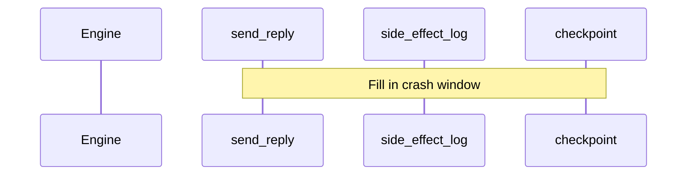

# Workshop Exercises (Extended)

Hands-on labs for the [DurableFlow workshop](README.md). These extend the core tasks in [exercises.md](../exercises.md) (E1–E8) with prediction exercises, diagrams, integration labs, and capstone preparation.

**Convention:** Use a dedicated SQLite path per lab, e.g. `/tmp/ws-W3.sqlite`, so you do not overwrite demo databases.

**Setup for all labs:**

```bash
cd durableflow
python3 -m venv .venv && source .venv/bin/activate
pip install -e ".[dev]"
export PYTHONPATH=.
```

---

## W1: Predict resume index before crash demo

**Module:** 2 — Durable execution  
**Time:** 15 minutes  
**Prerequisite:** Read inbox triage step list in [dflow-arch.md](../dflow-arch.md)

### Task

Before running `./start.sh crash`, write down:

1. Step index where the child process will die
2. Value of `current_step` immediately after crash
3. First step the parent will execute on `resume()`

Then run the demo and verify against SQLite.

### Solution check

| Question | Answer |
|----------|--------|
| Crash during | `triage_llm` (index 2) |
| `current_step` after crash | `1` (last completed: `select_context`) |
| First step on resume | `triage_llm` (index 2) |

---

## W2: Stale `running` workflow detection

**Module:** 2 — Durable execution  
**Time:** 20 minutes  
**Prerequisite:** E1

### Task

1. Read `WorkflowEngine.recover_crashed` and `WorkflowStore.mark_stale_for_demo` in the codebase.
2. Explain in 3–5 sentences how a workflow stuck in `running` becomes `crashed`.
3. What field besides `status` helps detect staleness?

### Stretch

Run `pytest tests/test_resume.py -v -k crash` and identify which test asserts recovery behavior.

---

## W3: Rejection policies — terminate vs continue

**Module:** 3 — Human gates  
**Time:** 25 minutes  
**Prerequisite:** E2

### Task

1. Find `ApprovalRejectionPolicy` in `src/engine.py`.
2. Read `tests/test_extensibility.py` (or `tests/test_approval_gate.py`) for a workflow that continues after rejection.
3. Answer: When would a product team choose `CONTINUE` over `TERMINATE`?

### Hands-on

Sketch a three-step workflow:

- `propose_crm_update` (needs approval)
- `log_denial` (runs even if rejected)
- `notify_slack` (runs only if approved)

Which steps need policy configuration?

---

## W4: Fallback in a full workflow

**Module:** 4 — Cost and routing  
**Time:** 30 minutes  
**Prerequisite:** E3

### Task

Create `examples/ws_fallback_lab.py` (or run inline) that:

1. Uses a temp SQLite DB under `/tmp/`
2. Builds `InboxTriageWorkflow` with a custom `RoutingPolicy` whose primary has `fail=True`
3. Runs a full inbox triage for one action-required email
4. Prints `was_fallback` from triage and draft steps
5. Greps telemetry for `model_fallback` events

### Expected

At least one `model_fallback` event; workflow completes via secondary provider.

### Reference snippet

```python
from pathlib import Path
from src.model_router import ModelProvider, ModelRouter, RoutingPolicy
from src.store import WorkflowStore
from src.approval import ApprovalGate
from src.engine import WorkflowEngine
from src.telemetry import TelemetryLogger
from src.workflows import InboxTriageWorkflow

db = Path("/tmp/ws-w4.sqlite")
policy = RoutingPolicy([
    ModelProvider("primary", "claude-sonnet-mock", 3.0, 15.0, fail=True),
    ModelProvider("secondary", "claude-haiku-mock", 0.8, 4.0),
])
# Wire policy into workflow dependencies — see InboxTriageWorkflow.dependencies()
```

Inspect `InboxTriageWorkflow` for how `model_router` is constructed and override it.

---

## W5: Cost reconciliation

**Module:** 4 — Cost and routing  
**Time:** 20 minutes  
**Prerequisite:** E3, `./start.sh inbox` (approved run)

### Task

1. Open `examples/inbox_triage_demo.sqlite` (or your lab DB).
2. Query:

```sql
SELECT step_name, cost_usd, model_used FROM step_results ORDER BY step_index;
```

3. Sum `cost_usd` manually.
4. Find `workflow_complete` in `inbox_triage_demo.telemetry.jsonl` and compare totals.

### Discussion

What is missing for production finance controls? (budgets, alerts, per-tenant attribution)

---

## W6: Budget tuning lab

**Module:** 4 — Context budgets  
**Time:** 25 minutes  
**Prerequisite:** E4

### Task

In a Python REPL:

1. Load mock email corpus (see `data/mock_emails.json` or test fixtures).
2. Call `ContextSelector().select(..., token_budget=4096)` — note count and top subjects.
3. Repeat with `token_budget=512` and `token_budget=8192`.
4. Record how many items selected and whether the top-3 relevant emails remain in the 512 case.

### Deliverable

Small table: budget → items selected → total tokens → top subject still included (Y/N).

---

## W7: Crash window diagram

**Module:** 4 — Idempotency  
**Time:** 20 minutes  
**Prerequisite:** E5

### Task

Draw a sequence diagram (paper or Mermaid) for `send_reply` showing:

1. Idempotency key computation
2. Side effect execution
3. Checkpoint write
4. Crash between (2) and (3)
5. Resume behavior

Compare your diagram to [dflow-arch.md](../dflow-arch.md) — "Idempotent Send".

### Mermaid starter



---

## W8: Telemetry timeline

**Module:** 5 — Observability  
**Time:** 25 minutes  
**Prerequisite:** E8

### Task

After `./start.sh crash`, produce a CSV or markdown table:

| timestamp | event_type | step_name | notes |
|-----------|------------|-----------|-------|

Include at minimum: first `step_start`, last `step_complete` before crash, `crash_detected`, `workflow_resumed`, `workflow_complete`.

### Stretch

Write a 10-line Python script that parses JSONL and prints the table (stdlib `json` only).

---

## W9: Seed sensitivity (Colony)

**Module:** 6 — Colony  
**Time:** 30 minutes  
**Prerequisite:** Module 6 lecture

### Task

```bash
python3 examples/chaos_benchmark_demo.py --profile hostile --seed 1337
python3 examples/chaos_benchmark_demo.py --profile hostile --seed 42
python3 examples/chaos_benchmark_demo.py --profile hostile --seed 9999
```

Record completion % for naive and dflow-vast for each seed.

### Deliverable

3–5 sentences: Is the +10 pt completion delta stable across seeds? When would you distrust a single-seed benchmark?

---

## W10: MCP write trace

**Module:** 7 — Readiness  
**Time:** 25 minutes  
**Prerequisite:** `./start.sh mcp`

### Task

1. Run MCP demo and approve the gated write.
2. Locate CRM state or mock server response showing the write applied once.
3. Identify idempotency key or equivalent deduplication in agent path.
4. Re-run resume scenario if demo supports it — confirm no duplicate write.

### Reading

`examples/mcp_demo.py`, `mcp_server/legacy_crm.py`, `agent/runner.py`

---

## W11: Field checklist for a hypothetical deployment

**Module:** 7 — Durable Agent Pattern  
**Time:** 30 minutes  
**Prerequisite:** `./start.sh readiness`

### Task

Pick a fictional agent: "Tier-1 support bot with CRM write access."

Fill the checklist from [field-pattern.md](../field-pattern.md) for each failure mode:

| Failure mode | Naked agent risk | Wrapped control | Evidence artifact |
|--------------|------------------|-----------------|-------------------|
| Tool timeout | | | |
| Malformed tool output | | | |
| Prompt injection | | | |
| Context overflow | | | |
| Model fallback | | | |
| Crash after side effect | | | |

### Deliverable

Verdict: ship / do not ship + single primary blocker.

---

## W12: Capstone peer review

**Module:** 8 — Capstone  
**Time:** 30 minutes per review pair  
**Prerequisite:** [capstone.md](capstone.md)

### Review rubric

| Criterion | Points |
|-----------|--------|
| Checkpoint after new step / scenario | 2 |
| Test demonstrates behavior | 2 |
| Idempotency or approval considered for side effects | 2 |
| Telemetry or SQLite evidence documented | 2 |
| Production mapping note (1 paragraph) | 2 |

### Process

1. Author runs `./start.sh test` and capstone-specific test.
2. Reviewer inspects SQLite or JSONL without reading implementation first.
3. Reviewer predicts behavior, then author demos.

---

## Quick reference: core exercises (E1–E8)

| ID | Link |
|----|------|
| E1–E8 | [exercises.md](../exercises.md) |

Complete all E-series exercises during the Standard workshop; W-series deepens each module.
