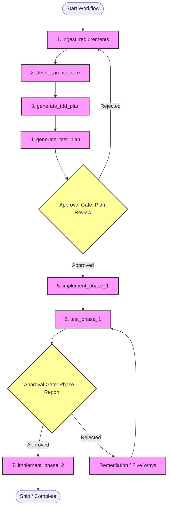
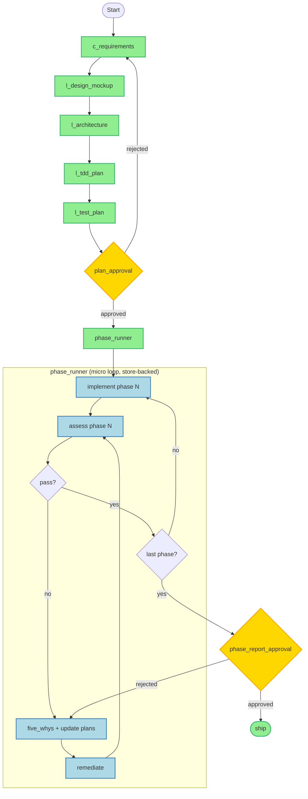

# Feasibility Study: Running the CLEAR Method on DurableFlow

The **CLEAR** method ([CLEAR.md](./CLEAR.md)) is compatible with DurableFlow's **planning and durability primitives** (checkpointed steps, approval gates, model routing). Full coding-agent execution — iterative implement/test/remediate loops — requires additional design at the extension layer, not new engine primitives. See **§6** for the recommended approach.

DurableFlow's design—durable execution state, SQLite checkpoints, approval gates, context selectors, and cost-aware multi-model routing—maps cleanly to the **macro** phases of CLEAR (Context → Layout → Execute → Assess → Run). The **micro** loops inside Execute and Assess should be owned by a `ClearWorkflow` extension, following the same boundary already used by Colony, Context, Planner, and Readiness ([extension pattern](../docs/dflow-arch.md)).

**Role of `factory/` in this repo.** DurableFlow is an educational reference implementation. The `factory/` package is deliberately a **worked example**, not a productized software factory: it exercises the framework daily, surfaces gaps (tooling, checkpointing, approval UX, cost accounting), and forces improvements to core primitives. CLEAR remains the pedagogical method inside the example; **§7** suggests industry-current vocabulary for readers who arrive with spec-driven or agent-platform expectations — without rebranding the repo into a methodology product.

---

## 1. Mapping CLEAR to DurableFlow Primitives

| CLEAR Phase / Action | DurableFlow Primitive | Execution Detail |
| :--- | :--- | :--- |
| **Context** (Requirements / `prd.md`) | `WorkflowEngine` Step + `ModelRouter` | An initial step invokes the primary LLM (via `ModelRouter`) to ingest requirements and write `prd.md`. |
| **Layout** (Architecture, TDD & Test plans) | `WorkflowEngine` Sequential Steps | Steps `define_architecture`, `generate_tdd_plan`, and `generate_test_plan` run sequentially, saving `stack.md`, `plan.md`, and `test.md`. |
| **Operator Verification** | `ApprovalGate` & `PauseForApproval` | The engine pauses after the Layout phase. The operator inspects the plans and decides to approve (advance to Execute) or reject (go back to Context). |
| **Execute** (Phase implementation) | Step-level file execution or Agent Loop | The code generation step reads `plan.md` and implements the active phase, generating code edits. |
| **Assess** (Testing & Verification) | `WorkflowEngine` Step + `ApprovalGate` | Executes the tests defined in `test.md` and generates `phase_X_report.md`. If tests fail, `PauseForApproval` stops execution. |
| **Remediation Loop** (Five Whys) | Rejection Handler & Loop Strategy | If the operator rejects a phase report due to failure, the engine initiates a Five Whys step and remediates. |
| **Run** (Ship) | Terminal Workflow Step | Completes the workflow, flags the status as `completed`, and saves the final checkpoint. |

---

## 2. Structural Design (Alternatives Considered)

Two strategies were evaluated before arriving at the recommended hybrid in **§6**. Neither is sufficient on its own; both inform the final design.

### Strategy A: The Linear Step Unrolling
We register planning steps, followed by a sequence of phase steps determined by parsing `plan.md`.

> **Note:** The back-edges in the diagram below (`Rejected → Step1`, `Rejected → Remediation`) are **not** supported by `WorkflowEngine` today. They illustrate CLEAR's intent, not a runnable engine graph. §6 replaces these with store-backed iteration.



### Strategy B: The ReAct Agent Loop (`AgentRunner`)
We wrap the CLEAR method in an agentic loop using [`AgentRunner`](../agent/runner.py) and a specialized agent (similar to [`MiniReActAgent`](../agent/mini_react.py)). The agent observes files in the workspace (e.g. `prd.md`, `stack.md`, reports) and calls tools (e.g. `write_file`, `run_tests`) until it reaches a terminal `Ship!` state.

---

## 3. Blueprint Implementation (Early Sketch)

The sketch below was the initial single-class design. **§6 supersedes the `execute_phases` placeholder** with the hybrid `phase_runner` state machine. Retained here as a starting point for macro-step registration.

Here is a blueprint for implementing the CLEAR workflow in `durableflow`. This maps to the custom workflow step registry used by [`InboxTriageWorkflow`](../src/workflows.py).

```python
from pathlib import Path
from typing import Any
import json
import time

from src.engine import PauseForApproval, WorkflowEngine
from src.store import StepResult, WorkflowState, WorkflowStore
from src.approval import ApprovalGate
from src.model_router import ModelRouter

class ClearWorkflow:
    def __init__(
        self,
        store: WorkflowStore,
        router: ModelRouter,
        approval_gate: ApprovalGate,
        workspace_dir: Path
    ):
        self.store = store
        self.router = router
        self.approval_gate = approval_gate
        self.workspace_dir = workspace_dir

    def register(self, engine: WorkflowEngine) -> None:
        # 1. Planning Steps
        engine.register_step("c_requirements", self.c_requirements)
        engine.register_step("l_architecture", self.l_architecture)
        engine.register_step("l_tdd_plan", self.l_tdd_plan)
        engine.register_step("l_test_plan", self.l_test_plan)
        engine.register_step("plan_approval", self.plan_approval)
        
        # 2. Execution Loop / Phase steps
        engine.register_step("execute_phases", self.execute_phases)

    def c_requirements(self, state: WorkflowState, step_data: dict[str, Any], deps: dict[str, Any]) -> StepResult:
        started = time.perf_counter()
        prompt = "Create a product requirements document called prd.md for Zen Chat..."
        response = self.router.route(prompt, system="You are a Product Manager.", policy=deps["policy"])
        
        # Write prd.md to workspace
        (self.workspace_dir / "prd.md").write_text(response.content, encoding="utf-8")
        
        return StepResult("c_requirements", {"prd_path": "prd.md"}, duration_ms=(time.perf_counter() - started) * 1000)

    def l_architecture(self, state: WorkflowState, step_data: dict[str, Any], deps: dict[str, Any]) -> StepResult:
        # Reads prd.md, runs LLM routing, writes stack.md
        ...

    def l_tdd_plan(self, state: WorkflowState, step_data: dict[str, Any], deps: dict[str, Any]) -> StepResult:
        # Reads prd.md & stack.md, generates plan.md (containing phase items)
        ...

    def l_test_plan(self, state: WorkflowState, step_data: dict[str, Any], deps: dict[str, Any]) -> StepResult:
        # Generates test.md
        ...

    def plan_approval(self, state: WorkflowState, step_data: dict[str, Any], deps: dict[str, Any]) -> StepResult | PauseForApproval:
        gate_id = self.approval_gate.request_approval(
            state.workflow_id,
            "plan_approval",
            {"message": "Please review prd.md, stack.md, plan.md, and test.md before code generation begins."}
        )
        return PauseForApproval(gate_id, "plan_approval", {"reason": "Waiting for architecture sign-off."})

    def execute_phases(self, state: WorkflowState, step_data: dict[str, Any], deps: dict[str, Any]) -> StepResult:
        # Load plan.md and dynamically execute steps phase-by-phase.
        # This wrapper executes each sub-phase step and saves incremental checkpoints.
        ...
```

---

## 4. Key Durability Advantages in CLEAR

1. **Context Management under Hard Limits**: When executing phase X, the [`ContextSelector`](../src/context_selector.py) feeds only the relevant parts of the large `prd.md` and `stack.md` to prevent prompt bloat and keep cost down.
2. **Resilience to Code-Generation Crashes**: Code writing and testing steps are highly prone to syntax errors, environment crashes, or rate limits. DurableFlow's SQLite-based persistence ensures that if the agent fails on Phase 4, the workflow restarts on Phase 4 without losing the checkpoints or files from Phase 1-3.
3. **Idempotent Actions**: Modifying production/dev codebases could lead to duplicate writes. DurableFlow's side-effect logging helps ensure that a write is only executed once, avoiding double file modifications or duplicate API executions.

---

## 5. Critique

This section stress-tests the claims above against the current codebase. The mapping in §1 is directionally correct, but several assertions are aspirational rather than implemented.

### 5.1 What holds up

**Planning (C + L) is genuinely feasible.** Sequential `register_step` calls, `ModelRouter` for LLM calls, artifact outputs (`prd.md`, `stack.md`, etc.), and a `PauseForApproval` gate after layout match how [`InboxTriageWorkflow`](../src/workflows.py) already works.

**Strategy B is real, not hypothetical.** [`AgentRunner`](../agent/runner.py) already wraps turns in the engine, gates writes behind approval, and deduplicates side effects via idempotency keys. That is the right primitive for agentic code editing.

**Durability claims are valid under the right shape.** If each CLEAR phase is its own engine step (not one mega-step), crash recovery and resume behave as advertised.

### 5.2 Where compatibility is overstated

#### Loop-back on rejection is not built in

The §2 mermaid diagram shows `Gate1 -- Rejected --> Step1` and `Gate2 -- Rejected --> Remediation --> Step6`. The engine does not support this natively. On rejection, the default policy is `TERMINATE` — the workflow stops. `CONTINUE` advances anyway. Neither jumps back to Context or into a remediation subgraph.

See [`_resume_index_after_approval`](../src/engine.py): rejection either terminates or advances to the next step. CLEAR's remediation loop (Five Whys → update plans → re-test) requires **custom loop semantics** not specified here: dynamic step indices, a sub-state machine inside `execute_phases`, or engine extensions.

#### `execute_phases` hand-waves the core problem

The blueprint in §3 ends with `...` on the step that matters most. CLEAR is mostly **Execute → Assess → Remediate**, not planning. Collapsing all phases into one registered step means:

- Engine checkpoints only at phase boundaries if you manually call `save_checkpoint` inside the step.
- The "restart on Phase 4" story depends on implementation details the doc does not define.
- You lose the clean mapping shown in the §1 table.

#### Strategy A is "recommended" but Strategy B is closer to CLEAR

[CLEAR.md](./CLEAR.md) describes an iterative, branchy flow — implement, test, maybe remediate, maybe update plans, repeat. That is agent-shaped. Strategy A (linear unrolling) only works if you **pre-parse `plan.md` and register N×(implement + test + gate) steps at runtime**, which §2 mentions but does not design.

Meanwhile Strategy B hits real limits in the current runner: `max_turns=12` and `token_budget=512` are appropriate for readiness demos, not multi-phase app construction.

#### ContextSelector is misapplied

§4 claims `ContextSelector` will feed relevant parts of `prd.md` / `stack.md` under token limits. In practice it is TF-IDF over `ContextItem` lists built for inbox triage — not markdown-aware file retrieval. A file-indexing layer (chunking, path-aware selection, possibly the `context/` extension ledger) is required before this claim holds.

#### Idempotency is not free in Strategy A

Side-effect dedup is implemented in `AgentRunner._execute_write_once` and `InboxTriageWorkflow.send_reply`, not automatically for every step. Strategy A's linear LLM-write steps would duplicate files on retry unless each write step implements its own idempotency key — the §3 blueprint's `c_requirements` calls `write_text` with no guard.

#### Execute/Assess needs tools, not just `ModelRouter.route`

The sample step generates text via `ModelRouter.route` and writes a file. It does not run tests, apply patches, resolve `@plan.md` references, or execute shell commands. Real Execute/Assess requires a **tool layer** (`write_file`, `read_file`, `run_tests`, `git diff`) — which Strategy B assumes but Strategy A's blueprint omits entirely.

### 5.3 Gaps vs [CLEAR.md](./CLEAR.md)

| CLEAR.md has | This feasibility doc |
| :--- | :--- |
| `design.html` mockup step | Missing from mapping table and blueprint |
| Automated test failure → Five Whys (no human gate) | Conflated with operator `PauseForApproval` |
| "Update stack/plan/test per Five Whys" | Mentioned but not designed |
| `@file` reference syntax in prompts | No file-resolution mechanism described |
| Continuous phase loop until "Done?" | No state variable for current phase, pass/fail, or retry count |

The doc simplifies CLEAR into a linear pipeline with two approval gates. That is a **subset** of CLEAR, not the full method.

### 5.4 Missing concerns for a coding-agent factory

These are not blockers for a demo, but should appear in a complete feasibility study:

1. **Workspace isolation** — where does the generated app live? Git repo? Temp dir? How do you avoid corrupting `durableflow` itself?
2. **Test execution environment** — dependencies, Docker, language runtime; test failures vs infra failures.
3. **Human operator UX** — approval gates exist, but there is no review UI; who inspects `plan.md` and how?
4. **Cost model** — multi-phase codegen across many LLM calls; `ModelRouter` helps but is not analyzed here.
5. **Quality gate** — passing tests ≠ shippable; no lint, review, or diff inspection step.
6. **Determinism** — same prompt, different code each run; checkpoints help with resume, not reproducibility.
7. **Substrate justification** — why DurableFlow vs Cursor skills / Claude Code / other agent runners?

### 5.5 Feasibility verdict (pre-recommendation)

This table reflects gaps **before** the recommended approach in §6. See **§6.9** for the updated verdict.

| Area | Feasibility | Notes |
| :--- | :--- | :--- |
| C + L planning with approval gate | **High** | Straightforward extension of existing patterns |
| Linear phase execution (Strategy A, fully unrolled) | **Medium** | Needs dynamic step registration + tool layer |
| Full CLEAR loop (test fail → Five Whys → remediate) | **Low–Medium** | Requires loop semantics the engine lacks today |
| Strategy B agent factory as-is | **Low** | Turn/token limits; `MiniReActAgent` is a test stub, not a coder |
| "Highly compatible" overall claim | **Overstated** | Compatible at the **workflow skeleton** level, not the **coding agent** level |

### 5.6 Outcome

The critique above motivates the recommended approach in **§6**: do not add first-class loops to `WorkflowEngine`; instead, use a hybrid macro-step pipeline with store-backed micro-iterations owned by `ClearWorkflow`.

---

## 6. Recommended Approach

### 6.1 Decision: no engine-level loops

`WorkflowEngine` should remain a **linear, index-based macro-step runner**. CLEAR's implement → test → remediate cycle is **domain logic**, not infrastructure logic. Adding `while`/`goto`/back-edges to the engine would:

- Complicate the one contract the repo is trying to teach (`current_step` = last completed macro-step index)
- Introduce cycle detection, max-iteration limits, and ambiguous resume semantics
- Turn a small reference runtime into a mini orchestration framework

The repo already draws this boundary explicitly. Extensions may use fixed steps when work maps to a registered sequence, or wrap `WorkflowStore` directly when the domain has its own execution loop ([dflow-arch.md § Extension Pattern](../docs/dflow-arch.md)). Planner's spec states the same rule: variable attempt chains must not be forced through `register_steps()`.

**Recommendation:** keep the engine linear. Record iterations as **checkpoints and `step_data`**, not backward jumps in the step index.

### 6.2 Hybrid architecture: macro engine, micro state machine

Use two layers:

| Layer | Owner | Responsibility |
| :--- | :--- | :--- |
| **Macro** | `WorkflowEngine` | Fixed, inspectable pipeline: plan → approve → run phases → ship |
| **Micro** | `ClearWorkflow.phase_runner` | Variable loop: implement → assess → (remediate \| next phase) |
| **Durability** | `WorkflowStore` | Checkpoint after every macro-step; sub-checkpoint each micro-lap inside `phase_runner` |

```text
Macro (engine):  c_* → l_* → plan_approval → phase_runner → ship
Micro (store):   phase_runner checkpoints {phase, attempt, status, report_path, next_action}
```

On crash or resume, the engine restarts at the `phase_runner` macro-step. `phase_runner` reads `step_data` (or extension tables) to determine the current phase and attempt — a **new iteration**, not a `goto` to an earlier engine step.



**Key semantic change from §2:** rejection and remediation do not jump the engine index backward. They set `step_data["next_action"]` (e.g. `"remediate"`, `"replan"`) and either re-enter the micro loop on the next `phase_runner` invocation or restart planning steps by creating a **new workflow run** if a full replan is required.

### 6.3 Why this over Strategy A, Strategy B, or engine loops

**vs Strategy A (full linear unroll):** Pre-registering `implement_1`, `test_1`, `implement_2`, … gives good observability but requires dynamic registration before `execute()` and cannot gracefully handle an unknown number of remediation attempts per phase. The hybrid keeps a stable macro graph while allowing unbounded micro retries.

**vs Strategy B (whole workflow as agent):** CLEAR is iterative and branchy, so an agent loop is the right shape for Execute/Assess — but wrapping the *entire* method in `AgentRunner` hits current limits (`max_turns=12`, `token_budget=512`) and loses macro-level gates and cost accounting per phase. The hybrid scopes `AgentRunner` to **one implement or assess lap** inside `phase_runner`, with expanded tools and limits.

**vs first-class engine loops:** Production orchestrators (Temporal, Step Functions) do support loops, but the durable unit is usually **each iteration as history**, not a backward step index. Coding agents (Cursor, Claude Code, Devin-style runners) use a **turn loop with state**, not workflow-engine back-edges. LangGraph puts cycles at the **agent graph** layer, not the durability layer. DurableFlow is the durability layer — loops belong in extensions.

**vs one mega-step `execute_phases`:** Collapsing all phases into a single registered step (§3 blueprint) makes crash recovery depend on undocumented internal checkpointing. The hybrid requires `phase_runner` to call `store.save_checkpoint()` (or write to additive `clear_*` tables) after each micro-lap so recovery is inspectable.

### 6.4 Mapping the hybrid to CLEAR

| CLEAR phase | Macro step | Micro behavior |
| :--- | :--- | :--- |
| C — Requirements | `c_requirements` | LLM writes `prd.md` |
| L — Design mockup | `l_design_mockup` | LLM writes `design.html` (missing from §1; required by [CLEAR.md](./CLEAR.md)) |
| L — Architecture | `l_architecture` | Reads artifacts, writes `stack.md` |
| L — TDD plan | `l_tdd_plan` | Writes `plan.md` with phased items |
| L — Test plan | `l_test_plan` | Writes `test.md` |
| Operator review | `plan_approval` | `PauseForApproval`; rejection sets `next_action=replan` |
| E — Implement | inside `phase_runner` | `AgentRunner` lap with `write_file`, `read_file`, patch tools |
| A — Assess | inside `phase_runner` | `run_tests` tool → `phase_X_report.md` |
| Automated fail | inside `phase_runner` | Five Whys → update `stack.md`/`plan.md`/`test.md` → remediate → re-assess (no human gate unless configured) |
| Operator review | optional per-phase gate | `PauseForApproval` on report; rejection sets `next_action=remediate` |
| R — Ship | `ship` | Terminal step; workflow `completed` |

Distinguish **automated remediation** (test failure triggers Five Whys inside `phase_runner`) from **human approval** (operator rejects a plan or report). The §1 table conflated these; the hybrid separates them.

### 6.5 `phase_runner` state sketch

`phase_runner` is a single registered engine step that runs until all phases pass or a terminal failure is reached. It persists lap state in `step_data`:

```python
# step_data keys written incrementally by phase_runner
{
    "current_phase": 2,
    "attempt": 1,
    "phase_status": "assessing",  # implementing | assessing | remediating | passed
    "next_action": None,          # replan | remediate | advance | ship
    "last_report": "phase_2_report.md",
    "lap_history": [              # append-only for audit
        {"phase": 1, "attempt": 1, "status": "passed", "report": "phase_1_report.md"},
        {"phase": 2, "attempt": 1, "status": "failed", "report": "phase_2_report.md"},
    ],
}
```

Each lap calls `store.save_checkpoint()` with merged `step_data` before returning `PauseForApproval` or completing. If the process crashes mid-lap, resume re-enters `phase_runner`, reads the last checkpoint, and continues from `phase_status` — not from macro-step zero.

For implement/assess laps that need tool use, delegate to `AgentRunner` with domain-specific tools and raised limits (turns, token budget). Keep idempotency on every mutating tool via side-effect keys, as [`AgentRunner`](../agent/runner.py) already does for writes.

### 6.6 Required extensions (implementation checklist)

These are extension-layer concerns; none require changing `WorkflowEngine` execution semantics:

1. **`ClearWorkflow` package** under `factory/` or top-level sibling — registers macro steps, owns `phase_runner` state machine
2. **Tool layer** — `read_file`, `write_file`, `run_tests`, `git_diff` (Execute/Assess cannot be `ModelRouter.route` + `write_text` alone)
3. **File-aware context selection** — chunk/index workspace markdown for token limits (extend or wrap `ContextSelector`; see **§8** for [`context/`](../context/README.md) ledger integration)
4. **Idempotent writes** — every mutating step uses side-effect keys (pattern from `send_reply` and `AgentRunner._execute_write_once`)
5. **Workspace isolation** — generated app in a dedicated temp dir or git worktree, never inside `durableflow/` source
6. **Rejection routing via `step_data`** — not engine back-edges; optional `approval_rejection_policies` + commit handlers where human gates apply
7. **Align with CLEAR.md** — include `design.html`; separate automated Five Whys from operator approval

### 6.7 Industry alignment

| Audience | Typical pattern | Hybrid fit |
| :--- | :--- | :--- |
| Workflow orchestration (Temporal, Step Functions) | Each iteration recorded as durable history; `continueAsNew` for long loops | Micro-laps as checkpoint rows matches this |
| Coding agents (Cursor, Claude Code, Devin) | Turn loop + session state; optional checkpoint | `AgentRunner` inside `phase_runner` matches this |
| Agent frameworks (LangGraph) | Explicit graph cycles at agent layer | Cycles live in `phase_runner`, not engine |
| DurableFlow extensions (Colony, Planner, Readiness) | Own the loop; use `WorkflowStore` | Same boundary |

This approach is **closer to what coding-agent builders do** (turn loop + state) while preserving **what DurableFlow is for** (checkpointed macro-steps, approval gates, cost telemetry).

### 6.8 MVP spike

Prove the hybrid before building the full factory:

1. Two-phase Zen Chat plan in an isolated workspace
2. Macro steps: `c_requirements` → `l_*` → `plan_approval` → `phase_runner` → `ship`
3. `phase_runner` runs phase 1 only: implement → run one test → write `phase_1_report.md`
4. One automated remediation lap on forced test failure (Five Whys updates `plan.md`, re-implement, re-test)
5. Manual operator approval before `ship`

**Success criteria:** crash mid-`phase_runner` resumes on the correct phase/attempt; remediation lap is visible in `lap_history`; no duplicate file writes on retry; total cost and model usage appear in telemetry.

### 6.9 Updated feasibility verdict

| Area | Feasibility | Notes |
| :--- | :--- | :--- |
| C + L planning with approval gate | **High** | Unchanged; straightforward macro steps |
| Hybrid `phase_runner` with store-backed laps | **Medium–High** | Fits existing extension pattern; needs tool layer |
| Full CLEAR loop (automated Five Whys + remediate) | **Medium** | Achievable inside `phase_runner`; no engine changes |
| Full coding-agent factory | **Medium** | Depends on tool quality, workspace isolation, operator UX |
| Engine-level loop primitive | **Not recommended** | Wrong layer; conflicts with repo design goals |

---

## 7. Suggested Vocabulary (Industry-Current)

CLEAR is a **teaching mnemonic** for this repo: easy to remember, maps cleanly to prompts and artifacts, and works well in an educational context. It is not a widely adopted industry standard, and readers from platform engineering or agent-tooling backgrounds may not recognize the acronym. The goal of this section is not to replace CLEAR — the example can keep it — but to **translate** it so the factory example reads as current practice, not a bespoke retro workflow.

### 7.1 Principle: teach CLEAR, speak the industry dialect

| In the repo (keep) | In docs, demos, and external conversation (prefer) |
| :--- | :--- |
| "Run the CLEAR method" | "Run a **spec-driven agent workflow** with durable checkpoints" |
| "CLEAR phase" | "**Workflow stage**" or "**macro-step**" |
| "CLEAR loop" | "**Verify–remediate iteration**" or "**eval loop**" |
| "Software factory" | "**Reference agent workflow**" or "**worked example extension**" |
| "Ship!" prompt | "**Deploy gate**" or "**release checkpoint**" |

CLEAR stays in [CLEAR.md](./CLEAR.md) and in step names where it aids learning (`c_requirements`, `phase_runner`). Public-facing README language should lead with terms practitioners already search for: *spec*, *plan*, *eval*, *checkpoint*, *approval gate*, *agent turn*.

### 7.2 Phase vocabulary mapping

| CLEAR | Industry-current term | What practitioners expect |
| :--- | :--- | :--- |
| **C** — Context | **Spec / intent gathering** | Problem statement, requirements, constraints; output is a **spec artifact** not necessarily named `prd.md` |
| **L** — Layout | **Design & planning** | Architecture decision record (ADR), stack choice, **implementation plan**, **test plan** — often grouped as "planning" in spec-kit / plan-mode flows |
| **E** — Execute | **Implementation / codegen** | Agent applies edits; may be one **task** or one **agent session** scoped to a plan slice |
| **A** — Assess | **Verification / eval** | Run tests, linters, or eval harness; output is an **eval report** or **verification record** |
| **C** — Update (Five Whys) | **Root-cause & spec revision** | Update spec/plan after failure; aligns with "context improvement" in context-driven development |
| **E** — Remediate | **Fix iteration** | Another implement lap driven by eval output |
| **R** — Run | **Release / deploy gate** | Merge, deploy, or mark workflow complete; human or automated promotion |

The letters still work pedagogically. The shift is naming the **activities** the way agent platforms and platform teams already do.

### 7.3 Artifact vocabulary mapping

| CLEAR artifact | Suggested alias in docs | Industry parallel |
| :--- | :--- | :--- |
| `prd.md` | **product spec** / **intent spec** | Spec Kit `spec.md`, Kiro-style requirements, PRD |
| `design.html` | **design reference** / **UI mock** | Figma export, HTML prototype, design token doc |
| `stack.md` | **architecture brief** / **ADR bundle** | ADR, tech stack doc, `architecture.md` |
| `plan.md` | **implementation plan** / **task breakdown** | Phased plan, agent task list, epic decomposition |
| `test.md` | **verification plan** / **acceptance criteria** | Test plan, eval rubric, definition of done |
| `phase_X_report.md` | **eval report** / **verification report** | CI result summary, agent eval output, benchmark row |
| `@file` references | **context attachments** / **grounding files** | Cursor rules, CLAUDE.md, RAG sources, skill inputs |

File names in the example can stay as-is (they are concrete and grep-friendly). When explaining the repo, describe them by **role** first, filename second: "the verification report (`phase_1_report.md`)".

### 7.4 Process vocabulary mapping

| CLEAR concept | Industry-current phrasing |
| :--- | :--- |
| Prompt-driven steps | **Instruction stages** with **grounded context** |
| Phase loop | **Plan slice → implement → verify** iteration |
| Remediation loop | **Eval-driven retry** or **self-correction loop** |
| Five Whys | **Root-cause analysis** (RCA); keep Five Whys in CLEAR.md as the teaching form |
| Human-verifiable outputs | **Acceptance criteria** / **eval assertions** |
| Operator verification | **Human-in-the-loop gate** / **approval checkpoint** |
| `@plan.md` implement phase X | **Execute task N from implementation plan** |

### 7.5 DurableFlow-specific vocabulary to foreground

Because `factory/` exists to **stress the framework**, docs should emphasize what this repo adds beyond generic agent coding — vocabulary competitors rarely own:

| DurableFlow term | Use instead of (when external) | Why foreground it |
| :--- | :--- | :--- |
| **Checkpoint** | "save state" | Core educational invariant |
| **Macro-step / micro-lap** | "step" (ambiguous) | Clarifies §6 hybrid |
| **Approval gate** | "human review" | Ties to `PauseForApproval` |
| **Side-effect idempotency** | "don't run twice" | Operational primitive, not agent novelty |
| **Token budget / cost routing** | "model pick" | Planner/Colony story |
| **Workflow durability** | "agent memory" | Distinguishes infra from prompt tricks |

Lead with: *"a durable spec-driven agent workflow"* — then show CLEAR as the **example encoding** of that pattern inside `factory/`.

### 7.6 What not to rename

Keep these stable inside the educational example:

- **CLEAR** as the acronym in `factory/CLEAR.md` — it is memorable and coherent for learners
- **Step prefixes** (`c_`, `l_`, `phase_runner`) — they map 1:1 to the method
- **Concrete filenames** (`prd.md`, `plan.md`, …) — they make demos reproducible
- **Five Whys** in the remediation subgraph — good teaching detail even if industry says "RCA"

Renaming everything to industry jargon inside the example would hurt the pedagogical through-line. Translation belongs in **README prose, architecture docs, and this feasibility study** — not necessarily in every prompt template.

### 7.7 Suggested one-liner for the repo

For README or talks, a current framing:

> **DurableFlow** is a reference runtime for durable agent workflows. **`factory/`** is a worked example: a spec-driven build loop (CLEAR) that checkpoints each stage, gates writes and releases, and verifies output before advancing — the operational layer most agent demos skip.

That positions CLEAR as the **example encoding**, DurableFlow as the **lesson**, and uses vocabulary practitioners already recognize — without pretending CLEAR is an industry standard or rewriting the method into something else.

---

## 8. Using the Context Extension (`context/`)

Earlier sections treat "context" mostly as prompt sizing via [`ContextSelector`](../src/context_selector.py) (core) or as CLEAR's **C** phase (requirements). This section addresses the peer extension in [`context/`](../context/README.md): **context durability** — making information flow inspectable alongside execution checkpoints.

### 8.1 Should `factory/` use it?

**Yes — recommended for the educational example**, for three reasons aligned with why `factory/` exists:

1. **CLEAR is information-heavy.** Every phase produces or consumes artifacts (`prd.md`, `plan.md`, eval reports). The Context extension's claim — *a checkpoint is incomplete unless you can explain what the workflow knew* — maps directly to factory debugging ("why did phase 2 implement the wrong API?").
2. **Forces framework improvement.** Inbox triage already wires `context_ledger` through [`InboxTriageWorkflow`](../src/workflows.py). Factory is a second consumer; gaps in artifact registration, lap-level lineage, or audit rendering will surface requirements for both extensions.
3. **Completes the repo's story.** DurableFlow teaches **execution durability** (core) and **context durability** (Context). A factory example that only checkpoints steps without lineage would demonstrate half the thesis.

**When to skip (for a minimal spike):** the thinnest MVP in §6.8 can run without Context to prove `phase_runner` resume first. Add Context once implement/assess laps exist — that is when lineage matters.

**What Context is not:** a vector DB, RAG framework, or replacement for file chunking/`ContextSelector`. It records **which artifacts were observed, selected, consumed, and credited** — not how to retrieve them. Selection logic stays in factory code; Context records the outcome.

### 8.2 Context vs ContextSelector (do not conflate)

| Concern | Layer | Factory use |
| :--- | :--- | :--- |
| Which files fit in the token budget? | `ContextSelector` or custom file chunker | Build `ContextItem` list from workspace markdown; select under budget |
| Which artifacts entered a prompt? | `ContextLedger.record_event(…, "selected")` | After selection, before LLM call |
| Which artifacts were mounted? | `record_event(…, "consumed")` | Same lap, when prompt is assembled |
| What did the model decide? | `record_decision` + `record_lineage` | After each LLM implement/assess/plan step |
| Human-readable audit | `context.cli audit` / `render_context_audit` | Demo output, operator review, post-mortem |

§4 and §5.2 correctly note that pointing `ContextSelector` at `prd.md` alone is insufficient. Context does not fix selection — it **audits** selection once factory implements it.

### 8.3 Integration pattern (mirror inbox triage)

Follow the existing demo wiring in [`examples/inbox_triage_context_demo.py`](../examples/inbox_triage_context_demo.py):

```python
store = WorkflowStore(db_path)
ledger = ContextLedger.from_store(store)
clear_workflow = ClearWorkflow(
    store,
    router,
    approval_gate,
    workspace_dir,
    context_ledger=ledger,  # optional; None disables lineage (tests)
)
engine = WorkflowEngine(store, telemetry, clear_workflow.dependencies())
clear_workflow.register(engine)
```

Pass `context_ledger` in the dependencies dict (same key [`InboxTriageWorkflow`](../src/workflows.py) uses). Steps call ledger helpers only when `dependencies.get("context_ledger")` is not `None` — keeps unit tests free of Context when unneeded.

Reuse or extract shared helpers from `workflows.py` (`_record_consumed`, `_record_model_context`, `_log_context_event`) into a small `factory/context_hooks.py` rather than duplicating ledger ceremony in every step.

### 8.4 Mapping CLEAR phases to Context hooks

| CLEAR moment | Macro/micro step | Context actions |
| :--- | :--- | :--- |
| Write `prd.md` | `c_requirements` | `record_artifact` (`source_artifact`, `source_type="spec"`, `content_ref=workspace:prd.md`); `observed` |
| Write `design.html`, `stack.md`, `plan.md`, `test.md` | `l_*` | Same pattern per file; link `content_digest` to workspace path |
| Plan approval gate | `plan_approval` | Optional: register approval payload as artifact; no model decision |
| Select files for implement lap | `phase_runner` (pre-LLM) | Chunk/index workspace files → `selected` events with rank metadata |
| Implement phase N | `phase_runner` implement lap | `consumed` on mounted spec/plan slices; `record_decision` + lineage to mounted IDs |
| Run tests | `phase_runner` assess lap | Register test output / `phase_X_report.md` as `source_artifact`; tool stdout as artifact |
| Five Whys / plan update | remediation lap | Register **new** artifact rows for revised `plan.md` (digest change = new row); defer supersession to Context v0.2 |
| Operator rejects report | approval gate | Telemetry event; optional artifact for rejection reason |
| Ship | `ship` | Terminal; audit CLI shows full trail |

**Lineage rule (match inbox triage):** credit only **explicit** attribution — mounted artifact IDs passed into the prompt payload, not guessed relevance. Factory controls prompt assembly; Context records what was mounted.

### 8.5 Suggested helper: workspace artifact registration

Factory steps repeat the same shape. A thin helper keeps steps readable:

```python
def register_workspace_file(
    ledger: ContextLedger,
    workflow_id: str,
    step_name: str,
    path: Path,
    *,
    source_type: str = "workspace_file",
    role: str = "source_artifact",
) -> InfoArtifact:
    content = path.read_text(encoding="utf-8")
    artifact = ledger.record_artifact(
        workflow_id,
        artifact_role=role,
        source=path.name,
        source_type=source_type,
        content=content,
        content_ref=f"workspace:{path.as_posix()}",
        token_count=estimate_tokens(content),
        metadata={"phase": step_name},
    )
    ledger.record_event(workflow_id, step_name, artifact.artifact_id, "observed")
    return artifact
```

Call after every macro step that writes a CLEAR artifact. On implement/assess laps, call `selected` → assemble prompt → `consumed` → `record_decision` (same sequence as `triage_llm` in inbox triage).

### 8.6 `phase_runner`-specific considerations

Micro-laps need **lap-scoped** metadata so audit traces remain readable:

- Include `phase`, `attempt`, and `lap_kind` (`implement` | `assess` | `remediate`) in event `metadata`.
- Store mounted artifact ID lists in `step_data` / lap history (§6.5) **and** in Context lineage — execution state for resume, Context for audit.
- On crash mid-lap: execution resume reads `step_data`; Context artifacts are append-only and idempotent by digest — re-registering the same file content does not duplicate rows ([`record_artifact`](../context/ledger.py) dedupes on `(workflow_id, role, source, content_digest)`).

**AgentRunner laps:** when implement uses `AgentRunner`, instrument at the **lap boundary** (prompt in, final tool observations out), not every agent turn — unless Readiness-style turn registration is explicitly desired. Context MVP targets step-level decisions; per-turn lineage is deferred noise for factory v0.1.

### 8.7 What to defer (Context MVP cutline)

Per [`context-spec.md`](../context/context-spec.md), do not block factory on:

- Supersession / "current version" of `plan.md` after Five Whys (new digest = new artifact is enough for v0.1)
- Context compaction, replay, or OpenLineage export
- Trust/freshness policy blocking stale specs
- Embedding / vector retrieval

Factory should produce a demo comparable to inbox triage:

> Run CLEAR factory workflow. Open context audit. See which spec and plan artifacts were selected, consumed, and credited for the phase 2 implement decision.

### 8.8 Phased adoption

| Phase | Context scope | Proves |
| :--- | :--- | :--- |
| **Spike (§6.8)** | Optional / off | `phase_runner` resume, tools, one eval lap |
| **Factory v0.1** | Register all CLEAR markdown artifacts; lineage on one implement + one assess LLM call | End-to-end audit trail for a single phase |
| **Factory v0.2** | Selection hooks + remediation artifacts; audit compares attempt 1 vs 2 | Context improvement loop visible in ledger |
| **Factory v0.3** | Extract shared hooks; document factory as second Context consumer alongside inbox triage | Framework extensibility |

### 8.9 Verdict

| Question | Answer |
| :--- | :--- |
| Use `context/` for factory? | **Yes**, after or in parallel with first implement/assess lap |
| Required for feasibility? | **No** for execution durability; **Yes** for the full educational thesis |
| Replaces `ContextSelector`? | **No** — complementary |
| Engine changes needed? | **No** — optional `context_ledger` in dependencies; [`_link_context_decisions`](../src/engine.py) already links ledger to step results when present |
| Best forcing function? | **Phase 2 wrong implementation post-mortem** — audit must show mounted `plan.md` slice vs full plan |

Integrating Context turns `factory/` from a workflow demo into a **dual-durability** demo: the same run that survives crashes also answers what information drove each codegen and eval decision.
