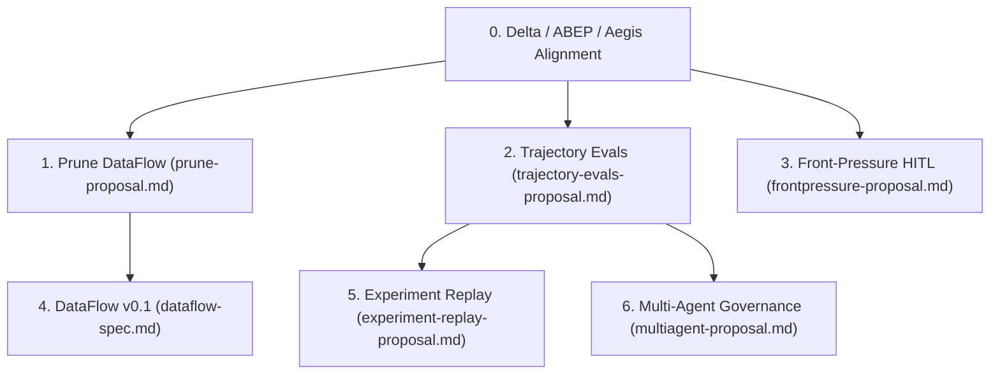

# DurableFlow Proposals & Roadmap

This directory contains specifications and proposals for extending **DurableFlow**, a durable orchestration runtime.

**Primary lens:** the Delta Framework (an internal working doc, not tracked in this repository) — every proposal here is scoped against it, not against a layer diagram. See [`delta-abep-aegis-alignment-proposal.md`](delta-abep-aegis-alignment-proposal.md) for the cross-repository ownership model, [`drae-dflow-workplan.md`](drae-dflow-workplan.md) for the scoring of DurableFlow's current surface against D1–D6 and the DurableFlow-side schedule, and [`../../aegis/docs/grk-aegis-drae-proposal.md`](../../aegis/docs/grk-aegis-drae-proposal.md) for the Aegis-owned executable schedule (Phases 1–4). DurableFlow does not own that runtime work.

All proposals are evaluated against DurableFlow's core thesis:

> **Workflow-as-progress. External authority by contract. Completion only from verified terminal evidence.**
>
> *DurableFlow does not optimize for model intelligence or agent framework features. It durably checkpoints and resumes orchestration steps. Local, mock-only workflows may complete from their own step results. Consequential external effects may complete only from a terminal result returned by an action authority (ABEP-conformant Aegis, or an equivalent gateway) — DurableFlow does not decide whether such an effect is authorized or whether an ambiguous remote effect occurred.*

**Delta Conformance Statement.** DurableFlow owns no new D1 (approval-bound authorization) or D2 (effect resolution against non-participating endpoints) guarantee in standalone mode. `ApprovalGate` is durable workflow interruption, not authorization. `side_effect_log` is local mock-replay suppression, not reconciliation. Both are exercised as D1/D2 only through a foreign action gateway. See the workplan and alignment proposal above for the falsification conditions behind these claims — they are not asserted as final.

**Target architecture marker (until WS2 exits).** Consequential effects still route through the local `ApprovalGate`/`side_effect_log` substitutes described in the workplan’s §2, not through Aegis. Do not read the thesis as current verified-terminal-effect behavior until WS2’s joint exit criterion is met.

---

## Proposal Index & Status

Delta status follows the classification in the workplan (§4.4) and the
alignment proposal (§3): **core** demonstrates mature orchestration and stays;
**supporting** is application-level work with no identified delta of its own;
**experimental** must ask a falsifiable question, not assert a guarantee;
**constrained** is in tension with a specific delta (named below) unless
reframed; **deferred** has no delta identified yet.

| Proposal | File | Status | Delta status | Core Value |
|---|---|---|---|---|
| **Delta / ABEP / Aegis Alignment** | [`delta-abep-aegis-alignment-proposal.md`](delta-abep-aegis-alignment-proposal.md) | **PROPOSAL** (direction; Aegis schedule is a PLAN) | gate | Reframes DurableFlow as orchestration, ABEP as the protocol, Aegis as the runtime. Phases 1–4 are scheduled in [`aegis/docs/grk-aegis-drae-proposal.md`](../../aegis/docs/grk-aegis-drae-proposal.md). Phase 0 (this repo's docs/thesis) remains the DurableFlow ask. |
| **Delta Framework critique & plan** | [`drae-dflow-workplan.md`](drae-dflow-workplan.md) | **PLAN** | gate | Scores DurableFlow against D1–D6 and sequences the fix as WS0 (claim alignment, mostly done) / WS1 (standing engine guardrail) / WS2 (Aegis client + conformance suite, blocked on Aegis's own Gateway shipping). |
| **Prune DataFlow** | [`prune-proposal.md`](file:///Users/marcos/Downloads/playground/fde/durableflow/proposals/prune-proposal.md) | **PROPOSAL** | supporting | Tightens `dataflow-spec.md` to a 4-concept v0.1, preventing scope creep into mini-orchestrator frameworks. |
| **Trajectory Evals** | [`trajectory-evals-proposal.md`](file:///Users/marcos/Downloads/playground/fde/durableflow/proposals/trajectory-evals-proposal.md) | **PROPOSAL (v0.3)** | experimental | Scores step-by-step agent execution paths (plan, tool selection, duplicate writes, recovery loops) beyond simple outcome metrics; keep only while it asks a falsifiable D4 compatibility question, not a general eval story. |
| **Front-Pressure** | [`frontpressure-proposal.md`](file:///Users/marcos/Downloads/playground/fde/durableflow/proposals/frontpressure-proposal.md) | **PROPOSED** | constrained (D6) | Governs human intervention state with SLA tracking, routing policies, and portable override telemetry. As written it industrializes approval throughput, which D6 says is the wrong axis — attention doesn't survive volume. Must be reframed around *reducing and consolidating* interventions, not processing more of them faster, before it counts as conforming. |
| **DataFlow Spec** | [`dataflow-spec.md`](file:///Users/marcos/Downloads/playground/fde/durableflow/proposals/dataflow-spec.md) | **DRAFT** | supporting | Introduces typed data product contracts and artifact lineage DAGs across workflow steps. Descriptive lineage only — must not be positioned as a second control plane or a consistency model. |
| **Experiment Replay** | [`experiment-replay-proposal.md`](file:///Users/marcos/Downloads/playground/fde/durableflow/proposals/experiment-replay-proposal.md) | **PROPOSAL** | experimental | Re-simulates recorded production scenarios against candidate prompt/model configs for hill-climbing optimization; stays off the authority path. |
| **Multi-Agent** | [`multiagent-proposal.md`](file:///Users/marcos/Downloads/playground/fde/durableflow/proposals/multiagent-proposal.md) | **PROPOSAL** | deferred | Supervisor-coordinated agent teams with single-writer state ACLs and hard turn spend caps. No precondition violation has been identified for coordination itself; defer until a concrete one is shown, not merely until single-agent context/authority limits are hit. |
| **AWS Deployment** | [`aws-deployment-proposal.md`](aws-deployment-proposal.md) | **PROPOSAL** | constrained | Maps DurableFlow primitives onto an AWS topology (API Gateway, SQS, ECS Spot, Aurora). Must reconcile around deploying the Aegis/gateway boundary, not stand up a second DurableFlow authority layer in AWS. |
| **Vast Colony Live** | [`vast-colony-proposal.md`](vast-colony-proposal.md) | **PROPOSAL** | supporting | Gated, budget-capped live Vast verification (G0 mock → G1 smoke → G2 scoreboard) for Colony; does not claim Vast unreliability. |
| **Core Lifecycle Evidence** | [`lifecycle-evidence-proposal.md`](lifecycle-evidence-proposal.md) | **PROPOSAL** | core | Pure transition table, co-committed lifecycle events, attempts vs resume, cancel, named recovery policy, seed + operator legibility — core evidence spine without growing the engine. Workflow-local legibility only; not a claim on effect evidence, which Aegis owns. |
| **nanoq Tool Integration** | [`nanoq-tool-integration-proposal.md`](nanoq-tool-integration-proposal.md) | **PROPOSAL** | supporting | Thin adapter + flagship “grounded refund reply” demo (inbox + nanoq + context lineage + approval); RO SQL tool under a durable shell; optional agent/readiness. The approval step in this demo is workflow interruption, not D1 authorization — label it that way in the demo copy. |
| **Control Plane via nanoq** | [`nanoq-control-plane-query-proposal.md`](nanoq-control-plane-query-proposal.md) | **PROPOSAL** | supporting | Opposite direction: operational catalog + goldens so nanoq (or RO SQL) interrogates DurableFlow SQLite after a run — act → persist → ask. |

No proposal below is deleted for being outside D1/D2. Each is scoped to stay
what it already is — a demo, an experiment, or application support — and is
forbidden from expanding the claimed platform boundary without passing the
Delta test.

---

## Strategic Prioritization & Phased Roadmap

The [`Delta / ABEP / Aegis Alignment`](delta-abep-aegis-alignment-proposal.md)
proposal is the architecture gate for the roadmap below. The reclassification
it requires (§3 of that proposal) is reflected in the Delta status column
above. Aegis-side Phases 1–4 are no longer open forks: they are scheduled in
[`grk-aegis-drae-proposal.md`](../../aegis/docs/grk-aegis-drae-proposal.md)
(Aegis owns the runtime; refinement mapping, not a decorative token). What
remains open **in this repository** is Phase 0 documentation alignment
(`docs/dflow-arch.md` still opens with the layer diagram). That gate, not
tier priority, is what should be approved before treating any DurableFlow
tier as an implementation commitment.

### 🥇 **Tier 1: Immediate Core Priorities (Phase 1 — Scope & Safety)**

1. **[`prune-proposal.md`](file:///Users/marcos/Downloads/playground/fde/durableflow/proposals/prune-proposal.md) — Scope Guardrail (P0)**
   - **Rationale**: `dataflow-spec.md` risks over-engineering DurableFlow into a mini-Dagster or schema registry. Applying `prune-proposal.md` narrows v0.1 down to 4 first-class concepts: `DataTypeSpec`, `StepContract`, `DataArtifact`, and `DataDependency`.
   - **Impact**: Keeps the runtime lean, readable, and strictly aligned with zero-dependency execution.

2. **[`trajectory-evals-proposal.md`](file:///Users/marcos/Downloads/playground/fde/durableflow/proposals/trajectory-evals-proposal.md) — Core Verification Engine (P0)**
   - **Rationale**: Current evaluators in `evals/` only judge final outcomes (cost, latency). An agent that loops 12 times, invents forbidden tools, or attempts duplicate writes scores 1.0 if it eventually completes. Trajectory evaluation deterministically scores Plan, Tool Selection, Write Arguments, Verification, and Recovery.
   - **Impact**: Serves as the critical verification substrate for the Agent Readiness Pack and offline experiment replay.

---

### 🥈 **Tier 2: Operational Governance & Lineage (Phase 2 — Governance)**

3. **[`frontpressure-proposal.md`](file:///Users/marcos/Downloads/playground/fde/durableflow/proposals/frontpressure-proposal.md) — Differentiated HITL Governance (P1, constrained by D6)**
   - **Rationale**: Upgrades simple boolean `approve/reject` gates into SLA-tracked, policy-routed human intervention state machines. Captures human override deltas (what the human modified vs what the agent proposed) as portable telemetry.
   - **D6 constraint**: approval gates assume attention, and attention does not survive volume — the delta framework's evidence is that cheaper, faster approval machinery raises the number of decisions reaching a human rather than reducing it. This proposal is only conforming if it is scoped to *reduce and consolidate* interventions (fewer decisions, more consequence each) instead of industrializing throughput on the existing per-write gate.
   - **Impact**: Establishes a standard intervention envelope format compatible with external UI/A2A exporters, once reframed.

4. **Pruned [`dataflow-spec.md`](file:///Users/marcos/Downloads/playground/fde/durableflow/proposals/dataflow-spec.md) v0.1 Implementation (P1)**
   - **Rationale**: Materializes typed data product contracts and tracks input-to-output artifact dependencies across steps.
   - **Impact**: Complements the `/context` extension by providing a data-product lineage DAG. Descriptive lineage, not a second control plane or consistency model — the delta framework downgrades evidence/lineage claims to an integrity-constraint set, not a new guarantee.

---

### 🥉 **Tier 3: Advanced Optimization & System Scaling (Phase 3 — Scale)**

5. **[`experiment-replay-proposal.md`](file:///Users/marcos/Downloads/playground/fde/durableflow/proposals/experiment-replay-proposal.md) — Hill-Climbing Substrate (P2)**
   - **Rationale**: Uses captured production scenarios to systematically benchmark candidate models/prompts against baseline trajectories.
   - **Prerequisite**: Depends on `trajectory-evals-proposal.md`.

6. **[`multiagent-proposal.md`](file:///Users/marcos/Downloads/playground/fde/durableflow/proposals/multiagent-proposal.md) — Governed Multi-Agent Teams (P2, deferred)**
   - **Rationale**: Enables supervisor-coordinated multi-agent teams with strict single-writer ACLs, hard spend caps per turn, and crash-durable sub-agent turns. Rejects chaotic peer-to-peer messaging in favor of deterministic supervisor topology.
   - **Delta status**: no precondition violation has been identified for multi-agent coordination itself — it inflates the surface without naming a delta. Hitting single-agent context or authority limits is a workflow-design problem, not evidence of a new mechanism/precondition gap. Do not schedule implementation until a concrete violation is shown; keep this as a labeled proposal, not a roadmap commitment.
