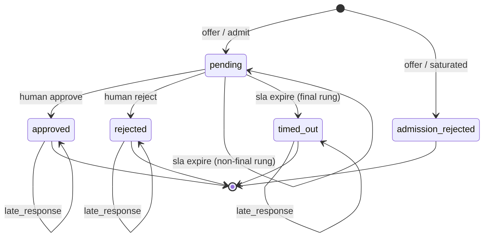

# Proposal: DurableFlow Front-Pressure (`/frontpressure`)

**Status:** PROPOSED
**Extension level:** Peer extension to `/context`, Colony, and Planner. Front-Pressure extends DurableFlow core by making human-intervention state durable, routable, SLA-governed, and eval-ready alongside workflow execution state.
**Owner:** Marcos Polanco
**Created:** 2026-07-06
**Updated:** 2026-07-07
**Repository:** `durableflow`
**Applies:** `process/spec-policy.md`, `process/semantics-policy.md`
**Depends on:** DurableFlow core SQLite persistence, `WorkflowStore`, `ApprovalGate`, `PauseForApproval`, `TelemetryLogger`, and the existing inbox triage `approval_gate` step.
**Dependency policy:** Core implementation remains Python standard library only. Portable protocol artifacts under `frontpressure/spec/` MUST remain importable without DurableFlow core types. Optional presentation-protocol adapters (AG-UI, A2A export) live behind optional extras and lazy imports. Optional development dependency remains `pytest==8.4.2`.
**Visibility:** Private implementation guide. Public artifacts are the repo: portable spec files, reference implementation, tests, conformance vectors, examples, and inbox audit traces.
**Delta constraint (D6):** This proposal must reduce and consolidate interventions, not industrialize approval throughput; attention does not survive volume.

---

## Policy Reference Resolution

This proposal follows the same process-policy shape used by `context/context-spec.md`, `planner/planner-spec.md`, and `docs/langsmith-adapter.md`:

- `spec-policy.md` for what/why/for-whom, phased delivery, entry/exit gates, and falsifiable claims
- `semantics-policy.md` for operator-facing surfaces (CLI inbox and audit read models)

Before this proposal moves from PROPOSED to DRAFT/READY, the owner MUST either confirm `process/spec-policy.md` and `process/semantics-policy.md` as the authoritative policy source, or copy/link those policies into a stable repo-relative location and update the `Applies` header.

---

## 0. Positioning Note

DurableFlow core already proves that agentic execution needs a durable shell: checkpoint every step, survive crashes, gate side effects, and pause for human approval.

Core `ApprovalGate` answers a narrow question:

> Can a workflow pause until an operator approves or rejects a proposed action?

That is necessary but incomplete. In production agentic systems, human attention is the slow consumer behind a fast producer. Without governed routing, SLA tracking, admission control, and override telemetry, approval queues collapse into rubber-stamping or stale execution backlogs.

This proposal makes the same claim for **human intervention** that `/context` makes for **information**:

> A workflow checkpoint is incomplete unless the runtime can also explain who was asked, under what policy, within what SLA, and what delta the human introduced versus what the agent proposed.

The load-bearing claim is:

> Human intervention is a durable state transition with routing policy, SLA metadata, and eval-ready override deltas — not just a boolean approve/reject.

The differentiated asset is the **portable envelope and state machine**, not the SQLite ledger. Temporal and LangGraph standardize the pause; nobody standardizes what the human changed in a comparable, exportable format.

This is **not**:

- a React inbox or generative UI framework
- an AG-UI renderer or CopilotKit replacement
- an identity/Active Directory governance platform
- a Slack, Teams, or PagerDuty integration
- a replacement for Temporal, LangGraph, or enterprise HITL SaaS

AG-UI, A2A, and OpenTelemetry are optional **consumers or exporters** of the portable protocol. The extension owns the bus contract; presentation and runtime hosts adapt to it.

### 0.1 Dual-Artifact Strategy

The protocol and its reference implementation are separate artifacts with one dependency direction:

| Artifact | What it is | Where it lives (now) | Where it goes (later) |
|----------|------------|----------------------|------------------------|
| **Front-Pressure Protocol** | Versioned envelope schema, event vocabulary, state machine, delta format, conformance vectors | `frontpressure/spec/` | Extractable to standalone `frontpressure-spec` repo (Apache 2.0, ~400 lines) |
| **Reference Implementation** | SQLite ledger, DurableFlow adapter, CLI inbox, tests | `frontpressure/` | Stays in `durableflow`; reference host for the protocol |

Implementation starts in DurableFlow. The portable spec is written for extraction:

- `frontpressure/spec/` MUST NOT import `src/`, `ApprovalGate`, or any DurableFlow core type.
- DurableFlow-specific glue lives only in `frontpressure/adapters/durableflow.py`.
- Conformance tests validate spec artifacts independently of the ledger.
- Any envelope exported from the ledger MUST round-trip through the portable JSON Schema without DurableFlow field names.

Runtime adapters emit conformant envelopes without adopting the ledger. Teams keep their runtime; they adopt the **format** as HITL audit and eval telemetry.

**LangGraph stub (Phase 0):** `frontpressure/adapters/langgraph.py` maps a fixture interrupt payload to a conformant `InterventionEnvelope` using only `frontpressure/spec/` types — no `src/` import, no LangGraph SDK. **LangGraph SDK wrapper** (optional extra, live `interrupt()` hook) ships in Phase 4.

### 0.2 Architectural Placement

```text
[Execution hosts: DurableFlow, LangGraph, Temporal, Cloudflare, ...]
        │
        ▼
[Runtime-specific pause primitive]
        │
        ▼
[Front-Pressure Protocol: envelope + state machine + delta format]  ← portable
        │
        ▼
[Reference ledger in DurableFlow]  ← one host; optional for adopters
        │
        ├──────────────┬────────────────┬──────────────────┬─────────────┐
        ▼              ▼                ▼                  ▼             ▼
   CLI inbox     Context cross-link   Eval gate        AG-UI export   A2A export
   (MVP demo)    (human saw/changed)  (override rate)  (optional)     (appendix)
```

In distributed-systems terms:

- **Backpressure** protects slow consumers from fast producers.
- **Front pressure** protects agent throughput from unbounded human-attention debt through **admission control** (WIP limits, dedup), routing, escalation, timeout, and measurable override quality.

v0.1 delivers governed HITL telemetry (routing, SLA timeout, audit, override deltas). v0.2 adds admission control.

### 0.3 Two HITL Patterns

Enterprise HITL is not one pattern. The protocol MUST distinguish them in `interruption_scope`:

| Pattern | `interruption_scope` | Duration | Pause scope | v0.1 status |
|---------|-------------------|----------|-------------|-------------|
| Workflow-based approval | `workflow` | Hours–weeks | Whole graph / step gate | **Required** (inbox triage) |
| Tool-based elicitation | `tool` | Seconds–minutes | Local tool block only | Deferred (MCP write-gating demo target) |

DurableFlow `ApprovalGate` maps to `workflow`. MCP `elicitInput` / MS `RequestPort` map to `tool`. They share the same envelope shape but MAY use different routing policies and SLA defaults.

### 0.4 MVP Cutline: v0.1 — Governed HITL Telemetry (GHT)

v0.1 ships **Governed HITL Telemetry (GHT)**: routing, SLA timeout, audit, and override deltas. **Front pressure** — admission-side producer relief via WIP limits — arrives in v0.2. The package name `/frontpressure` covers both tiers; they share one envelope schema.

**Phase 0–2 scope:** one golden path only.

```text
publish → pending → respond (approve | reject | override) → terminal disposition → export validates
```

Phase 0 + Phase 1 MUST ship before any CLI polish or inbox triage demo wiring.

**v0.1 IMPLEMENTED includes only:**

- minimal portable spec: two JSON Schemas, `state-machine.md`, `delta-format.md`, three conformance vectors
- **LangGraph stub adapter** (`adapters/langgraph.py`): `interrupt_fixture_to_envelope()` with no LangGraph SDK import (SDK wrapper in Phase 4)
- reference ledger: `offer`, `respond`, `audit`, `export_envelope` (no `list_queue` polish required in Phase 1)
- **single-lane, single-rung SLA** (timeout only; multi-rung escalation is Phase 3)
- DurableFlow adapter (`adapters/durableflow.py` only)
- override patch computation and `disposition` separation (`timed_out` ≠ `rejected`)
- lazy SLA evaluation on `audit` and `respond` precondition
- deterministic tests: idempotent publish, timeout, terminal race, `late_response`, schema conformance
- golden-path respond via **test harness or one minimal CLI command** (`frontpressure respond`); no presentation builders required for v0.1 exit

**v0.1 COMPLETE (Phase 3+) adds:**

- multi-rung SLA escalation ladder
- CLI inbox presentation contract (`inbox_view.py`)
- inbox triage integration demo
- eval-gate fixture consumption

**Deferred until v0.2:**

- admission control: per-lane WIP limits, near-duplicate coalescing, review batching
- `interruption_scope=tool` integration (MCP elicitation path)
- `resume_mode=reentry` engine integration (envelope field present in v0.1; only `handoff` exercised)
- AG-UI export adapter
- multi-operator assignment (`assigned` event + leasing; v0.1 is single-operator, self-asserted `operator_id` only)
- Slack, Teams, email, webhook notification channels
- authenticated operator identity
- multi-tenant queue isolation

**Phase 2 exit:**

> Inbox triage pauses on `approval_gate`. Adapter publishes an envelope. Test harness or `frontpressure respond` records an override. `export_envelope` JSON validates against `frontpressure/spec/*.schema.json`. Workflow resumes. No presentation layer required.

**First demo (Phase 3 exit):**

> Same path, plus CLI inbox list/audit with plain-language rendering and exported envelope validation in README.

---

## 1. Intent Mapping

### 1.1 Business Intent

DurableFlow should demonstrate that human gates are operational infrastructure, not chat decoration. The organizational outcome is governed automation: risky agent actions reach the right reviewer on time, stale requests escalate or fail closed, and human corrections become measurable alignment signal that **any runtime can emit in a shared format**.

### 1.2 Experience Intent

The operator believes they are **"triaging an intervention queue"** and **"recording a governed decision"** — not "polling `approval_queue`", "watching a generic chat bubble", or "rubber-stamping agent noise."

**Emotional context:** time-constrained, accountability-focused, and skeptical of agent output.

**Success feels like:** "I can see what the agent proposed, what policy routed it to me, how long I have, and exactly what I changed before the workflow resumed."

**Failure feels like:** "The workflow paused somewhere, but I cannot tell who should answer, what changed, or whether my override will be measured."

### 1.3 Technical Intent

1. The **portable protocol** is runtime-agnostic and versioned; DurableFlow is one conforming host.
2. Local SQLite remains the source of truth for the reference ledger only.
3. Core `ApprovalGate` semantics remain unchanged when `/frontpressure` is absent.
4. DurableFlow adapter wraps approval requests; it does not replace `WorkflowEngine` pause/resume mechanics.
5. SLA evaluation uses injectable clocks in tests; lazy evaluation on ledger reads in the demo.
6. Human-response export is best-effort and optional.
7. Deny-by-default parsing: malformed response payloads MUST NOT resume execution.
8. Completion claims require deterministic, network-free verification including conformance vectors.

---

## 2. Requirement & Narrative

### 2.1 What

Add a `frontpressure` extension to DurableFlow consisting of:

1. **Portable protocol** (`frontpressure/spec/`) — the extractable standard
2. **Reference ledger** (`frontpressure/ledger.py`) — SQLite-backed state machine host
3. **DurableFlow adapter** (`frontpressure/adapters/durableflow.py`) — maps `ApprovalGate` ↔ protocol
4. **CLI** (Phase 2: `respond` only; Phase 3: inbox presentation) — operator surface

Portable protocol introduces:

- `InterventionEnvelope` — published request with full provenance
- `HumanResponseEnvelope` — operator outcome with interoperable delta
- `InterventionState` — formal state machine (see §4.2)
- `InterventionEvent` — append-only vocabulary (see §4.4)
- `OverridePatch` — JSON Pointer diff entries (see §4.3)
- `SlaLadder` — ordered list of `(lane, deadline_offset_seconds)` rungs plus `terminal_disposition` (sole SLA term; no separate `SlaPolicy` type)
- `RoutingRule` — deterministic match rule with stable `routing_rule_id`

Reference implementation adds:

- `FrontPressureLedger` — offer, respond, audit, export (list_queue in Phase 3)
- host-input normalization per §4.4.1
- presentation builders and renderers (Phase 3 only)

Default integration instruments inbox triage `approval_gate` with `interruption_scope=workflow`, `intervention_kind=approval_gate`, `resume_mode=handoff`.

### 2.2 Why

Core approval gates solve pause/resume. They do not solve front pressure or portable override telemetry.

Industry practice has converged on layered protocols:

| Layer | Standard examples | Front-Pressure role |
|-------|-------------------|---------------------|
| Agent → tools | MCP | Orthogonal; `tool` elicitation is a v0.2 adapter target |
| Agent → agent | A2A (`INPUT_REQUIRED`) | Appendix mapping; export optional |
| Agent → user | AG-UI (`INTERRUPT`, `RUN_FINISHED`) | Downstream exporter of protocol envelopes |
| Execution pause | LangGraph interrupt, Temporal signal, `waitForApproval` | Upstream hosts; adopt envelope as telemetry |
| **Override audit** | *(no shared format)* | **This protocol** |

Without a portable middle layer, teams hardcode approval cards or lose override provenance when they change runtimes.

### 2.3 Who

**Primary persona — operations/platform engineer:** wants a small, inspectable reference implementation of a protocol they can emit from any runtime.

**Secondary persona — agent evaluation owner:** cares that override rates, response latency, and disposition (`timed_out` vs `REJECT`) are comparable across implementations.

**Audit persona — reviewer/operator:** opens an inbox or trace and needs plain-language routing and override explanation.

**Adopter persona — team on LangGraph/Temporal:** wants to keep their runtime and adopt only the envelope format for eval datasets.

### 2.4 Relationship to DurableFlow Core

`/frontpressure` is an additive extension. It MUST NOT change existing `WorkflowEngine` semantics.

Import rules:

| Module | MAY import |
|--------|------------|
| `frontpressure/spec/*` | Python stdlib only |
| `frontpressure/ledger.py` | `frontpressure/spec/*`, `WorkflowStore` |
| `frontpressure/adapters/durableflow.py` | `ApprovalGate`, `ApprovalRequest`, ledger, spec |
| `src/*` | MUST NOT import `frontpressure/*` |

Recommended integration:

```text
InboxTriageWorkflow(..., dependencies={
    "approval_gate": approval,
    "frontpressure_ledger": ledger,   # optional
})
```

When absent, core approval behavior is unchanged.

### 2.5 Relationship to Sibling Extensions

| Extension | Relationship |
|-----------|--------------|
| `/context` | Complementary. Context = what the model saw; frontpressure = what the human changed. Cross-link via `workflow_id`, `run_id`, `step_name`. |
| Eval gate | Downstream consumer of envelopes, override patches, autonomy ratio (v0.2). |
| OpenTelemetry | Human-review child spans; optional exporter of envelope metadata. |
| LangSmith | Optional exporter; local envelopes remain source of truth. |
| DataFlow / Planner / Colony | Orthogonal siblings; may emit protocol envelopes in future adapters. |

---

## 3. Gherkin Scenarios

### 3.1 Behavioral Gherkin (test coverage)

```gherkin
Scenario: Inbox triage approval is routed to the customer-facing lane
  Given the inbox triage workflow pauses on approval_gate with a draft reply payload
  And routing rule "inbox-customer-facing" maps workflow approval_gate to lane customer_facing
  When the DurableFlow adapter publishes an InterventionEnvelope
  Then the envelope state is pending
  And the envelope carries routing_rule_id "inbox-customer-facing"
  And the request appears in the customer_facing inbox queue
  And the audit trace records SLA deadline from the first ladder rung

Scenario: Operator approves without modification
  Given a pending intervention with proposed_payload P and resume_mode handoff
  When operator op-1 approves within SLA
  Then HumanResponseEnvelope.human_action is APPROVE
  And final_payload equals proposed_payload
  And override_patches is empty
  And disposition is approved
  And core ApprovalGate status becomes approved
  And the workflow resumes from the paused step

Scenario: Operator rejects with reason
  Given a pending intervention
  When operator op-1 rejects with reason "tone too casual"
  Then HumanResponseEnvelope.human_action is REJECT
  And disposition is rejected
  And disposition is not timed_out
  And core ApprovalGate status becomes rejected
  And default inbox triage semantics terminate the workflow

Scenario: Operator overrides inline before approval
  Given a pending intervention with proposed draft payload P
  When operator op-1 submits final_payload F different from P
  Then HumanResponseEnvelope.human_action is OVERRIDE_AND_APPROVE
  And override_patches contains JSON Pointer entries with op, path, before, after
  And core ApprovalGate resumes with the overridden payload

Scenario: SLA ladder escalates through multiple rungs
  Given a request in lane customer_facing on rung 0 with deadline 30 seconds
  And the SLA ladder has rungs [(customer_facing, 30s), (supervisor, 120s)]
  And no operator responds before the first deadline
  When the ledger is read (lazy SLA evaluation)
  Then an InterventionEvent escalated is recorded
  And the envelope state is pending on rung 1 in lane supervisor
  And the workflow remains paused

Scenario: Final SLA rung times out with fail-closed deny
  Given a request on the final SLA rung
  And terminal disposition is fail_closed_deny
  When the SLA deadline passes and the ledger is read
  Then the envelope state becomes timed_out
  And disposition is timed_out
  And disposition is not rejected
  And eval exports carry disposition=timed_out separately from human_action
  And core ApprovalGate is rejected with reason "sla_timeout"

Scenario: Response wins race against timeout
  Given a request one millisecond before SLA deadline
  When operator op-1 approves and SLA evaluation runs in the same tick
  Then the first durable terminal write wins
  And disposition is approved
  And no timed_out event changes the disposition

Scenario: Late response after terminal state is recorded but ignored
  Given a request already in state timed_out
  When operator op-1 submits a late approval
  Then a late_response event is appended
  And disposition remains timed_out
  And the late response MUST NOT resume the workflow

Scenario: Conformance vector validates without DurableFlow imports
  Given the golden intervention envelope fixture in frontpressure/spec/conformance/
  When the schema validator runs
  Then the fixture passes intervention-envelope.schema.json
  And the fixture passes response-envelope.schema.json after simulated response

Scenario: Crash during pending intervention preserves durable state
  Given a workflow paused with a published intervention
  And the process crashes before operator response
  When the engine restarts
  Then the pending envelope is still visible in the audit export
  And no duplicate envelope is created for the same correlation_id
```

**v0.1 automated coverage (Phase 0–2):** publish, approve, reject, override, single-rung timeout, terminal race, `late_response`, conformance validation, crash idempotency, LangGraph stub fixture → envelope.

**Phase 3 automated coverage:** multi-rung escalation (`tests/test_frontpressure_escalation.py`).

### 3.2 Conceptual Gherkin (v0.2 — not v0.1 automated coverage)

```gherkin
Scenario: Publish is rejected when lane WIP limit is saturated
  Given lane customer_facing has WIP limit 3 and 3 pending interventions
  When a fourth intervention is offered for publication
  Then publication fails with admission_rejected
  And no new envelope is created
  And the workflow receives a fail-closed publish rejection
```

### 3.3 Conceptual Gherkin (inbox surface semantics — Phase 3+)

```gherkin
Scenario: Operator triages a queue without reading backend tables
  Given an operator has five pending interventions
  When they open the frontpressure inbox
  Then they see queue lanes, headline risk labels, and time remaining in plain language
  And each item shows what the agent proposed before what action is available
  And table names, correlation_ids, and raw JSON dumps are never the primary presentation

Scenario: Reviewer inspects an override after the fact
  Given a workflow resumed after an operator changed the draft reply
  When the reviewer opens the intervention audit trace
  Then they see proposed versus final content in a scannable before/after summary
  And they see who decided, how long it took, which lane handled it, and disposition
  And exported envelope JSON validates against the portable schema
```

---

## 4. Portable Protocol Contract

This section is the extractable standard. It MUST remain valid if copied verbatim into a standalone `frontpressure-spec` repository.

### 4.1 File Layout (Extractable)

```text
frontpressure/spec/
  README.md                              # standalone one-pager; ZERO DurableFlow references
  intervention-envelope.schema.json      # published request schema
  response-envelope.schema.json          # operator outcome schema
  state-machine.md                       # normative transitions + shareable diagram
  delta-format.md                        # override patch rules
  events.md                              # event vocabulary (optional if inlined in state-machine)
  conformance/
    publish-workflow-approval.json       # golden publish vector
    respond-override.json                # golden override vector
    timeout-race.json                    # golden terminal race vector
```

**`frontpressure/spec/README.md` requirements (Phase 0, non-optional):**

- One page or less: problem statement, envelope purpose, state machine summary, delta format pointer, conformance instructions.
- MUST stand alone if copied verbatim into a new repo — no links to DurableFlow docs, no `src/` references, no "see implementation in…".
- MUST state v0.1 scope (governed HITL telemetry) and v0.2 scope (admission control) in one paragraph each.
- DRAFT exit gate includes standalone readability check of this file.

### 4.2 Intervention State Machine

Normative states:

| State | Type | Meaning |
|-------|------|---------|
| `pending` | Non-terminal | Awaiting human action on current ladder rung |
| `approved` | Terminal | Human approved; workflow may resume per `resume_mode` |
| `rejected` | Terminal | Human rejected |
| `timed_out` | Terminal | SLA ladder exhausted; system disposition applied |
| `admission_rejected` | Terminal | Never entered queue; lane saturated or policy denied publish |

Allowed transitions:

```text
[offer] ──admit──> pending
[offer] ──saturated──> admission_rejected

pending ──human approve──> approved
pending ──human reject──> rejected
pending ──sla expire (non-final rung)──> pending   # lane/rung changes; escalated event
pending ──sla expire (final rung)──> timed_out

approved  ──late_response──> approved   # event only; disposition unchanged
rejected  ──late_response──> rejected
timed_out ──late_response──> timed_out
admission_rejected ──(none)──> *
```

`state-machine.md` MUST include this normative diagram (Mermaid or ASCII) alongside the transition table.



**Race rule (normative):** First durable terminal state write wins. If `record_response` and `evaluate_sla` race, the ledger MUST use a single transactional compare-and-set on `state`. The loser appends a non-disposition-changing event (`late_response` or `stale_sla_tick`).

**Late response rule (normative):** A response arriving after any terminal state MUST be persisted as event type `late_response` and MUST NOT change `disposition`, MUST NOT resume upstream execution.

**Monotonicity:** `escalated` events MAY chain across multiple rungs. `rung_index` MUST increase monotonically. Final rung expiry is the only path to `timed_out`.

### 4.3 Intervention Envelope (Published Request)

Every published intervention MUST conform to `intervention-envelope.schema.json`:

```json
{
  "schema_version": "1.0",
  "intervention_id": "int-8f2c91",
  "correlation_id": "gate-abc123",
  "host": {
    "runtime": "durableflow",
    "workflow_id": "wf-inbox-001",
    "run_id": "run-001",
    "attempt_id": 1,
    "step_name": "approval_gate"
  },
  "interruption_scope": "workflow",
  "intervention_kind": "approval_gate",
  "resume_mode": "handoff",
  "routing_rule_id": "inbox-customer-facing",
  "lane": "customer_facing",
  "sla_ladder": {
    "rungs": [
      {"lane": "customer_facing", "deadline_offset_seconds": 30},
      {"lane": "supervisor", "deadline_offset_seconds": 120}
    ],
    "terminal_disposition": "fail_closed_deny"
  },
  "rung_index": 0,
  "state": "pending",
  "disposition": null,
  "response_schema_version": "1.0",
  "response_schema": {
    "type": "object",
    "required": ["approved"],
    "properties": {
      "approved": {"type": "boolean"},
      "final_payload": {"type": "object"},
      "rejection_reason": {"type": "string"}
    }
  },
  "proposed_payload": {
    "draft_reply": "Thanks for reaching out. We'll handle this today."
  },
  "published_at": "2026-07-07T04:00:00Z",
  "current_deadline_at": "2026-07-07T04:00:30Z",
  "trace": {
    "traceparent": "00-4bf92f3577b34da6a3ce929d0e0e4736-00f067aa0ba902b7-01"
  }
}
```

Field rules:

- `schema_version` — REQUIRED; semantic versioning for envelope evolution
- `correlation_id` — REQUIRED; idempotency key (DurableFlow: `gate_id`; LangGraph: `thread_id+interrupt_id`; host-specific)
- `host` — REQUIRED; opaque-to-protocol except `runtime` label; carries `run_id` and `attempt_id` for retried workflows
- `resume_mode` — REQUIRED; `handoff` (v0.1 default) or `reentry` (v0.2 engine support)
- `routing_rule_id` — REQUIRED on publish; provenance travels with export
- `disposition` — null while pending; one of `approved`, `rejected`, `timed_out`, `admission_rejected` at terminal
- `response_schema` — REQUIRED; JSON Schema for deny-by-default response validation
- `trace` — OPTIONAL; W3C `traceparent` for human-review span linking

`human_action` and `disposition` are **separate fields**. `timed_out` is a system disposition, not a human rejection. Eval consumers MUST NOT conflate them.

### 4.4 Human Response Envelope

Every operator response MUST conform to `response-envelope.schema.json`:

```json
{
  "schema_version": "1.0",
  "intervention_id": "int-8f2c91",
  "correlation_id": "gate-abc123",
  "human_action": "OVERRIDE_AND_APPROVE",
  "disposition": "approved",
  "resume_mode": "handoff",
  "proposed_payload": {
    "draft_reply": "Thanks for reaching out. We'll handle this today."
  },
  "final_payload": {
    "draft_reply": "Thanks for reaching out. We'll review this by end of day."
  },
  "override_patches": [
    {
      "op": "replace",
      "path": "/draft_reply",
      "before": "Thanks for reaching out. We'll handle this today.",
      "after": "Thanks for reaching out. We'll review this by end of day."
    }
  ],
  "operator_id": "op-marcos",
  "responded_at": "2026-07-07T04:00:42Z",
  "response_time_seconds": 42.0,
  "routing_rule_id": "inbox-customer-facing",
  "lane": "customer_facing",
  "rung_index": 0
}
```

Allowed `human_action` values in v0.1:

- `APPROVE`
- `REJECT`
- `OVERRIDE_AND_APPROVE`

### 4.4.1 Host Input vs. Portable Response (Normative)

The intervention `response_schema` and the exported `HumanResponseEnvelope` serve **different roles**. Implementations MUST NOT treat them as duplicate vocabularies.

| Layer | Artifact | Purpose |
|-------|----------|---------|
| **Host input** | JSON validated against intervention `response_schema` | What the UI, CLI, or runtime API collects from the operator |
| **Portable response** | `HumanResponseEnvelope` | What gets persisted, exported, and consumed by eval systems |

**Host input (v0.1 minimum):**

```json
{
  "approved": true,
  "final_payload": {"draft_reply": "..."},
  "rejection_reason": null
}
```

**Normalization rules (reference implementation MUST apply exactly):**

| Host input | Derived `human_action` | Derived `disposition` |
|------------|------------------------|----------------------|
| `approved=true`, `final_payload` deep-equals `proposed_payload` | `APPROVE` | `approved` |
| `approved=true`, `final_payload` differs from `proposed_payload` | `OVERRIDE_AND_APPROVE` | `approved` |
| `approved=false` | `REJECT` | `rejected` |
| fails schema validation, or `approved` missing/not boolean | `REJECT` | `rejected` |

The host adapter computes `human_action`, `disposition`, and `override_patches` from host input. **`human_action` is never accepted as raw operator input in v0.1** — it is always derived. This keeps AG-UI-style `approved: boolean` hosts and eval-oriented `human_action` exports aligned without ambiguity.

Deny-by-default rule: if host input fails `response_schema` validation, or `approved` is not explicitly `true` on approve/override paths, the host MUST derive `REJECT` and MUST NOT execute side effects.

### 4.4.2 Operator Identity Boundary

`operator_id` in the portable response envelope is **opaque and self-asserted** in v0.1.

- The reference CLI passes `--operator-id` (default: `operator`); tests use fixture strings.
- The ledger MUST NOT authenticate, authorize, or resolve `operator_id` against any identity provider.
- `operator_id` is an audit label for eval and trace export, not proof of enterprise identity.
- v0.2 MAY add optional `operator_claims` extension metadata (for example IAM subject URI) without changing `operator_id` semantics.

**Deny-by-default parsing (normative):** See §4.4.1. Host input validation precedes envelope construction.

### 4.5 Override Patch Format (Delta Format)

`override_patches` is the interoperable diff. Presence-only field lists are NOT sufficient.

Rules (`delta-format.md`):

1. Patches use JSON Pointer paths ([RFC 6901](https://datatracker.ietf.org/doc/html/rfc6901)).
2. Each entry MUST include `op`, `path`, `before`, `after`.
3. Allowed `op` values in v0.1: `add`, `remove`, `replace`.
4. Implementations MUST compute patches deterministically from `proposed_payload` and `final_payload` using the same canonical JSON serialization (sorted keys, UTF-8).
5. Redaction rules MUST apply identically to `before` and `after` before persistence and export. Default: replace string values longer than 256 chars with `digest:<sha256-prefix>`.
6. Empty patch list means no override (approve without modification).

### 4.6 Event Vocabulary

v0.1 events (`events.md`):

| Event type | Emitted when | Changes disposition? |
|------------|--------------|----------------------|
| `published` | Envelope admitted to queue | No |
| `admission_rejected` | Lane saturated or policy denied | Yes → `admission_rejected` |
| `routed` | Initial lane assignment recorded | No |
| `escalated` | SLA rung advanced | No (state stays `pending`) |
| `responded` | Valid human response accepted | Yes → `approved` or `rejected` |
| `timed_out` | Final rung expired | Yes → `timed_out` |
| `late_response` | Response after terminal state | No |
| `stale_sla_tick` | SLA evaluated after terminal state | No |

**Dropped from v0.1:** `assigned` (multi-operator leasing is v0.2+). v0.1 assumes a single self-asserted operator per response; no assignment or heartbeat events.

### 4.7 Admission Control (v0.2 — Front Pressure)

v0.1 (GHT) does not implement admission control. Front pressure — fast agent producers meeting a bounded human consumer — begins when lanes can reject at saturation.

v0.2 adds exactly three mechanisms (no more in first cut):

| Mechanism | Behavior | Demo criterion |
|-----------|----------|----------------|
| Per-lane WIP limit | `offer` → `admission_rejected` when `pending` count ≥ limit | Fourth publish to saturated lane fails closed |
| Near-duplicate coalescing | Same `dedup_key` within window reuses `intervention_id` | Two identical proposals → one queue item |
| Review batching | Presentation metadata only; groups compatible pending items | CLI shows batched review unit |

v0.1 documents these in `frontpressure/spec/README.md` under a **"v0.2 roadmap"** heading.

---

## 5. Reference Implementation Contract

This section is DurableFlow-specific. It MUST NOT appear in the extracted `frontpressure-spec` repo except as an illustrative "Host Integration Guide."

### 5.1 Module Layout

```text
frontpressure/
  spec/                          # portable; see §4.1
  models.py                      # dataclasses mirroring schema; no src imports
  ledger.py                      # SQLite state machine host
  adapters/
    durableflow.py               # ApprovalGate ↔ protocol (Phase 2)
    langgraph.py                 # Phase 0 stub: fixture → envelope; Phase 4: SDK wrapper (optional extra)
  cli.py                         # Phase 2: respond; Phase 3: list/audit
  inbox_view.py                  # Phase 3: presentation builders
```

### 5.2 Ledger API

Implementation lives in `frontpressure/ledger.py`.

| Method | Behavior |
|--------|----------|
| `offer(envelope: InterventionEnvelope) -> OfferResult` | Validates schema; idempotent on `correlation_id`; admission check stubbed until v0.2 |
| `list_queue(lane: str \| None = None, *, now: datetime) -> list[InterventionEnvelope]` | Phase 3+; lazy SLA eval before return |
| `respond(intervention_id, host_input: dict, *, now: datetime) -> RespondResult` | Validates against intervention `response_schema`; normalizes to `HumanResponseEnvelope` per §4.4.1; transactional race with SLA |
| `audit(intervention_id: str, *, now: datetime) -> InterventionAudit` | Full event log + current envelope |
| `export_envelope(intervention_id: str) -> dict` | Portable JSON only; no SQLite column names |

**SLA evaluation trigger:** There is **no background scheduler or ticker** in v0.1. SLA transitions are evaluated synchronously inside the ledger at these call sites only:

| Call site | When `evaluate_sla(now)` runs |
|-----------|-------------------------------|
| `audit(intervention_id, *, now)` | Always, before returning |
| `respond(..., *, now)` | Always, at entry (before accepting response) |
| `list_queue(..., *, now)` | Phase 3+ only, before returning |

The demo and tests MUST pass an injectable `now` at these boundaries. Any UI or script that needs fresh SLA state calls `audit` or `list_queue` — never assumes a background worker updated deadlines.

### 5.3 DurableFlow Adapter API

Implementation lives in `frontpressure/adapters/durableflow.py`.

| Method | Behavior |
|--------|----------|
| `publish_from_approval(request: ApprovalRequest, *, policies) -> InterventionEnvelope` | Maps `gate_id` → `correlation_id`; builds portable envelope; calls `ledger.offer` |
| `record_human_response(intervention_id, host_input: dict, approval: ApprovalGate) -> HumanResponseEnvelope` | Normalizes host input per §4.4.1; persists portable envelope; calls `approval.approve/reject` based on `disposition` |
| `map_timeout_to_approval(approval: ApprovalGate, correlation_id: str) -> None` | On `timed_out`: `approval.reject(reason="sla_timeout")` while envelope retains `disposition=timed_out` |

The adapter is the **only** module importing `ApprovalGate`.

### 5.4 Timeout vs. Human Rejection (Normative)

| Outcome | Envelope `disposition` | Envelope `human_action` | Core `ApprovalGate` | Eval metric bucket |
|---------|------------------------|-------------------------|---------------------|-------------------|
| Human approves | `approved` | `APPROVE` | `approved` | autonomy miss |
| Human rejects | `rejected` | `REJECT` | `rejected` | human rejection |
| SLA exhausted | `timed_out` | null | `rejected` (reason `sla_timeout`) | timeout |
| Lane saturated | `admission_rejected` | null | unchanged / host-specific | admission pressure |

Eval gate consumers MUST use envelope `disposition`, not `ApprovalGate.status`, as the authoritative bucket for override-rate and timeout-rate metrics.

### 5.5 Persistence Rules

- Additive SQLite tables only; core `approval_queue` schema unchanged.
- `correlation_id` is the idempotency key for `offer`.
- All state transitions append events; envelope row holds current snapshot.
- Terminal transitions use compare-and-set on `state` for race safety.

---

## 6. Presentation Contract

The CLI inbox is an operator-facing surface. Per `semantics-policy.md`, it requires an explicit presentation contract.

Presentation models live in `frontpressure/inbox_view.py`.

| View Type | Purpose |
|-----------|---------|
| `InboxQueueView` | Lane counts, oldest-waiting headline, saturation indicator (v0.2) |
| `InterventionCardView` | Risk label, time remaining, proposed action summary, rung indicator |
| `InterventionAuditView` | Event timeline, override patch summary, disposition |
| `OverridePatchView` | Before/after per JSON Pointer path |

Mandatory audit footer:

```text
v0.1 GHT boundary (Governed HITL Telemetry):
This trace shows routing, single-rung SLA timeout, and explicit human override patches.
It does not implement front-pressure admission control, multi-operator assignment, or production on-call coverage.
Export validates against frontpressure/spec/*.schema.json.
```

### 6.1 Ubiquitous Language (Lite)

| Operator term | Protocol term |
|---------------|---------------|
| Intervention queue | `state=pending` envelopes |
| Agent proposal | `proposed_payload` |
| Override | non-empty `override_patches` |
| Escalation | `escalated` event; `rung_index` increment |
| Timed out | `disposition=timed_out` (not operator rejection) |
| Queue full | `disposition=admission_rejected` (v0.2) |

---

## 7. Runtime Traceability

**Phase 2 golden path (v0.1 IMPLEMENTED):**

```text
tests/test_frontpressure_golden_path.py
  -> WorkflowStore(db_path)
  -> ApprovalGate(store)
  -> FrontPressureLedger.from_store(store, policies=FIXTURE_SINGLE_RUNG)
  -> DurableFlowAdapter(ledger, policies)
  -> InboxTriageWorkflow(..., dependencies={"frontpressure_adapter": adapter})
  -> WorkflowEngine.execute(workflow_id)
       -> approval_step -> adapter.publish_from_approval(...) -> PauseForApproval
  -> adapter.record_human_response(..., host_input={"approved": true, "final_payload": ...})
  -> ledger.export_envelope(correlation_id) -> validate against spec/conformance/
```

**Phase 3 demo path (v0.1 COMPLETE):**

```text
examples/frontpressure_inbox_demo.py
  -> ... same adapter wiring ...
  -> frontpressure list / frontpressure audit   # inbox_view presentation
  -> README schema validation command
```

Import-graph invariants:

- `src/*` MUST NOT import `frontpressure/*`
- `frontpressure/spec/*` MUST NOT import `frontpressure/ledger.py` or `src/*`
- AG-UI / A2A export lives in `integrations/` with lazy import

---

## 8. Optional Export Adapters (Post-MVP)

### 8.1 AG-UI Adapter

`integrations/agui_adapter.py` maps protocol envelopes to AG-UI events:

| Protocol | AG-UI |
|----------|-------|
| `state=pending` + `intervention_kind=approval_gate` | `RUN_FINISHED` with `outcome.type=interrupt` |
| `intervention_id` | `Interrupt.id` |
| `proposed_payload` + `response_schema` | interrupt payload / tool args |
| `HumanResponseEnvelope` with `approved=true` | `ResumeEntry` → `ToolApproved.override_args` |
| `HumanResponseEnvelope` with `approved=false` | `ToolDenied` |

Deny-by-default aligns with Pydantic AI AG-UI adapter behavior.

### 8.2 A2A State Mapping (Appendix)

| Front-Pressure state | A2A task state |
|----------------------|----------------|
| `pending` | `INPUT_REQUIRED` |
| `approved` | `WORKING` (resume) → `COMPLETED` (host-dependent) |
| `rejected` | `REJECTED` or `CANCELED` (host mapping) |
| `timed_out` | `CANCELED` |
| `admission_rejected` | `REJECTED` (server-side policy) |

This appendix is informative, not normative, until an A2A export adapter is implemented.

---

## 9. Goals

1. Define a **portable, versioned** human-intervention protocol extractable to `frontpressure-spec`.
2. Implement a **reference ledger** and DurableFlow adapter proving the golden path local-first.
3. Make **host input → portable response** normalization explicit and testable (§4.4.1).
4. Capture **interoperable override patches** suitable for cross-runtime eval comparison.
5. Formalize the **state machine** including terminal races (escalation ladder in Phase 3).
6. Ship LangGraph SDK adapter envelope emission (Phase 4).
7. Preserve extension-absent core behavior and zero-dependency spec validation.

---

## 10. Non-Goals (v0.1 IMPLEMENTED / GHT)

- No separate published repo yet (co-located `frontpressure/spec/`; extraction gated at DRAFT).
- No LangGraph **SDK** adapter yet (Phase 4); stub-only in Phase 0.
- No CLI presentation layer (Phase 3).
- No multi-rung SLA escalation (Phase 3 / `test_frontpressure_escalation.py`).
- No `interruption_scope=tool` path yet.
- No `resume_mode=reentry` engine integration yet (field reserved).
- No admission-control implementation (§3.2 conceptual only until v0.2).
- No `assigned` events or multi-operator leasing (self-asserted `operator_id` only).
- No authenticated operator identity.
- No universal HITL inbox UI.

---

## 11. Phased Implementation Plan

Phases are ordered by dependency. Phase 3 starts after Phase 2 golden path passes.

### Phase 0: Minimal Portable Protocol (small)

**Scope:** Smallest extractable standard. Zero DurableFlow imports.

Deliverables:

- `frontpressure/spec/README.md` (standalone one-pager per §4.1)
- `intervention-envelope.schema.json` and `response-envelope.schema.json`
- `state-machine.md` (transition table + Mermaid/ASCII diagram per §4.2) and `delta-format.md`
- three conformance vectors: publish, respond-override, timeout-race
- `frontpressure/adapters/langgraph.py` **stub**: `interrupt_fixture_to_envelope(dict) -> dict` conformant with publish schema; no LangGraph SDK, no `src/` imports
- `conformance/langgraph-interrupt-fixture.json` input for stub adapter test
- schema validation tests only

**Exit gate:** Conformance vectors validate with no DurableFlow install. LangGraph stub output validates against publish schema. `spec/README.md` is standalone.

### Phase 1: Reference Ledger — Golden Path Only (small)

**Scope:** SQLite host for single-lane, single-rung `workflow` approval.

Deliverables:

- `frontpressure/models.py`, `frontpressure/ledger.py`
- `offer`, `respond`, `audit`, `export_envelope` only
- single fixture routing rule; **one SLA rung** (timeout, no escalation chain)
- tests: idempotent `offer`, approve/reject/override normalization, single-rung timeout, terminal race, `late_response`
- respond via **test harness** (no presentation layer)

**Exit gate:** Golden path produces exportable JSON that validates against Phase 0 schemas.

### Phase 2: DurableFlow Adapter (small)

**Scope:** Wire adapter; one minimal CLI command.

Deliverables:

- `frontpressure/adapters/durableflow.py`
- host-input → `HumanResponseEnvelope` normalization per §4.4.1
- `disposition=timed_out` ≠ `human_action=REJECT` tests
- one CLI command: `frontpressure respond --correlation-id ... --input response.json`
- inbox triage `approval_gate` wired through adapter in **tests** (demo script optional)

**Exit gate:** Phase 0–2 behavioral Gherkin passes (single-rung SLA scenarios). Exported envelope validates. LangGraph stub test passes.

### Phase 3: Presentation + Demo Polish

**Scope:** Operator surfaces, end-to-end demo, and multi-rung SLA escalation (`tests/test_frontpressure_escalation.py`).

Deliverables:

- multi-rung SLA escalation ladder
- `frontpressure/inbox_view.py` + `frontpressure list` / `frontpressure audit`
- `examples/frontpressure_inbox_demo.py`
- optional dependency injection in `InboxTriageWorkflow`
- presentation contract tests
- §3.3 conceptual Gherkin coverage

**Exit gate:** v0.1 COMPLETE — demo matches README golden path with plain-language inbox.

### Phase 4: Eval + LangGraph SDK Adapter

**Scope:** Downstream consumption and live runtime integration (extends Phase 0 stub).

Deliverables:

- eval-gate fixture consuming `disposition` + `override_patches`
- extend `frontpressure/adapters/langgraph.py` with real `interrupt()` hook behind optional `langgraph` extra
- conformance test: live or recorded LangGraph interrupt output validates against portable schemas
- human-review span metadata hook for OpenTelemetry proposal (optional)

**Exit gate:** At least one envelope emitted from a LangGraph interrupt path validates without DurableFlow ledger types in the envelope JSON.

### Phase 5: Admission Control + Export Adapters (v0.2)

**Scope:** Front-pressure admission control and additional exporters.

Deliverables:

- per-lane WIP limits in `offer` (§3.2 Gherkin becomes automated)
- near-duplicate `dedup_key` coalescing
- `integrations/agui_adapter.py` skeleton (disabled by default)
- `interruption_scope=tool` adapter stub for MCP write-gating demo
- `resume_mode=reentry` engine integration design + tests
- Temporal wrapper (second runtime adapter)

---

## 12. Test Plan

**Phase 0–2 (v0.1 IMPLEMENTED / GHT):**

- conformance vectors validate against JSON Schema (no DurableFlow)
- LangGraph **stub** fixture → conformant publish envelope (no SDK)
- host-input normalization produces correct `human_action` + `disposition` (§4.4.1)
- patch computation is deterministic for nested payloads
- deny-by-default rejects malformed host input
- single-rung timeout, terminal race, `late_response`
- SLA evaluation only at `audit` / `respond` call sites (injectable `now`)
- `correlation_id` idempotency
- `timed_out` disposition ≠ `human_action=REJECT`
- export JSON contains no SQLite-internal field names
- extension absent: core approval tests still pass

**Phase 3+ (v0.1 COMPLETE):** `tests/test_frontpressure_escalation.py` — multi-rung ladder, `list_queue` SLA refresh, presentation contract, inbox demo.

**Phase 4 (live LangGraph SDK):** optional-extra adapter against real `interrupt()` events.

---

## 13. Entry and Exit Gates

### 13.1 Semantic Entry Gates

Implementation MUST NOT begin until:

- [ ] `frontpressure/spec/` layout exists with schema_version `1.0`
- [ ] State machine transition rules are written in `state-machine.md`
- [ ] Override patch format is defined in `delta-format.md`
- [ ] DurableFlow adapter boundary is explicit (`adapters/durableflow.py` only)
- [ ] MVP / v0.2 split is frozen (admission control deferred but documented)

### 13.2 Exit Gates

**v0.1 IMPLEMENTED (Phase 0–2 / GHT):**

- [ ] Phase 0 conformance vectors validate without DurableFlow imports
- [ ] LangGraph **stub** emits conformant publish envelope from fixture (no SDK)
- [ ] Golden path: publish → respond → export validates
- [ ] §4.4.1 host-input normalization is tested and unambiguous
- [ ] SLA evaluation trigger explicit: `audit` and `respond` only; injectable `now`
- [ ] `disposition=timed_out` separable from `human_action=REJECT`
- [ ] Extension-absent regression suite passes
- [ ] `operator_id` documented as self-asserted only; no `assigned` events in v0.1

**v0.1 COMPLETE (Phase 3):**

- [ ] `tests/test_frontpressure_escalation.py` covers multi-rung ladder (not Phase 0–2 gate)
- [ ] CLI inbox and audit with claim-boundary footer
- [ ] Demo README shows schema validation command

**Phase 4 exit:**

- [ ] LangGraph **SDK** adapter emits at least one conformant envelope from live or recorded interrupt

**DRAFT → extractable standard (§14):**

- [ ] `frontpressure/spec/` copies verbatim to standalone repo (Apache 2.0)
- [ ] `spec/README.md` is standalone (no DurableFlow references)
- [ ] `state-machine.md` includes shareable diagram + transition table
- [ ] No spec file imports DurableFlow modules
- [ ] LangGraph adapter exit gate (Phase 4) satisfied

---

## 14. Extraction Path to `frontpressure-spec`

Extraction is gated at DRAFT (§13.2), after LangGraph stub and SDK adapter exit gates pass.

When ready:

1. Copy `frontpressure/spec/` to new repo `frontpressure-spec` (Apache 2.0). Payload is self-contained: README, schemas, state-machine diagram, delta format, conformance vectors.
2. Add CI job there: schema validation + conformance vectors only.
3. In `durableflow`, pin to released spec version (git submodule, tagged copy, or package).
4. Publish runtime adapter examples (`langgraph.py` first) in `frontpressure-adapters` or `integrations/` docs.
5. DurableFlow remains the reference implementation, not the standard's home.

Until extraction, the spec lives co-located under `frontpressure/spec/`. Import boundaries, standalone README, conformance tests, and the Phase 0 LangGraph stub maintain portability.

---

## 15. Risks

| Risk | Mitigation |
|------|------------|
| Spec and implementation drift | Phase 0 schemas + conformance tests gate every ledger change |
| Co-located spec fuses with implementation | Import boundaries; standalone `spec/README.md`; LangGraph stub; DRAFT extraction gate |
| Standard capped at DurableFlow adoption | LangGraph stub in Phase 0; SDK adapter in Phase 4 |
| Name overclaims without admission control | v0.1 labeled GHT; front-pressure admission control in v0.2 |
| `timed_out` poisons override metrics | Separate `disposition`; eval uses envelope not gate status |
| Multi-operator ambiguity | No `assigned` event in v0.1; `operator_id` self-asserted only |
| AG-UI scope creep | Mapped exporter only; no UI components |

---

## 16. Decision

Proceed with `/frontpressure` as:

1. A **portable protocol** co-located in `frontpressure/spec/`, extractable to `frontpressure-spec`.
2. A **reference implementation** in phased delivery: golden path first (Phase 0–2), presentation polish second (Phase 3).
3. **Runtime adapters**: LangGraph stub in Phase 0; LangGraph SDK wrapper in Phase 4.

Do not proceed as an AG-UI inbox framework or a DurableFlow-only queue API.

**v0.1 IMPLEMENTED (GHT)** answers:

> Can a versioned, runtime-agnostic human-intervention envelope — with host-input normalization, separable disposition, and JSON Pointer override patches — be published, responded to, exported, and produced from a LangGraph interrupt **fixture** without DurableFlow types?

**v0.1 COMPLETE** additionally answers:

> Can an operator inspect routing, SLA, and overrides through a plain-language CLI demo?

**v0.2** must answer:

> Can front pressure be relieved at admission time so human attention is protected before the queue saturates?

If Phase 2 cannot export a conformant envelope without DurableFlow types in the envelope JSON itself, the extension MUST NOT be marked IMPLEMENTED.
